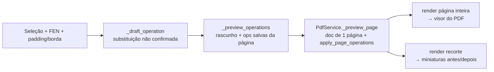

# Plano de Implementação (Skill): Editor de Diagramas de Xadrez em PDF

**Versão:** 1.6 (precisão, e sem depender de servidor de terceiros)  
**Status:** MVP entregue → endurecimento para Beta  
**Stack alvo:** Python 3.10+ (rodando em 3.13)  
**Última revisão:** 2026-08-08  

---

## 0) Estado atual (2026-08-08)

O MVP está **entregue e em uso** sobre livros reais (ex.: *A Matter of Endgame
Technique*, 898 páginas). O que existe hoje:

| Área | Situação |
|---|---|
| Abrir/navegar/renderizar PDF | ✅ pronto (`pdf_service.PdfService`) |
| Seleção manual de diagrama | ✅ pronto (`widgets.SelectablePageWidget`) |
| Reconhecimento OCR (seleção / página / PDF inteiro) | ✅ via API externa (`ocr_api`) |
| Editor visual de tabuleiro + paleta de peças | ✅ pronto (`widgets.BoardEditorWidget`) |
| Substituição vetorial (Merida embutida / CairoSVG) + fallback raster | ✅ pronto (`renderer`) |
| Whiteout por lado, borda, link Lichess | ✅ pronto |
| Apagamentos (erase) | ✅ pronto |
| **Prévia ao vivo do resultado (WYSIWYG)** | ✅ **novo — ver §21** |
| **Fila de conferência dos candidatos do OCR** | ✅ **novo — ver §23** |
| Projeto/checkpoint versionado (`schema_version=8`) | ✅ pronto |
| Modo Estudo (PGN, variantes, comentários por lance) | ✅ pronto (`study`) |
| Workers em segundo plano (OCR em lote / exportação) | ✅ pronto — ver §25.1 |
| Undo/redo no modo edição | ✅ pronto — ver §25.2 |
| Autosave do projeto | ✅ pronto — ver §25.3 |
| CI com `pytest` | ✅ pronto — ver §25.4 |
| Logs estruturados em arquivo | ✅ pronto (`logging_config`) |
| **Alças e setas para ajustar a seleção** | ✅ **novo — ver §26.1** |
| **Snap da seleção à borda do tabuleiro** | ✅ **novo — ver §26.2** |
| **Auto-orientação da posição** | ✅ **novo — ver §26.3** |
| **Relatório de alterações (CSV/JSON)** | ✅ **novo — ver §26.4** |
| **Detecção 100% local (OpenCV + PyTorch)** | ✅ **novo — ver §27** |
| **Motor híbrido: local primeiro, remoto como reforço** | ✅ **novo — ver §27.3** |
| **Aviso antes de enviar páginas para fora** | ✅ **novo — ver §27.4** |
| **Correções realimentando o dataset de treino** | ✅ **novo — ver §27.5** |
| **Migrações do projeto salvo entre schemas** | ✅ **novo — ver §28.1** |
| **Empacotamento (executável Windows)** | ✅ **novo — ver §28.2** |
| Instalador assinado / validação em máquina limpa | ❌ pendente — ver §28.4 |

**O desvio da §5/§6 foi fechado.** Até a versão 1.5 o reconhecimento existia só
como chamada HTTP para `helpman.komtera.lt/chessocr`, com três consequências:
privacidade (o livro inteiro ia para terceiros), disponibilidade (sem internet não
havia reconhecimento) e custo (898 páginas = 898 requisições).

Agora o pipeline OpenCV + PyTorch das §5 e §6 existe e é o **padrão**; o endpoint
remoto continua disponível e escolhível, mas como reforço. Ver §27 para o que foi
construído e §27.2 para de onde veio o modelo treinado.

---

## 1) Objetivo do Produto

Construir uma aplicação desktop que:

1. **Encontra diagramas de xadrez** em páginas de PDFs (escaneados e/ou digitais).
2. **Reconhece a posição** (peças por casa) e gera **FEN** confiável.
3. **Substitui o diagrama original** (baixa qualidade) por um **diagrama em alta qualidade**, preferencialmente **vetorial**, preservando:
   - tamanho (largura/altura),
   - posição (coordenadas exatas na página),
   - e layout do documento (sem deslocar texto/elementos).

### Resultados esperados
- PDF final com diagramas nítidos (vetor ou raster HQ), alinhados exatamente onde estavam.
- Fluxo de correção eficiente: o usuário consegue validar/corrigir em poucos cliques.
- Pipeline reutilizável (CLI) + GUI (produtividade).

---

## 2) Escopo, Não‑Escopo e Requisitos

### 2.1 Escopo (MVP)
- Abrir PDF, navegar páginas, renderizar preview.
- Detecção automática de candidatos a diagrama (com fallback manual).
- Extração do tabuleiro (crop + correção de perspectiva).
- Reconhecimento das 64 casas (classe vazia + 12 peças).
- Montagem do **piece placement** do FEN (ex.: `rnbqkbnr/pppppppp/8/...`).
- Editor visual para correção (clique nas casas + paleta de peças).
- Inserção no PDF:
  - **Preferência**: inserção de **vetor** (via “show page” de um PDF gerado do SVG).
  - **Fallback**: PNG HQ (300–600 DPI efetivos) com antialias.

### 2.2 Não‑Escopo (por enquanto)
- Reconhecer comentários, setas, marcações manuais (círculos, arrows), coordenadas (a‑h/1‑8) ou texto em volta.
- Reconhecer diagramas **parciais** (menos de 8×8) no MVP (pode entrar em v2).
- “Reflow” de PDFs (o produto é **edição visual**, não re-diagramação do livro).

### 2.3 Requisitos não‑funcionais (meta)
- **Precisão**: minimizar trocas graves (rei/rainha, cor errada).
- **Rapidez**: processar uma página típica em < 1s (CPU) após cache.
- **Confiabilidade**: salvar trabalho incremental (projeto com estado).
- **Reprodutibilidade**: pipeline determinístico para batch/CLI.
- **Auditabilidade**: logs + export de relatório (página, bbox, FEN, confiança).
- **Portabilidade**: instalação reproduzível em Windows (prioritário) e Linux.

---

## 3) Stack Tecnológico (atualizado)

| Componente | Tecnologia | Observações práticas |
|---|---|---|
| Linguagem | Python 3.9+ | Recomenda-se 3.11+ para performance/typing |
| GUI | **PySide6** (ou PyQt6) | PySide6 costuma ser mais simples em licenças; ambos ok |
| Render PDF | PyMuPDF (fitz) | Render rápido + edição sólida |
| CV | OpenCV (cv2) | Pré-processamento + detecção + perspectiva |
| ML | PyTorch | Classificação 13 classes |
| Xadrez | python-chess | Validação + geração de SVG |
| Vetor (opcional) | **CairoSVG** | Converter SVG → PDF (mantém vetor) |
| Raster HQ | Pillow | Redimensionamento/antialias e export |

> Nota: manter o core sem depender de CairoSVG é útil (fallback raster).

---

## 4) Arquitetura (módulos e contratos)

### 4.1 Visão macro (pipeline)
```mermaid
flowchart LR
  A[PDF: página] --> B[Render preview (pixmap)]
  B --> C{Auto-detect tabuleiros}
  C -->|OK| D[Extrair ROI + corrigir perspectiva]
  C -->|Falha| E[Seleção manual ROI]
  D --> F[Grid 8x8 + normalização]
  E --> F
  F --> G[Inferência ML por casa]
  G --> H[Montagem FEN + score/confiança]
  H --> I[Editor visual (correções)]
  I --> J[Render HQ (SVG->PDF ou PNG HQ)]
  J --> K[Inserir/overlay no PDF]
  K --> L[Salvar novo PDF + relatório]
```

### 4.2 Separação em camadas (recomendação)
- **Core (sem GUI)**: `cv`, `ml`, `chess`, `pdf`, `pipeline`
- **GUI**: apenas orquestra e chama o core (facilita testes)
- **CLI/Batch**: reusa o mesmo core

### 4.3 Contratos (dados)
Padronize estruturas simples para “passar dados” entre módulos.

**Tipos recomendados:**
- `DiagramCandidate`: `page_num`, `bbox_pdf` (Rect), `bbox_img` (x,y,w,h), `score_detect`
- `BoardCrop`: imagem corrigida 8×8, metadados de orientação e escala
- `InferenceResult`: matriz 8×8 de classes + confidências
- `FenResult`: FEN + validações + score
- `ReplaceOp`: `page_num`, `bbox_pdf`, `asset_bytes`, `asset_type` (pdf|png), `dpi`, `method`

---

## 5) Detecção de Diagramas (OpenCV) — robustez real

### 5.1 Estratégia híbrida (melhor que “apenas contornos”)
1. **Pré-processamento adaptativo**:
   - grayscale
   - `cv2.GaussianBlur` leve
   - binarização adaptativa (ou Otsu + morfologia)
2. **Heurística de “grid 8×8”**:
   - Hough Lines (linhas horizontais/verticais)
   - ou detecção de padrões repetitivos (picos em projeções)
3. **Validação geométrica**:
   - quadrilátero convexo
   - proporção ~ 1:1
   - presença de linhas internas (mínimo de 7 divisões em cada direção)
4. **Score final** combinando:
   - “gridness” + área + retidão + contraste

> Isso reduz falsos positivos (ex.: tabelas, gráficos, quadros decorativos).

### 5.2 Correção de perspectiva e normalização
- Encontrar 4 cantos (linhas → interseções ou contorno principal).
- `cv2.getPerspectiveTransform` + warp para um **quadrado canônico** (ex.: 512×512).
- Definir grid 8×8 com coordenadas **inteiras** (casas exatas).

### 5.3 Orientação do tabuleiro (importante)
Problema: alguns diagramas podem estar invertidos (brancas em cima).

Abordagens:
- **Heurística por material**: peões tendem a estar em ranks 2/7 (em posições “normais”).
- **Heurística por “legalidade fraca”**: ambos os reis devem existir e não podem ocupar mesma casa.
- **Auto-rotacionar**: testar 4 rotações; escolher a que maximiza a confiança global da inferência + validade.

---

## 6) Reconhecimento de Peças (ML) — plano mais operacional

### 6.1 Classes
- 0: vazio
- 1–6: P, N, B, R, Q, K (brancas)
- 7–12: p, n, b, r, q, k (pretas)

### 6.2 Dataset sintético (domínio‑randomizado)
Além do seu plano original, incluir:
- **Variação de temas**: contraste baixo, papel amarelado, sombras.
- **Variação de impressão**: halftone, bleed, artefatos de scanner.
- **Bordas/ruído de recorte**: uma casa “invade” a outra (padding aleatório).
- **Linhas grossas/falhas**: bordas apagadas, linhas duplas.
- **Compressão**: JPEG com qualidade variável + downscale/upsample.

Sugestão de geração:
- Renderizar o board inteiro → depois cortar as 64 casas.
- Guardar metadados: fonte/tema/seed/transform (para rastrear erros).

### 6.3 Modelo e calibração
- Arquitetura: **ResNet18** ou **MobileNetV3-Small** adaptada para 1 canal.
- Treino:
  - `CrossEntropyLoss`
  - `WeightedRandomSampler` ou pesos por classe (vazio domina)
  - Augmentations (torchvision transforms) consistentes com seu CV
- Métricas:
  - acurácia por classe
  - matriz de confusão
  - “board accuracy”: % de tabuleiros com **64/64** corretas (métrica dura)
  - “edit distance” (número médio de casas erradas por diagrama)

### 6.4 Rejeição (não forçar resposta)
Introduzir um estado **UNKNOWN** via regra:
- se `max_prob < threshold` numa casa, marcar como “incerta”
- GUI exige revisão das casas incertas (fluxo assistido)

Isso reduz erros silenciosos.

### 6.5 Fine‑tuning com feedback do usuário
- Quando o usuário corrige:
  - salvar `crop_board.png`, `grid_cells/*.png`, `fen_final.txt`, `rotation`, `bbox`
- Periodicamente:
  - re-treinar (ou fine-tune) com esses exemplos reais

---

## 7) Montagem e Validação do FEN (python-chess)

### 7.1 FEN mínimo vs completo
Para diagramas, o essencial é o **piece placement**.  
Você pode gerar:
- **FEN mínimo**: `piece_placement w - - 0 1` (default)
- **FEN estendido (opcional)**: permitir usuário definir lado a jogar

### 7.2 Validações úteis (sem virar “motor”)
- Exatamente 1 rei branco e 1 rei preto.
- Nenhuma casa com duas peças.
- Peões não podem estar na 1ª/8ª fileira (regra prática; exceções raras podem ser tratadas como aviso).
- Se falhar, destacar como **warning** e pedir revisão.

---

## 8) Renderização HQ (Vetor preferencial + fallback)

### 8.1 Vetor (recomendado)
Pipeline:
1. `python-chess` gera SVG do tabuleiro.
2. Converter SVG → **PDF vetorial** (CairoSVG).
3. Inserir no PDF alvo via PyMuPDF usando “show page” (colocar a página do PDF gerado dentro do retângulo do diagrama).

**Vantagens:**
- zoom infinito (texto/linhas nítidos)
- arquivo final menor que PNG gigante (muitas vezes)

### 8.2 Raster fallback (alta qualidade)
- Gerar SVG → raster (PNG) com dimensão suficiente para a bbox no PDF:
  - objetivo: 300–600 DPI efetivos no retângulo final
- Inserir com `page.insert_image(rect, stream=...)`

---

## 9) Inserção no PDF (PyMuPDF) — detalhes que evitam bugs

### 9.1 Conversão de coordenadas (pixel ↔ PDF)
- Render do preview usa uma `Matrix(scale_x, scale_y)`.
- Armazene sempre:
  - `matrix` usada
  - bbox no espaço de **imagem**
  - bbox no espaço de **PDF points**
- Quando usuário seleciona no preview:
  - converter para PDF via inversa da matrix

Cuidados obrigatórios para não deslocar overlay:
- considerar `page.rotation` (0/90/180/270) na ida e volta de coordenadas.
- trabalhar com `page.rect`/`cropbox` de forma explícita (não assumir origem simples).
- guardar um `TransformContext` por página: `rotation`, `cropbox`, `matrix_preview`, `zoom`, `dpi`.
- padronizar uma função única de conversão (evitar lógica duplicada GUI/core).

Contrato sugerido:
```python
@dataclass
class TransformContext:
    page_num: int
    rotation: int
    cropbox: tuple[float, float, float, float]
    matrix_preview: tuple[float, float, float, float, float, float]

def img_rect_to_pdf_rect(img_rect, ctx: TransformContext) -> tuple[float, float, float, float]:
    """Converte bbox do preview para coordenadas PDF points, respeitando rotação/crop."""
    ...
```

Teste mínimo obrigatório:
- para cada página de teste (incluindo rotações 90/180/270), validar round-trip:
  - `pdf -> img -> pdf` com erro absoluto <= 1.0 point por borda.

### 9.2 Estratégia “não destrutiva”
- Não remover a imagem antiga (pode ser difícil dependendo do PDF).
- Fazer **overlay** com o diagrama novo por cima.
- Opcional (v2): “whiteout” do fundo com um retângulo branco antes (se o diagrama original sangra bordas).

Ajuste recomendado para produção:
- tornar **whiteout padrão configurável** (`on` por default no MVP).
- ordem de desenho:
  1) retângulo branco no `bbox_pdf` (com pequena margem opcional, ex.: +0.5 pt)
  2) overlay do diagrama vetorial/raster
- oferecer opção de export:
  - `overlay_only` (sem whiteout)
  - `whiteout_overlay` (padrão)
- incluir preview “antes/depois” com e sem whiteout para inspeção rápida.

### 9.3 PDFs protegidos
- Detectar criptografia/senha.
- Se não puder editar, exportar como **novo PDF** (mesmo assim pode falhar se for “no copy/edit” estrito).

---

## 10) GUI (PySide6) — UX para produtividade

### 10.1 Layout sugerido (MVP)
- Esquerda: viewer do PDF (zoom/pan, página atual)
- Direita (tabs):
  - **Detecção**: lista de candidatos (página, miniatura, score)
  - **Edição**: tabuleiro interativo + FEN + warnings
  - **Exportação**: opções de saída + relatório

### 10.2 Editor de tabuleiro (muito melhor que “só campo FEN”)
- Grid 8×8 clicável
- Paleta de peças (brancas/pretas/vazio)
- Atalhos:
  - clique direito para limpar
  - scroll para alternar peça
  - Ctrl+Z / Ctrl+Y (undo/redo)
- Campo FEN sincronizado (edição textual também funciona)

### 10.3 Preview antes de gravar
- “Antes / Depois”:
  - overlay do diagrama HQ no preview da página
  - toggle para comparar

### 10.4 Estado do projeto
- Salvar automaticamente um `.json` (checkpoint):
  - diagramas detectados, FENs confirmados, bboxes
- Se o app fechar, continua de onde parou.

Reforço de robustez:
- incluir `schema_version` e `app_version` no topo do arquivo.
- incluir `source_pdf_fingerprint` (hash + tamanho + mtime) para detectar troca de arquivo.
- incluir migração de schema (`v1 -> v2`) com fallback seguro e log.

---

## 11) Estrutura de Diretórios (recomendada)

```
chess_pdf_editor/
├── README.md
├── pyproject.toml              # (ou requirements.txt)
├── src/
│   └── chess_pdf_editor/
│       ├── app/                # GUI
│       ├── pipeline/           # orquestração do core
│       ├── pdf/                # PyMuPDF wrapper
│       ├── cv/                 # detecção/crops/perspectiva
│       ├── ml/                 # modelo, dataloaders, inferência
│       ├── chess/              # FEN, SVG render, validações
│       ├── storage/            # cache + projetos + relatórios
│       └── utils/              # logging, types, configs
├── assets/
│   ├── fonts/
│   └── icons/
├── data/
│   ├── synthetic/
│   ├── real_samples/
│   ├── feedback/
│   └── models/
├── scripts/
│   ├── gen_dataset.py
│   ├── train.py
│   └── batch_replace.py
└── tests/
    ├── test_fen_validation.py
    ├── test_grid_detection.py
    └── test_pdf_overlay.py
```

---

## 12) Snippets (mais “concretos” e prontos para evoluir)

### 12.1 Interface do pipeline (core)
```python
from dataclasses import dataclass
from typing import List, Optional, Tuple

@dataclass
class DiagramCandidate:
    page_num: int
    bbox_pdf: Tuple[float, float, float, float]   # x0,y0,x1,y1 (points)
    score: float

@dataclass
class FenResult:
    fen: str
    confidence: float
    warnings: List[str]

def process_candidate(pdf_path: str, candidate: DiagramCandidate) -> FenResult:
    ...
```

### 12.2 Inserção vetorial via “show page” (conceito)
- Gerar um PDF de 1 página contendo o diagrama (a partir do SVG).
- Inserir essa página dentro do `rect` na página alvo.

```python
import fitz  # PyMuPDF

def overlay_pdf_page(target_doc: fitz.Document, page_num: int, rect, diagram_pdf_bytes: bytes):
    src = fitz.open("pdf", diagram_pdf_bytes)
    page = target_doc[page_num]
    page.show_pdf_page(fitz.Rect(rect), src, 0)  # coloca vetor dentro do retângulo
```

### 12.3 Inserção raster (fallback)
```python
import fitz

def overlay_png(target_doc: fitz.Document, page_num: int, rect, png_bytes: bytes):
    page = target_doc[page_num]
    page.insert_image(fitz.Rect(rect), stream=png_bytes, overlay=True)
```

---

## 13) Testes, QA e Métricas

### 13.1 Conjunto “golden”
- Separar 30–100 diagramas reais representativos (vários livros/estilos).
- Para cada diagrama:
  - bbox correta
  - FEN correto
  - snapshot do “antes/depois” para inspeção visual

### 13.2 Métricas operacionais
- % de diagramas detectados automaticamente (sem intervenção)
- % de FENs corretos sem correção
- # médio de casas corrigidas por diagrama
- tempo médio por diagrama (com/sem correção)

### 13.3 Gates de aceite (MVP/Beta)
Definir critérios objetivos para evitar “pronto subjetivo”.

MVP (mínimo):
- detecção automática >= 70% em conjunto golden.
- FEN correto sem edição >= 85% (com fallback manual sempre disponível).
- tempo médio por diagrama (com revisão) <= 20s em CPU.
- erro de alinhamento visual <= 1.5 pt no PDF final.

Beta (meta):
- detecção automática >= 85% em conjunto golden.
- FEN correto sem edição >= 93%.
- # médio de casas corrigidas <= 1.0 por diagrama.
- tempo médio por diagrama (com revisão) <= 10s.

---

## 14) Riscos e Mitigações (atualizado)

| Risco | Impacto | Mitigação prática |
|---|---|---|
| Falsos positivos (tabelas/quadros) | Troca indevida no PDF | Score + confirmação visual + lista de candidatos |
| Baixa resolução extrema | Confusão peça/vazio | Threshold + casas “incertas” forçando revisão |
| Estilos muito diferentes | queda de precisão | domain randomization + feedback + fine-tuning |
| Diagramas inclinados | grid errado | perspectiva robusta + validação por “gridness” |
| PDF protegido | sem edição | exportar novo PDF / alertar usuário |
| Desalinhamento (bbox) | overlay fora do lugar | conversão coordenadas rigorosa + preview antes de salvar |

---

## 15) Roadmap

### Concluído

**Sprint 1 — core mínimo** ✅
- Render PDF + seleção manual de ROI
- Inserção raster (PNG HQ) no PDF

**Sprint 2 — correção assistida** ✅
- Editor visual do tabuleiro + paleta de peças
- Checkpoint versionado (`schema_version`) + restauração automática de sessão

**Sprint 3 — reconhecimento** ✅ (com desvio: OCR remoto, não ML local)
- Reconhecer seleção / página / PDF inteiro
- Deduplicação por IoU + heurística anti-falso-positivo (>50% da página)
- Retomada do lote na página pendente após cancelamento

**Sprint 4 — vetor + acabamento** ✅
- Merida embutida → PDF vetorial; CairoSVG como segundo caminho; raster como fallback
- Whiteout por lado + borda + link Lichess
- Apagamentos independentes das substituições

**Sprint 4.5 — prévia ao vivo (2026-08-08)** ✅ — ver §21
- Substituição visível na página **antes** de confirmar
- Miniaturas antes/depois do diagrama
- Garantia WYSIWYG coberta por teste (prévia == PDF exportado, byte a byte)

**Sprint 5 — "não travar e não perder trabalho" (2026-08-08)** ✅ — ver §25
- Workers em segundo plano para OCR em lote e exportação
- Undo/redo de substituições, apagamentos e candidatos
- Autosave do projeto em intervalo fixo + ao fechar
- CI com `pytest` (GitHub Actions, Windows + Ubuntu)
- Extras da §22.4 que vinham junto: endpoint do OCR centralizado e persistido,
  `confidence` preenchida, `QSettings` injetável, logs estruturados

**Sprint 6 — precisão e ajuste fino (2026-08-08)** ✅ — ver §26
- Alças de redimensionamento, deslocamento por arrasto e setas do teclado
- Snap da seleção à borda real do tabuleiro
- Auto-orientação por plausibilidade da posição
- Relatório de alterações em CSV/JSON

**Sprint 7 — independência do OCR remoto (2026-08-08)** ✅ — ver §27
- Detector local de diagramas (OpenCV) e classificador das 64 casas (PyTorch)
- Motor híbrido: local primeiro, remoto como reforço das leituras inseguras
- Aviso explícito antes do primeiro envio de páginas para servidor externo
- Correções do usuário exportáveis para o dataset que treina o classificador

**Sprint 8 — empacotamento e distribuição (2026-08-08)** ✅ — ver §28
- Executável Windows com o classificador e os assets embutidos
- Migrações explícitas de `project_state.json`, e recusa de projeto de versão futura
- Documentação de desenvolvimento no README

### Sprint 9: o que o Sprint 7 destravou

1. **Modo "revisar pendências"** ✅ — ver §29.
2. **Dividir `app.py`** ✅ — ver §30.
3. **Galeria de diagramas do livro** ✅ — ver §31.
4. **O que sobrava na página** (link Lichess, coordenadas) ✅ — ver §32.
5. **Exportação interrompível** ✅ — ver §33.
6. **A interface cabendo na tela** ✅ — ver §34.
7. **Comparação "cortina"** ✅ — ver §35.
8. **Estilo em lote com prévia** ✅ — ver §36.
9. **Auditoria de legalidade da posição** ✅ — ver §37.
10. **Diagrama por clique único** ✅ — ver §38.
11. **Diagramas isolados** ✅ — ver §39.
12. **Diff de projeto** ✅ — ver §40. Com ele, a §22.5 fecha.
13. **Auditoria do painel lateral** ✅ — ver §41.
14. **Auto-orientar reversível** ✅ — ver §42.
15. **Autosave durável de verdade** ✅ — ver §43.
16. **Variante light do executável** ✅ — ver §44.
17. **Redes contra perda silenciosa de campo** ✅ — ver §45.

### 15.1 O que falta (revisado em 2026-08-09)

As listas de trabalho do plano estão fechadas: §19 (backlog técnico), §20.2 (redesign
da interface) e §22.5 (as oito ferramentas sugeridas). Sobram **cinco** itens, e
**nenhum** deles é código:

| Item | Onde | Por que está aberto |
|---|---|---|
| Rodar em 3 PDFs reais diferentes | §18 | precisa dos livros em mão; os outros 5 itens da lista têm teste automatizado, este não pode ter |
| Instalador (`.msi`/Inno Setup) | §28.4 | precisa do Inno Setup instalado |
| Assinatura de código | §28.4 | precisa de um certificado |
| Validação em Windows sem Python | §28.4 | precisa da máquina limpa |
| Painel sem rolagem em 1500×900 | §20.5 | **decidido não forçar**: faltam 191 px e o caminho já foi medido e reprovado (§41.2, §34.3) |

Os quatro primeiros são dependências físicas, não decisões pendentes. O quinto é uma
decisão registrada, com o número medido: o fluxo cabe a partir de 1.100 px de altura.

Duas pendências de sprint continuam anotadas de propósito, e **não** são tarefas:
o render de prévia síncrono (§25.7, medido em 119 ms — "não incomoda") e o
reconhecimento de seleção síncrono (§27.8, ~350 ms com o motor local). Ambas têm a API
já isolada, se algum dia incomodarem.

---

## 16) Requisitos de Instalação (sugestão)

### requirements.txt (mínimo)
```txt
PySide6>=6.6.0
PyMuPDF>=1.23.0
opencv-python>=4.8.0
numpy>=1.24.0
pillow>=10.0.0
python-chess>=1.999
torch>=2.0.0
torchvision>=0.15.0
```

### extras (vetor)
```txt
cairosvg>=2.7.0
```

### Notas de instalação reproduzível (Windows/Linux)
- Priorizar Python 3.11 x64.
- Fixar versões em ambiente de release (`requirements-lock.txt`).
- `torch/torchvision`: instalar pares compatíveis (CPU ou CUDA) no mesmo índice.
- `cairosvg` no Windows pode exigir runtime nativo; manter fallback raster ativo por padrão.
- Validar setup com script `scripts/check_env.py` (import + versão + smoke test).

---

## 17) Entregáveis recomendados (para “fechar” o projeto)
- App GUI (Windows/Linux) com instalador/zip.
- CLI para batch (`batch_replace.py`) e logs.
- Pasta `golden/` com casos reais e um script de avaliação.
- Modelo `.pth` versionado + `model_card.md` (dados, métricas, limitações).
- `project_state.json` para retomar trabalho.

---

## 18) Checklist de aceitação (MVP)
- [x] Selecionar diagrama manualmente e gerar FEN
- [x] Corrigir FEN no editor visual
- [x] Gerar diagrama HQ e inserir no PDF no mesmo lugar
- [x] Salvar PDF de saída sem quebrar layout
- [x] Reabrir projeto e continuar (checkpoint)
- [ ] Rodar em pelo menos 3 PDFs reais diferentes — **único item aberto desta
      lista**, e depende de ter os livros em mão. Os cinco acima estão cobertos por
      teste automatizado; este não pode ser.

---

## 19) Backlog de melhorias futuras

Esta seção registra melhorias identificadas na revisão do projeto em 2026-05-17. Elas não fazem parte de uma implementação imediata, mas servem como guia para as próximas etapas.

### 19.1 Prioridade alta

- [x] **Mover OCR e exportação para workers em segundo plano** — feito no Sprint 5.1, ver §25.1.
  - Hoje o reconhecimento por OCR e a exportação do PDF rodam na thread principal da interface.
  - Para PDFs grandes ou endpoints lentos, a janela pode parecer travada.
  - Implementar com `QThread`, `QRunnable`/`QThreadPool` ou uma camada equivalente de worker.
  - Manter progresso, cancelamento e propagação clara de erros para a UI.

- [x] **Dividir `app.py` em módulos menores** — feito no Sprint 9.2, ver §30.
  - O arquivo principal concentra UI, OCR, estado do projeto, estudo, overlays e exportação.
  - Separação sugerida:
    - `main_window.py`: janela principal e composição de telas.
    - `study_panel.py`: painel/modo de estudo.
    - `ocr_workflow.py`: reconhecimento de seleção, página atual e lote.
    - `operations.py`: criação, atualização e validação de operações.
    - `settings.py`: preferências persistidas via `QSettings`.
  - Objetivo: reduzir acoplamento, facilitar testes e tornar futuras mudanças menos arriscadas.

- [x] **Adicionar GitHub Actions para testes** — feito no Sprint 5.4, ver §25.4.
  - Rodar `pytest` automaticamente em push e pull request.
  - Começar com matriz simples em Windows e Python estável.
  - Validar pelo menos testes unitários sem dependência de interface gráfica real.

### 19.2 Prioridade média

- [x] **Melhorar configuração do OCR** — feito no Sprint 5, ver §22.4.
  - Evitar endpoint duplicado/hardcoded em múltiplos lugares.
  - Centralizar endpoint padrão, fallback e timeout.
  - Persistir endpoint escolhido pelo usuário em `QSettings`.
  - Permitir configuração por variável de ambiente para uso em scripts e ambientes automatizados.

- [x] **Adicionar logs estruturados** — feito no Sprint 5, ver §22.4.
  - Registrar falhas de OCR, renderização, exportação e carregamento de projetos.
  - Evitar `except Exception` silencioso em pontos críticos.
  - Usar `logging` com arquivo local opcional, por exemplo `logs/chess_pdf_editor.log`.
  - Exibir mensagens amigáveis na UI, mantendo detalhes técnicos no log.

- [x] **Criar migrações explícitas para `project_state.json`** — feito no Sprint 8,
  ver §28.1.

- [x] **Ampliar testes de integração** — feito ao longo dos Sprints 5–9.16: 35 arquivos de teste.
  - Testar aplicação de overlay em PDF real de amostra.
  - Testar inserção de link Lichess.
  - Testar salvar/carregar projeto com operações, apagamentos e posições de estudo.
  - Testar OCR com mock HTTP, sem depender da internet.
  - Testar renderização com Merida, sem Merida e com fallback raster.

### 19.3 Prioridade baixa / empacotamento

- [x] **Gerar executável Windows** — feito no Sprint 8, ver §28.2. Falta ainda a
  validação numa máquina limpa de verdade (§28.4).

- [x] **Melhorar relatório de processamento** — feito no Sprint 6, ver §26.4.

- [x] **Documentar fluxo de desenvolvimento** — feito no Sprint 8, ver §28.3.

### 19.4 Ordem sugerida de implementação

1. Adicionar GitHub Actions com `pytest`.
2. Criar workers para OCR/exportação sem travar a interface.
3. Separar `app.py` em módulos menores.
4. Centralizar configuração do OCR.
5. Adicionar logs estruturados.
6. Implementar migrações de projeto.
7. Expandir testes de integração.
8. Preparar empacotamento Windows.

---

## 20) Backlog de melhorias de interface e experiência do usuário

Esta seção registra a análise de UX feita em 2026-05-17. O objetivo é reduzir a sensação de interface poluída sem remover funcionalidades importantes.

### 20.1 Diagnóstico atual

- [x] **Painel direito com excesso de responsabilidades** — atendido pelo fluxo em etapas e pelo `Avançado`.
  - O painel lateral mistura editor de tabuleiro, OCR, lista de substituições, áreas apagadas, FEN, acabamento, fonte Merida, endpoint OCR e estudo.
  - O usuário vê muitas decisões ao mesmo tempo, mesmo quando ainda não selecionou um diagrama.

- [x] **Muitos botões com o mesmo peso visual** — atendido; hierarquia fechada no Sprint 9.13, ver §41.4.
  - Ações como reconhecer seleção, reconhecer página, reconhecer PDF inteiro, substituir, apagar área, remover e limpar aparecem com destaque semelhante.
  - Falta uma ação principal clara para cada momento do fluxo.

- [x] **Configurações avançadas visíveis demais** — atendido; grupos recolhidos por padrão.
  - Endpoint OCR, caminho da fonte Merida, padding detalhado, borda e link Lichess são úteis, mas não deveriam competir com as ações principais.

- [x] **Comandos duplicados em painel, toolbar e menus** — atendido no Sprint 9.6, ver §34.1.
  - A duplicação é boa para produtividade, mas aumenta a carga visual quando os mesmos comandos aparecem em vários lugares.

- [x] **Editor de tabuleiro pouco direto** — atendido pela paleta visual de peças.
  - A seleção de peça por combo funciona, mas exige mais leitura e cliques do que uma paleta visual de peças.

### 20.2 Direção de redesign

- [x] **Organizar a edição como fluxo por etapas** — as etapas 1 a 5 estão no painel, numeradas.
  - Substituir ou reorganizar abas técnicas por etapas de trabalho:
    1. Selecionar
    2. Reconhecer
    3. Corrigir
    4. Aplicar
    5. Exportar
  - O painel deve indicar a próxima ação provável, não mostrar todas as ações com o mesmo destaque.

- [x] **Criar painel contextual de edição** — `edit_context_label` + uma ação em destaque por estado.
  - Quando não houver PDF aberto: mostrar estado vazio com ação `Abrir PDF`.
  - Quando houver PDF sem seleção: orientar para selecionar um diagrama.
  - Quando houver seleção: destacar `Reconhecer seleção`.
  - Quando houver FEN válido: destacar `Adicionar substituição`.
  - Quando houver operações: destacar `Exportar PDF`.

- [x] **Mover opções avançadas para área recolhível ou preferências** — dois grupos `Avançado`, recolhidos por padrão e com estado persistido (§41.3).
  - Mover para `Avançado`:
    - endpoint OCR;
    - fonte Merida;
    - padding detalhado;
    - borda;
    - inclusão de link Lichess;
    - aplicar estilo em todas as substituições.
  - Alternativa futura: criar diálogo `Preferências`.

- [x] **Unificar listas operacionais** — lista única `5 · Alterações`.
  - Trocar listas separadas de substituições, apagamentos e FENs por uma lista principal de `Alterações`.
  - Cada item deve indicar tipo, página e resumo:
    - `Diagrama`, com FEN resumido;
    - `Apagamento`, com página e área;
    - `Estudo`, se for mantido no mesmo painel.
  - Manter filtros ou abas secundárias apenas se a lista crescer demais.

- [x] **Simplificar toolbar** — feito no Sprint 9.6: 2.223 px → 1.130 px, ver §34.1.
  - Manter na toolbar apenas comandos globais:
    - abrir PDF;
    - carregar/salvar projeto;
    - exportar PDF;
    - modos leitura/edição/estudo;
    - navegação de página;
    - zoom.
  - Remover ou evitar comandos de OCR/substituição na toolbar principal.

- [x] **Melhorar rótulos** — os seis renomeados.
  - `Reconhecer pagina atual` -> `Reconhecer página`
  - `Encontrar diagramas no PDF` -> `Detectar no PDF`
  - `Substituir no PDF` -> `Adicionar substituição`
  - `Apagar area` -> `Adicionar apagamento`
  - `Acabamento` -> `Aparência`
  - `Posicoes` -> `FEN`

- [x] **Criar paleta visual de peças** — 13 botões, sem combo.
  - Substituir o combo `Peça ativa` por botões/ícones de peças.
  - Incluir opção de casa vazia.
  - Manter clique direito para limpar casa.
  - Usar destaque visual na peça ativa.

### 20.3 Layout-alvo sugerido

```text
PDF / Preview da página
└── seleção visual, overlays de alterações e zoom

Painel lateral: Edição
├── Seleção
│   ├── Reconhecer seleção
│   ├── Reconhecer página
│   └── Detectar no PDF
├── Posição
│   ├── editor de tabuleiro
│   ├── paleta visual de peças
│   ├── FEN
│   └── avisos de validação
├── Aplicar
│   ├── Adicionar substituição
│   └── Adicionar apagamento
├── Alterações
│   ├── lista única de alterações
│   ├── remover selecionada
│   └── limpar
└── Avançado
    ├── OCR endpoint
    ├── fonte Merida
    ├── padding
    ├── borda
    └── link Lichess
```

### 20.4 Etapas sugeridas para implementação

1. **Limpeza rápida de rótulos e hierarquia**
   - Renomear botões/abas.
   - Reordenar ações por fluxo.
   - Reduzir comandos duplicados visíveis.
   - Baixo risco, sem mudança estrutural profunda.

2. **Área avançada recolhível**
   - Esconder endpoint OCR, fonte Merida, padding, borda e link Lichess em `Avançado`.
   - Manter valores atuais e comportamento existente.
   - Reduz bastante a poluição visual sem mexer na lógica central.

3. **Painel contextual de edição**
   - Criar estados de UI conforme o progresso: sem PDF, sem seleção, seleção ativa, FEN válido, operações prontas.
   - Destacar uma ação principal por estado.
   - Exige cuidado com sinais/eventos da UI.

4. **Lista única de alterações**
   - Consolidar substituições e apagamentos em uma visão principal.
   - Manter compatibilidade com as estruturas internas atuais.
   - Exige revisão de seleção, remoção, foco e overlays.

5. **Paleta visual de peças**
   - Substituir combo por botões de peças.
   - Melhorar velocidade de correção manual.
   - Pode ser implementado dentro do `BoardEditorWidget`.

6. **Polimento final**
   - Ajustar espaçamentos, tamanhos mínimos, estados vazios e mensagens da barra de status.
   - Revisar modo estudo para seguir a mesma linguagem visual.
   - Fazer teste manual com PDFs reais em telas pequenas e grandes.

### 20.5 Critérios de aceite para a nova interface

Medidos no Sprint 9.13 — ver §41.5 para o veredito de cada um, e §41.2 para o número
do único que não passou.

- [x] O usuário consegue identificar a próxima ação principal em até 3 segundos.
      Rótulo contextual por estado, com **um** botão em destaque de cada vez.
- [x] Configurações avançadas não aparecem por padrão. Os dois grupos `Avançado`
      abrem recolhidos, e agora o estado que o usuário escolher persiste (§41.3).
- [ ] O painel lateral não exige rolagem para executar o fluxo básico em tela
      1500x900. **Não cumprido, medido:** faltam 191 px. O painel de cima fica preso
      no seu mínimo de 538 px e o visor das abas fica com 222 px para 745 px de
      conteúdo. O fluxo cabe a partir de **1.100 px** de altura (1.050 com a prévia
      recolhida). Ver §41.2, incluindo por que forçar não valeria a pena.
- [~] O fluxo básico é possível com estes passos visíveis:
  1. abrir PDF;
  2. selecionar diagrama;
  3. reconhecer seleção;
  4. corrigir FEN/tabuleiro;
  5. adicionar substituição;
  6. exportar PDF.

      Todos existem e ficam habilitados no momento certo; o passo 5 exige rolagem em
      900 px de altura, pela mesma causa do item acima.
- [x] A correção manual no tabuleiro exige menos cliques do que o combo atual.
      Paleta: 2 cliques (peça + casa). Combo: 3 (abrir, escolher, casa).
- [x] Comandos destrutivos, como remover/limpar, têm menos destaque que ações
      principais. Feito no Sprint 9.13 — botão achatado, não vermelho (§41.4).

---

## 21) Prévia ao vivo do resultado (implementado em 2026-08-08)

### 21.1 Problema

Até aqui o fluxo era **cego**: o usuário selecionava a área, corrigia a posição,
clicava em `Adicionar substituição` e só descobria como o diagrama tinha ficado
depois de exportar o PDF inteiro e abri-lo em outro programa. Erros de padding,
borda ou bbox custavam um ciclo completo de exportação.

### 21.2 Princípio de projeto: um único caminho de código

A prévia **não** reimplementa o desenho do diagrama em Qt. Ela roda exatamente a
mesma função que a exportação usa:

```text
apply_page_operations(page, operations, erase_operations, whiteout, include_lichess_link)
        ├── apply_operations_to_pdf(...)      → grava o PDF final
        └── PdfService._preview_page(...)     → alimenta a prévia na tela
```

Consequência: qualquer divergência entre "o que vejo" e "o que exporto" seria um
bug de renderização do PyMuPDF, não uma diferença de implementação. Isso está
travado por teste (`tests/test_preview.py::test_preview_matches_exported_pdf`),
que compara os PNGs da prévia e do PDF exportado **byte a byte**.

### 21.3 Arquitetura



Pontos-chave:

- **Documento de prévia de uma página só.** `insert_pdf(from_page=n, to_page=n)`
  copia apenas a página atual, então o custo não depende do tamanho do livro.
- **Cache por assinatura.** A chave cobre página, whiteout, link, fonte Merida
  ativa e a identidade visual de cada operação (retângulo, FEN, paddings, borda).
  Mudou algo → reconstrói; não mudou → reaproveita.
- **Cache de diagramas renderizados.** Mesma FEN + mesmo tamanho reaproveita o
  PDF/PNG do tabuleiro (`_BOARD_PDF_CACHE`), o que também acelera a exportação em
  lote de livros com posições repetidas.
- **Debounce de 140 ms.** Arrastar a seleção ou clicar várias casas seguidas não
  dispara um render por evento.
- **A seleção sobrevive à troca de bitmap.** `_apply_page_pixmap` salva e
  restaura o retângulo, com uma flag `_refreshing_view` para não realimentar o
  próprio ciclo de atualização.
- **Rascunho tem prioridade sobre a operação salva.** Se o rascunho cobre uma
  substituição existente (IoU ≥ 0,80), a salva é omitida da prévia — assim editar
  uma substituição já aplicada mostra a edição, não a versão antiga.
- **Redações em lote.** Todos os whiteouts e apagamentos da página viram
  `add_redact_annot` e um único `apply_redactions()`. Além de mais rápido, isso
  elimina o risco de uma redação posterior apagar um overlay já desenhado.

### 21.4 Interface

| Elemento | Onde | Função |
|---|---|---|
| `Prévia do resultado` (Ctrl+D) | toolbar + menu PDF | alterna a página entre original e resultado |
| `Ver resultado na página` | aba OCR | mesmo toggle, junto do fluxo de edição |
| `Prévia (antes / depois)` | aba OCR | miniaturas lado a lado do diagrama em foco |

Detalhes de comportamento:

- No modo prévia as marcações de trabalho (retângulos azul/laranja/verde) somem,
  para não competir com o resultado real. O título da janela ganha o sufixo
  `[prévia do resultado]`.
- Página sem nenhuma alteração pendente não monta documento de prévia: o
  resultado seria idêntico ao original.
- As miniaturas usam um recorte com 10% de margem, para que padding, borda e o
  link Lichess apareçam no enquadramento.

### 21.5 Ancoragem da posição (correção de 2026-08-08)

A primeira versão montava o rascunho com "seleção atual + FEN atual do editor". Isso
produzia um efeito errado e assustador: ao selecionar o **segundo** diagrama de uma
página, a prévia desenhava por cima dele a posição do **primeiro**, que ainda estava
carregada no editor. Parecia que o app tinha aplicado a substituição errada sozinho.

A correção é uma âncora: `_position_anchor` guarda `(página, retângulo)` da área que
originou a posição carregada. O rascunho só existe quando a seleção atual bate com a
âncora (IoU ≥ 0,40). A âncora é atualizada quando — e só quando — a posição passa a
pertencer àquela área:

| Evento | Âncora vira |
|---|---|
| `Reconhecer seleção` conclui | retângulo refinado pelo OCR |
| Usuário move uma peça / edita a FEN | seleção ativa |
| Foco em uma substituição existente | retângulo da substituição |
| Foco em um candidato | retângulo do candidato |
| `Reconhecer página` | retângulo da primeira detecção |

O limiar de 0,40 é folgado de propósito: reenquadrar a mesma bbox (para ajustar o corte)
mantém o rascunho vivo e a prévia acompanha o ajuste; selecionar outro diagrama zera.

### 21.6 Desempenho medido

Livro real de 1120 páginas, zoom 2.0, uma substituição na página:

| Operação | Tempo |
|---|---|
| Render normal da página (linha de base) | 123 ms |
| Prévia, primeira montagem | 119 ms |
| Prévia, cache válido (só re-render) | 94 ms |
| Prévia após trocar a FEN | 119 ms |
| Miniatura (recorte) | 8 ms |

Ou seja: a prévia custa **o mesmo que abrir a página**. Com o debounce, editar
uma casa aparece na tela em ~260 ms. Se algum PDF patológico fugir disso, o
caminho é mover o render de prévia para o worker do Sprint 5 — a API já é
síncrona e isolada em `PdfService`, então a mudança é local.

### 21.7 Cobertura de teste

`tests/test_preview.py` (motor):
- a área do diagrama realmente muda;
- **prévia == PDF exportado, byte a byte**, em múltiplas páginas com apagamentos;
- o recorte da miniatura bate com o mesmo recorte da página inteira;
- o cache é reaproveitado e invalidado quando a FEN muda;
- geometria preservada em página com `/Rotate 90`;
- operações fora do intervalo de páginas não derrubam a exportação.

`tests/test_app_preview.py` (GUI offscreen):
- rascunho montado a partir de seleção + FEN;
- alternância prévia/original preservando a seleção do usuário;
- prévia acompanha a edição do tabuleiro;
- **prévia do rascunho == prévia depois de confirmar** (o que se vê é o que se obtém);
- miniaturas antes/depois geradas e diferentes entre si;
- **selecionar outro diagrama não reaproveita a posição do anterior** (§21.5);
- reenquadrar a mesma bbox mantém o rascunho.

---

## 22) Backlog da revisão de 2026-08-08

### 22.1 Decisões que precisam do dono do produto

- [x] **Política de privacidade do OCR em lote.** Decidido: aviso explícito antes
  do primeiro envio, com a contagem de páginas e o destino nomeados, e opção de
  não perguntar de novo. Modo `Somente local` disponível para não enviar nada.
  Ver §27.4.

- [x] **Dependência de rede.** Decidido: o detector local entra e vira o padrão; o
  endpoint remoto permanece como reforço opcional, não requisito. Ver §27.3.

### 22.2 Corrigidos nesta revisão

- [x] **Exportação quebrava com operação fora do intervalo de páginas.**
  `apply_operations_to_pdf` indexava `doc[op.page_num]` sem checar limites
  (apagamentos já checavam). Um projeto salvo e reaberto contra um PDF menor
  derrubava a exportação com `IndexError`. Agora operações fora do intervalo são
  ignoradas, como já acontecia com os apagamentos.

- [x] **Sobrescrita silenciosa no auto-save do OCR em lote.**
  Ao terminar `Detectar no PDF`, o app gravava `<nome>_hq.pdf` sem perguntar,
  sobrescrevendo um arquivo existente. Agora pede confirmação.

- [x] **Fallback raster com Merida gerava caixas vazias.**
  `_render_with_merida_font` desenhava os code points Unicode de xadrez
  (`♙♘♗…`) usando a fonte Merida, que mapeia as peças em letras ASCII. O
  resultado eram glifos `.notdef`. Agora usa o mesmo mapeamento do caminho
  vetorial (`_merida_rows`).

- [x] **Prévia reaproveitava a posição do diagrama anterior.** Ver §21.5.

- [x] **OCR de página/PDF aplicava sem conferência.** Ver §23.

- [x] **Redações repetidas por operação.** Cada whiteout fazia
  `add_redact_annot` + `apply_redactions()` isolado, reescrevendo o content
  stream N vezes por página. Agora é uma passada só.

### 22.3 Prioridade alta

- [x] **Workers em segundo plano** — feito no Sprint 5, ver §25.1.

- [x] **Undo/redo das alterações** — feito no Sprint 5, ver §25.2.

- [x] **CI com `pytest`** — feito no Sprint 5, ver §25.4.

- [x] **Ajuste fino da seleção** — feito no Sprint 6, ver §26.1 e §26.2.

- [x] **Dividir `app.py`** — feito no Sprint 9.2, ver §30.

### 22.4 Prioridade média

- [x] **`confidence` nunca é preenchida.** `OcrApiClient.predict` agora lê o campo
  da resposta, aceitando os nomes usuais (`confidence`/`conf`/`score`/
  `probability`/`prob`) e normalizando porcentagem para 0–1. Quando o serviço não
  manda nada o valor continua `None` — inventar número seria pior que não ter.

- [x] **Endpoint OCR hardcoded em dois lugares.** O padrão tem um dono só
  (`ocr_api.default_endpoint()`), a escolha do usuário é persistida em
  `QSettings: ocr_endpoint`, e `CHESS_OCR_ENDPOINT` / `CHESS_OCR_TIMEOUT`
  configuram scripts e ambientes automatizados sem tocar na GUI.

- [x] **`QSettings` embutido no `MainWindow.__init__`.** Agora é
  `MainWindow(settings=...)`; as fixtures de teste injetam um `.ini` descartável
  em vez de trocar a classe inteira por monkeypatch.

- [x] **Logs estruturados.** `logging_config` grava em
  `%LOCALAPPDATA%/ChessPdfEditor/logs` com rotação (2 MB × 3). Os `except
  Exception: pass` de render, projeto, fingerprint e redação viraram
  `logger.warning(..., exc_info=True)` — continuam engolindo a exceção (o app não
  pode morrer porque um diagrama falhou), mas deixam rastro.

- [x] **Link Lichess pode colidir com o texto do livro** — feito no Sprint 9.4,
  ver §32.1.

### 22.5 Novas ferramentas sugeridas

Ordenadas por (valor percebido ÷ esforço):

1. ~~**Modo comparação "cortina"**~~ — feito no Sprint 9.7, ver §35. A aposta do
   esforço baixo se confirmou: são dois `RenderedPage` do mesmo tamanho, e nenhum
   render novo entrou.

2. ~~**Aplicar estilo por lote com pré-visualização**~~ — feito no Sprint 9.8, ver
   §36. Metade do item já estava pronta sem que ninguém anotasse: como o estilo é
   aplicado na hora, a galeria (item 3) já mostrava o estilo atual em todo o livro.
   O que faltava era o **antes de confirmar**, e foi isso que entrou.

3. ~~**Galeria de diagramas do livro**~~ — feito no Sprint 9.3, ver §31.

4. ~~**Verificação de posição por engine**~~ — feito no Sprint 9.9, ver §37. O
   `python-chess` pega o xeque do lado errado mas **não** faz contabilidade de
   promoções, então o "material absurdo" virou conta própria. E o xeque do lado
   errado teve de ser suspeita, não impossibilidade: o lado a jogar vem preenchido
   por padrão.

5. ~~**Detecção de diagrama por clique único**~~ — feito no Sprint 9.10, ver §38.
   Barato porque a detecção da página inteira custa ~40 ms, então roda no próprio
   clique, sem worker.

6. ~~**Exportar diagramas isolados**~~ — feito no Sprint 9.11, ver §39. O SVG saiu
   de graça: o CairoSVG opcional só serve para *rasterizar* o SVG, gerá-lo é
   `python-chess` puro.

7. **Modo "revisar pendências"** — fila só com as posições marcadas como
   incertas (depende de `confidence` funcionar, §22.4).

8. ~~**Diff de projeto**~~ — feito no Sprint 9.12, ver §40. O casamento teve de ser
   geométrico: por chave exata, todo diagrama reenquadrado sairia como removido +
   readicionado, ou seja, o diff falharia no próprio caso de uso.

---

## 23) Fila de conferência dos candidatos (implementado em 2026-08-08)

### 23.1 Problema

`Reconhecer página` e `Detectar no PDF` gravavam as detecções direto em
`self.operations`. Ou seja: o OCR errava e a substituição errada já estava
aplicada — restava caçá-la na lista de `Alterações` e removê-la. Em `Detectar no
PDF` o efeito era pior, porque ao final o app ainda exportava `<nome>_hq.pdf`
automaticamente com tudo dentro.

### 23.2 Modelo

Um estado intermediário entre "detectado" e "aplicado":

```text
OCR ──► candidates[]  ──(Aplicar)──►  operations[]  ──► PDF exportado
             │
             └──(Descartar)──► descartado
```

`candidates` reusa `OverlayOperation` (mesma forma, `source` marcado com o sufixo
`-candidato`) e é persistido no projeto — `schema_version` 8. Projetos salvos em
schema 7 continuam abrindo: o campo ausente vira lista vazia.

A chave `Aplicar automaticamente ao reconhecer página/PDF` (`QSettings:
auto_apply_recognition`, **padrão desligado**) escolhe o destino. Ligada, o
comportamento antigo volta inteiro, incluindo a exportação automática ao fim do
lote — que agora só acontece nesse modo.

### 23.3 Fluxo de conferência

Clicar num candidato chama `_focus_candidate`, que reconstrói todo o contexto:
página, retângulo selecionado, posição no tabuleiro, lado a jogar e número do
lance. Com a prévia ligada (Ctrl+D), o usuário vê o resultado real antes de
decidir. Os candidatos aparecem na página em **roxo pontilhado**, distintos do
azul das substituições aplicadas.

Detalhe importante: `Aplicar` grava o **rascunho da prévia**, não a detecção
original. Se o usuário corrigiu uma casa durante a conferência, é a versão
corrigida que entra em `operations` — mantendo a promessa de que o que está na
tela é o que é aplicado. Sem rascunho válido, cai de volta no candidato como veio
do OCR.

Atalhos na lista: `Enter` aplica, `Delete` descarta. `Aplicar todos` e
`Descartar todos` pedem confirmação com a contagem.

A deduplicação por IoU (`_has_similar_operation`) passou a considerar
`operations` **e** `candidates`, senão rodar `Reconhecer página` duas vezes
enfileiraria tudo em dobro.

### 23.4 Cobertura de teste

`tests/test_app_preview.py`, com o cliente de OCR trocado por um dublê:
- auto-aplicar desligado → nada em `operations`, detecção em `candidates`;
- auto-aplicar ligado → aplica direto, fila vazia;
- `Aplicar` move o candidato para `operations`;
- **corrigir durante a conferência aplica a versão corrigida**;
- `Descartar` não deixa operação nenhuma;
- conferir com a prévia ligada não aplica nada.

`tests/test_project_state.py`:
- ida e volta dos candidatos no JSON do projeto;
- projeto em schema 7 (sem o campo) continua carregando.

---

## 24) Revisão de interface (2026-08-08)

Auditoria feita renderizando a `MainWindow` real com fontes nativas e capturando
as telas em tema claro e escuro, mais inspeção programática dos widgets.

### 24.1 Textos cortados — a causa

A aba OCR pedia **1121 px** de altura e recebia **270 px**. Sem área rolável, o
Qt comprime os widgets abaixo do mínimo e corta o texto. O caso extremo era
`Adicionar substituição`, a ação principal do produto, virar uma barra azul sem
texto nenhum.

Correção: cada aba do painel passou a ser embrulhada em `QScrollArea`
(`MainWindow._scrollable`). Com isso a aba pede 288 px e o `minimumSizeHint` cai
para 68 px — cabe em qualquer altura e rola quando precisa.

### 24.2 Texto invisível no tema escuro

`_SECTION_STYLE` fixava `color: #223042` **sem fundo**. Em tema escuro isso é
preto sobre preto: sumiam `Reconhecimento`, `Aplicar`, `Alterações`, `FEN`,
`Posições deste PDF` e todos os demais rótulos de seção. O botão de casa vazia da
paleta tinha o mesmo problema ao contrário: fundo `#ffffff` fixo com o `×`
herdando o branco do tema.

Regra adotada:

| Situação | Solução |
|---|---|
| Cor pode vir do tema | `palette(...)` no QSS (`palette(base)`, `palette(mid)`, `palette(alternate-base)`) |
| Fundo é fixo por design (casas do tabuleiro, paleta de peças) | cor de texto **também** fixa |
| Cor é semântica (aviso, marcador de comentário) | escolhida por `is_dark_theme()` |

Sobraram 5 cores fixas no QSS, todas intencionais: o azul de destaque com texto
branco e o preto dos botões de fundo claro.

### 24.3 Visor de PDF esmagado

Num perfil novo o splitter dava **58 px de 1500** ao PDF. O `QScrollArea` do
visor usa `widgetResizable(False)` e nesse modo reporta `sizeHint` (10, 20),
enquanto o painel lateral pedia 576 px. Correções: `minimumWidth` nos dois lados,
`setChildrenCollapsible(False)` e divisão inicial 60/40 quando não há estado
salvo. Agora abre em `[897, 598]`.

### 24.4 Widgets órfãos removidos

Cinco widgets eram criados e populados a cada atualização sem nunca aparecer —
restos da unificação em "Alterações":

`ops_list` · `erasers_list` · `btn_remove_eraser` · `btn_clear_erasers` ·
`moves_table` (StudyPanel)

O `moves_table` reconstruía três colunas **a cada lance jogado** no modo Estudo.
O `ops_list` era usado como modelo invisível de seleção; virou
`_current_operation_index` + `_set_current_operation()`. O `erasers_list` virou
`_current_eraser_index`. Auditoria confirma zero órfãos.

### 24.5 Acentuação

82 substituições em textos de interface. Conviviam `Aparência` e `Alterações`
(corretos) com `Edicao`, `Pagina`, `Configuracoes`, `Estudar selecao`,
`Numero do lance`, `Substituicao adicionada`. Dois testes que assertavam os
textos antigos foram atualizados.

### 24.6 Validação de FEN sem modal

`_on_fen_edited` dispara no `editingFinished`: sair do campo com uma FEN pela
metade abria um `QMessageBox` bloqueante. O aviso passou para o rótulo
`warnings`, que já existia logo abaixo do campo exatamente para isso. Os modais
continuam nas ações explícitas (`Adicionar substituição`, `Estudar seleção`),
onde o usuário clicou esperando um resultado.

### 24.7 Aba OCR em etapas numeradas

`1 · Reconhecer` → `2 · Conferir` → `3 · Conferir a prévia` → `4 · Aplicar` →
`5 · Alterações` → `Avançado` (recolhido).

A seção `2 · Conferir` fica **oculta quando a fila está vazia** — que é o estado
normal —, devolvendo espaço vertical ao resto.

### 24.8 Verificado e descartado

Suspeita de que os atalhos de tecla única (`←`/`→` para página, `Delete` e
`Enter` nas listas, todos com contexto de janela) roubassem teclas dos campos de
texto. Testado com eventos reais via `QTest`: **não roubam**. O Qt envia
`ShortcutOverride` antes e o campo focado consome a tecla. Nenhuma mudança feita.

### 24.9 Pendente → resolvido no Sprint 9.6 (§34)

- ~~Barra de ferramentas ainda transborda (`»`)~~ — 2.223 → 1.097 px.
- O editor de tabuleiro ocupa 424 px fixos no topo do painel — **tentado e
  revertido**, ver §34.3.
- ~~Modo Estudo: altura mínima maior que a janela~~ — 1.136 → 560 px.

---

## 25) Sprint 5 — "não travar e não perder trabalho" (implementado em 2026-08-08)

### 25.1 Workers em segundo plano

#### O problema

`Detectar no PDF` fazia 898 requisições HTTP **sequenciais na thread da UI**,
com `QtWidgets.QApplication.processEvents()` no meio do laço para manter a
janela viva. Consequências reais:

- o Windows marcava o app como *"não respondendo"* e escurecia a janela;
- `progress.wasCanceled()` só era lido no topo da iteração seguinte, então
  cancelar podia demorar uma requisição inteira;
- qualquer redraw dependia de o laço chegar no próximo `processEvents`.

A exportação tinha o mesmo defeito, em escala menor: `apply_operations_to_pdf`
num livro com centenas de diagramas segurava a UI por dezenas de segundos.

#### O contrato de thread

Este é o ponto delicado, porque PyMuPDF não é thread-safe e a prévia ao vivo
mantém um documento aberto na UI. A regra:

> Cada worker abre o **seu próprio** `fitz.Document` a partir do caminho do
> arquivo. Nenhum `fitz.Page`, `fitz.Document` ou `PdfService` cruza a fronteira
> de thread.

O que atravessa por sinal são só dataclasses próprias e tipos imutáveis:

```text
BatchOcrWorker (thread própria)          MainWindow (thread da UI)
  PdfService(pdf_path)  ──┐
  render_page(n)          │  page_done(page_num, [BoardDetection])
  OcrApiClient.predict()  ├──────────────► _on_batch_ocr_page_done
  image_rect_to_pdf_rect()│                  monta OverlayOperation
                        ──┘                  dedup por IoU, aplica ou enfileira
```

A conversão de coordenadas acontece **no worker**, não na UI, justamente porque
ela precisa do documento — e o documento do worker é o único que ele pode tocar.
As conexões entre threads são `QueuedConnection` por padrão, então todos os
`_on_batch_ocr_*` rodam na thread da UI e podem mexer em widgets à vontade.

#### O que passou a ser compartilhado

O cache global de diagramas renderizados (`_BOARD_PDF_CACHE` / `_BOARD_PNG_CACHE`
em `pdf_service`) agora é tocado por duas threads: a exportação no worker e a
prévia ao vivo na UI. `move_to_end` seguido de `popitem` não é atômico entre si,
então os acessos ganharam um `threading.Lock`. O render em si fica **fora** do
lock — é a parte cara, e renderizar a mesma posição duas vezes é melhor que uma
thread segurar a outra.

#### Detalhes de comportamento

| Antes | Agora |
|---|---|
| Janela congelada durante o lote | Janela responsiva; a barra de progresso anda de verdade |
| Cancelar esperava a requisição corrente terminar | Cancelar é lido imediatamente; termina a página atual e sai |
| Estilo (padding/borda) lido a cada detecção | Congelado no início do lote — mudar no meio não sai com metade de cada jeito |
| Fechar durante o lote: comportamento indefinido | `closeEvent` cancela e espera (teto de 5 s, depois `terminate`) |
| Segundo `Detectar no PDF` durante o primeiro | Recusado com aviso, em vez de sobrescrever o worker |

As listas de Alterações e Candidatos só são remontadas **no fim** do lote —
remontar a lista inteira a cada página custaria mais que o próprio OCR num livro
de 900 páginas. A página visível é a exceção: ali os overlays atualizam na hora,
para o usuário ver a detecção aparecer.

### 25.2 Undo/redo no modo edição

O modo Estudo já tinha desfazer; o modo Edição não — remover uma substituição
era definitivo. Isso ficou mais grave com a fila de candidatos, onde
`Descartar todos` some com dezenas de detecções de uma vez.

**Snapshot, não comando.** Um `Command` por ação (adicionar, remover, aplicar
candidato, estilo em lote, limpar tudo) exigiria escrever e manter o inverso de
cada uma — cinco oportunidades de errar. As listas aqui são rasas e pequenas
(algumas centenas de dataclasses por livro), então `ChangeHistory` copia o estado
inteiro: `operations` + `erase_operations` + `candidates`. Custa microssegundos e
não tem inverso para errar. O limite de 60 snapshots segura a memória.

Pontos de projeto:

- **`commit()` roda depois da mutação**, com um rótulo (`"remover substituição"`)
  que vira o texto do próprio menu: *Desfazer remover substituição*.
- **Commit sem mudança real é ignorado**, então ações que não alteram nada não
  entopem a pilha.
- **Mudança de estilo é debounced em 600 ms.** Cada passo do spinbox emite um
  sinal; sem isso, arrastar o padding de 0,5 a 3,0 criaria seis estados que
  ninguém quer desfazer um a um.
- **Abrir outro PDF zera o histórico.** Desfazer não pode ressuscitar alterações
  de outro livro.
- **`Ctrl+Z` no modo Estudo continua sendo do Estudo** — `_undo_change` roteia
  para `study_panel._undo()` quando esse é o modo ativo.

### 25.3 Autosave do projeto

Reconhecer um livro de 900 páginas e conferir os candidatos leva horas. Um
travamento antes do primeiro `Salvar projeto` jogava tudo fora.

**Onde grava.** Se o usuário já escolheu um arquivo de projeto, o autosave
escreve nele — foi o arquivo que ele pediu. Enquanto não escolheu, grava em
`%LOCALAPPDATA%/ChessPdfEditor/autosave/<nome>-<hash>.autosave.json`. O hash do
caminho absoluto desempata dois livros de mesmo nome em pastas diferentes, e o
nome legível na frente deixa o arquivo reconhecível. Assim o app não espalha
`.json` pelas pastas de livros do usuário.

**Como grava.** Sempre em arquivo temporário + `os.replace`, que é atômico no
Windows e no POSIX. Um autosave interrompido no meio (queda de energia, kill)
não pode deixar um JSON truncado no lugar do projeto bom.

**Como volta.** O caminho do autosave é gravado na mesma chave
(`last_project_path`) que a restauração de sessão já consultava, então a próxima
abertura reencontra o trabalho sem nenhuma pergunta. O projeto restaurado vira a
linha de base do histórico.

Intervalo padrão de 120 s, mais um autosave no `closeEvent`. Só grava se houver
algo pendente (`_autosave_dirty`). Uma falha de gravação nunca interrompe o
usuário com modal: vai para o log e a próxima tentativa acontece no tique
seguinte.

### 25.4 CI com `pytest`

`.github/workflows/tests.yml` roda a suíte em push na `main`, em pull request e
sob demanda. Matriz: **Windows** (plataforma prioritária) e **Ubuntu** (mais
barato, pega regressão de caminho/encoding cedo), ambos em Python 3.12.

Os testes de GUI rodam com `QT_QPA_PLATFORM=offscreen`; no Linux o PySide6 ainda
exige as libs de sistema do Qt, instaladas num passo `apt-get`. O relatório
JUnit sobe como artefato mesmo quando a suíte falha.

### 25.5 Isolamento da suíte

O app grava fora do diretório do projeto (autosave e log em `%LOCALAPPDATA%`).
Rodar os testes não pode sujar — nem ler — o perfil real do usuário, então
`tests/conftest.py` redireciona `CHESS_PDF_EDITOR_AUTOSAVE_DIR` e
`CHESS_PDF_EDITOR_LOG_DIR` para um temporário de sessão, e o `MainWindow` recebe
um `QSettings` apontando para um `.ini` descartável.

Sem isso, `test_closing_the_window_saves_pending_work` teria gravado um autosave
de verdade em `%LOCALAPPDATA%` a cada execução da suíte.

### 25.6 Cobertura de teste

De 63 para 123 testes (~8 s no total).

`tests/test_history.py` (11) — pilha de undo/redo isolada da GUI:
- o snapshot é imune a mutação posterior da lista da UI;
- commit sem mudança real não cria passo;
- um novo commit descarta o ramo de redo;
- o limite descarta o passado mais antigo, nunca o presente.

`tests/test_autosave.py` (6) — caminho e gravação:
- caminho estável para o mesmo PDF, distinto para nomes iguais em pastas diferentes;
- nome sobrevive a caracteres que o sistema de arquivos recusa;
- **uma gravação que falha não destrói o arquivo bom anterior** (o ponto do `os.replace`).

`tests/test_ocr_api.py` (22) — configuração e confiança, sem rede:
- variável de ambiente vence o padrão mas mantém a cadeia de fallback;
- confiança lida dos cinco nomes de campo usuais, porcentagem normalizada;
- **valor ausente ou lixo vira `None`, não um número inventado**.

`tests/test_app_workflow.py` (24) — o app real, offscreen:
- **o OCR roda mesmo fora da thread da UI** (o dublê registra em que thread foi chamado);
- o loop de eventos continua girando durante o lote;
- cancelar de fato interrompe e grava o ponto de retomada;
- **nenhuma `QThread` sobrevive ao fechamento da janela**;
- desfazer restaura substituição removida, apagamento e candidatos descartados;
- abrir outro PDF limpa o histórico;
- fechar a janela grava o trabalho pendente;
- autosave que falha não quebra o app e mantém o trabalho em memória;
- **a sessão seguinte reabre o autosave** com o histórico zerado;
- o endpoint do OCR sobrevive ao fechar e reabrir.

Os quatro testes mais importantes foram verificados por mutação: quebrar o commit
de histórico, o autosave no fechamento, a espera pelo worker e o reset ao abrir
outro PDF faz falhar exatamente um teste cada — o correspondente.

### 25.7 Pendente deste sprint

- O render de prévia continua síncrono na UI. Medido em 119 ms num livro de 1120
  páginas (§21.6), então não incomoda; se algum PDF patológico fugir disso, a API
  já está isolada em `PdfService` e a mudança é local.
- ~~`apply_operations_to_pdf` não é interrompível~~ — feito no Sprint 9.5, ver §33.

---

## 26) Sprint 6 — precisão e ajuste fino (implementado em 2026-08-08)

### 26.1 A seleção virou um objeto vivo

Até aqui só existia "arrastar do zero". Corrigir um recorte 2 pt torto exigia
apagar e redesenhar a seleção inteira — e com a prévia ao vivo isso ficou pior,
porque cada redesenho pisca o diagrama todo.

`SelectablePageWidget` agora distingue três gestos no mesmo clique:

| Onde o botão desce | O que acontece |
|---|---|
| Sobre uma alça | redimensiona por aquele lado/canto |
| Dentro da seleção | desloca o retângulo inteiro |
| Fora da seleção | começa uma seleção nova (comportamento antigo) |

São 8 alças; as de borda somem quando o lado fica abaixo de 34 px, senão elas
cobririam as de canto. A tolerância de clique (11 px) é maior que o desenho
(8 px), porque acertar a alça não pode ser questão de sorte.

**O clique parado continua sendo clique.** Clicar dentro de uma seleção existente
sempre emitiu `point_clicked`, que é o que foca a substituição naquele ponto. Um
deslocamento de menos de 10 px continua contando como clique — senão o gesto de
focar teria sumido junto com a novidade.

**Teclado.** Setas deslocam 1 pt, Shift+setas 0,25 pt, Ctrl+setas redimensionam.
O passo é em **pontos PDF**, não em pixels de tela: o widget recebe o zoom em
vigor (`set_points_scale`) e converte, então "uma seta" significa a mesma coisa em
qualquer ampliação. Deslocar contra a margem não encolhe o retângulo — o diagrama
tem tamanho fixo e encolher ao encostar seria perder o ajuste feito.

**O detalhe que exigiu cuidado.** `←`/`→` já eram atalhos de janela (página
anterior/próxima), e atalho dispara **antes** do `keyPressEvent`. Sem tratar
`ShortcutOverride` as setas nunca chegariam à seleção. O widget aceita o override
somente quando há seleção — sem seleção, as setas continuam sendo da navegação.

### 26.2 Snap da seleção à borda do tabuleiro

`Ajustar seleção à borda` (Ctrl+B) expande a seleção em 30%, roda o detector local
naquele recorte e devolve a borda real do tabuleiro. A margem existe porque a
seleção à mão costuma cortar *para dentro* do diagrama: sem folga não haveria como
crescer até a borda verdadeira.

Duas escolhas de projeto:

- **Não usa o classificador.** `refine_rect` é função de módulo, não método do
  reconhecedor, justamente para funcionar numa instalação que tem OpenCV mas ainda
  não tem o `.pt` do classificador. Há teste que quebra se alguém carregar o
  modelo nesse caminho.
- **Não achou borda ⇒ não mexe.** Ajustar a seleção para um lugar arbitrário seria
  pior que não fazer nada; a barra de status diz que nada mudou.

Medido em 7 diagramas de dois livros reais, partindo de seleções deslocadas e
encolhidas de 4 a 10%: o retângulo devolvido pelo recorte é **idêntico ao pixel**
ao que a detecção da página inteira encontra para o mesmo diagrama, em ~40 ms. Ou
seja, o resultado é a borda do tabuleiro e não a seleção que o originou — o que o
usuário percebe clicando duas vezes e nada se mexendo.

### 26.3 Auto-orientação

`orientation.py` pontua as quatro rotações e aplica a mais plausível. Todos os
critérios são **independentes do lado a jogar**, porque um diagrama de livro não
carrega essa informação e o app preenche "brancas" por padrão — qualquer regra que
dependesse disso estaria pontuando o preenchimento, não a posição:

| Critério | Peso | O que separa |
|---|---|---|
| Exatamente 1 rei de cada cor | ±3,0 | leitura quebrada |
| Peão na 1ª/8ª fila | −2,0 cada | **90° e 270°** |
| Sentido do avanço dos peões | ±3,0 | **0° e 180°** |
| Contagem de peões/peças | −2,0 por excesso | leitura quebrada |

O sentido dos peões é o único critério que decide entre 0° e 180°: girar uma
posição legal 180° a mantém legal, com a mesma contagem de reis e de peças. Os
outros são principalmente **eliminatórios**.

Sem peão de alguma cor o sinal mais forte não tem o que dizer; nesse caso o
resultado sai marcado como ambíguo e a barra de status pede conferência em vez de
fingir certeza. Empate mantém a orientação atual: girar à toa assusta.

O módulo é puro — só `fen.py` e listas —, então o botão funciona numa instalação
sem torch e sem OpenCV. Quando o motor local está disponível ele tem a sua própria
escolha de orientação, que olha os **pixels** (§27.2) e é melhor.

### 26.4 Relatório de alterações

`report.py` grava uma linha por alteração em CSV (planilha) ou JSON (diff entre
processamentos). Além da geometria, as três colunas que faltavam para auditar:

- **origem** (`manual`, `ocr-page`, `local-candidato`…): diz se um humano olhou;
- **confiança**, quando o motor reportou — vazio continua vazio, inventar número
  seria pior;
- **avisos** de validação da FEN, que é o que faz uma linha valer revisão.

A geometria sai em pontos PDF *e* em largura × altura: um diagrama com 2 pt de
diferença entre os lados é o sintoma de bbox torta, e isso não se enxerga lendo
x0/x1. O CSV vai com BOM (`utf-8-sig`), senão o Excel em português abre
"substituição" como "substituição".

O JSON carrega ainda `resumo` (contagens, confiança mínima e média, quantos sem
confiança) e o **motor** que produziu aquele processamento — sem isso, comparar
dois relatórios não diria qual configuração gerou cada um.

---

## 27) Sprint 7 — reconhecimento local (implementado em 2026-08-08)

### 27.1 O que estava em jogo

O produto inteiro dependia de `helpman.komtera.lt`. Um livro de 898 páginas eram
898 requisições HTTP, o livro do usuário viajava para um servidor de terceiros, e
sem internet o reconhecimento automático simplesmente não existia.

### 27.2 De onde veio o modelo (e por que não treinar do zero)

O plano previa gerar dataset sintético e treinar uma ResNet18/MobileNetV3. Ao
começar, o dono do produto apontou um projeto próprio já existente —
**ChessVisionOFF_Puro** — com o problema resolvido e medido:

- **3.290 tabuleiros reais rotulados** (`data/labels.csv`), com splits fixos;
- **classificador CNN treinado**, `cnn-gray-64-linear`, métrica 0,9869;
- detector por contorno + `_board_pattern_score`, já ajustado em 6 livros;
- decodificação sujeita às regras do xadrez e escolha de orientação por diagrama.

Treinar do zero, aqui, produziria algo pior por construção: dataset sintético não
tem o halftone, o papel amarelado nem as figurinas alemãs que aquele conjunto tem.
Então o Sprint 7 **integrou** em vez de reimplementar.

**Validação antes de adotar** (torch 2.13, numpy 2.5, OpenCV 5.0 — versões bem mais
novas que as do projeto de origem):

| Medição | Resultado |
|---|---|
| Split de teste, 60 tabuleiros | **59/60 exatos** |
| Tempo por tabuleiro | 60 ms (CPU, sem CUDA) |
| Detecção em 4 páginas do Aagaard | 12/12 diagramas, bbox correta |

O código vive em `local_ocr/_vendor/`, cópia fiel do commit `ee308dd`, com a
proveniência registrada em `_vendor/__init__.py`. Regra: **não editar**. Correção
vai no projeto de origem e volta como recópia, para `diff` continuar sendo a forma
de saber o que mudou. A única divergência deliberada está no fim de `config.py`, e
está marcada como tal.

Vendorizar em vez de depender do pacote: o editor precisa rodar numa máquina que
não tem o ChessVisionOFF_Puro instalado — inclusive no executável do Sprint 8.

### 27.3 O motor híbrido

Todo o app fala com **um** contrato, que já existia e nasceu do serviço remoto:

```text
predict(image_png, filename) -> OcrPrediction   # caixas normalizadas 0–1
```

É isso que permitiu trocar o motor sem tocar em GUI, worker de lote ou fila de
candidatos. Três implementações:

```text
local     só a máquina. Nada sai daqui.
remote    só o serviço externo. O comportamento de antes, intacto.
hybrid    local primeiro; o remoto reforça as leituras inseguras.   ← padrão
```

**A confiança reportada é a `min_confidence`, não a média.** ~77% das casas de um
diagrama são vazias e triviais, então a média fica ~0,97 mesmo num tabuleiro com
erro. A casa mais insegura é o que separa acerto de erro — e é ela que decide se o
remoto é chamado (limiar 0,80, o mesmo portão de exportação do projeto de origem).

**Reforço é por tabuleiro, não por página.** Quando o remoto responde, só as
leituras inseguras são substituídas; a **geometria continua a do detector local**,
que trabalha na resolução do render, enquanto o remoto devolve a caixa normalizada
e arredondada. Um tabuleiro que só o remoto viu é acrescentado.

Degradação, nos dois sentidos:

| Situação | O que acontece |
|---|---|
| Sem torch/OpenCV, modo híbrido | cai para remoto, em silêncio (é o padrão de fábrica) |
| Sem torch/OpenCV, modo local | **recusa** — pedir offline e ganhar rede seria quebra de contrato |
| Local falha em uma página | aquela página vai para o remoto |
| Rede falha durante o reforço | mantém a leitura local; jogá-la fora seria pior |

**Desempenho medido**, mesmo livro de 898 páginas, zoom 2,0, CPU sem CUDA:

| Etapa | Tempo |
|---|---|
| Carga do modelo (uma vez por lote) | 47 ms |
| Render da página | 222 ms |
| Detecção + classificação de todos os diagramas da página | 345 ms |
| **Total por página** | **567 ms** |
| **Livro inteiro, offline** | **~8,5 min** |

O worker de lote constrói o motor **dentro da sua própria thread** e chama
`warm_up()` antes da primeira página — senão a barra de progresso ficaria parada em
"página 1" sem explicação enquanto o modelo carrega.

### 27.4 Aviso antes de enviar páginas para fora

O produto passou o MVP inteiro mandando o livro para terceiros sem dizer isso em
lugar nenhum. Agora que existe alternativa local, a pergunta é legítima.

O aviso nomeia **o destino** e **quantas páginas**, e distingue os dois modos:
`remoto` diz "serão enviadas", `híbrido` diz "podem ser enviadas (só as que o
motor local ler com confiança baixa)". Tem caixa "não perguntar de novo neste
computador" — repetir a cada página transformaria o aviso em ruído que ninguém lê.
O botão padrão é **Cancelar**.

No modo `Somente local` o aviso não aparece, porque não há o que avisar.

Fora do diálogo, um rótulo permanente na aba OCR diz, **antes** de qualquer
clique, o que aquele modo faz com as páginas — e, quando o motor local não está
disponível, por quê.

### 27.5 As correções voltam para o treino

Toda vez que alguém conserta uma casa, produz o dado mais caro que existe neste
domínio: um diagrama real, no estilo de impressão de um livro real, com a posição
correta ao lado. Até aqui esse dado morria no `project_state.json`.

`Exportar correções para treino...` grava no formato que o projeto de origem
consome direto — `samples/board_*.png` (800×800) e linhas acrescentadas ao
`labels.csv`. Dois cuidados:

- **O recorte sai do PDF a 300 DPI**, não do preview em zoom 2,0: treinar em
  imagem já degradada por ampliação seria ensinar o defeito.
- **Acrescenta, nunca reescreve** o `labels.csv` — o arquivo de destino tem
  milhares de linhas rotuladas à mão.

O retreino continua sendo trabalho do projeto de origem, que é onde estão os
splits, as métricas e o histórico de experimentos.

### 27.6 Dependências opcionais

`torch`, `torchvision`, `opencv-python-headless` e `numpy` entraram como extra
`local`, não como dependência base: sem eles o app continua abrindo e usa o motor
remoto, que é o comportamento que existia antes.

```bash
pip install -e ".[local]"
```

`opencv-python-headless` e não `opencv-python` porque este último embute o próprio
Qt e conflita com o PySide6 no Windows.

### 27.7 Cobertura de teste

De 123 para **222 testes** (~20 s no total).

`tests/test_selection_handles.py` (14) — alças e teclado, sem app:
- arrastar canto redimensiona e o canto oposto fica parado;
- arrastar o meio desloca; encostar na margem **não** encolhe;
- **o clique parado dentro da seleção continua emitindo `point_clicked`**;
- passo do teclado em pontos PDF, acompanhando o zoom;
- **o `ShortcutOverride` só é reivindicado quando há seleção** — senão as setas
  continuam navegando entre páginas.

`tests/test_orientation.py` (12) — as quatro rotações:
- toda rotação de uma posição real é revertida;
- 90°/270° perdem por peão na 1ª/8ª fila; 0°/180° se separam pelo sentido;
- **posição sem peões sai marcada como ambígua**, não como certeza;
- empate mantém a orientação atual.

`tests/test_report.py` (10) — CSV e JSON:
- avisos de validação chegam à linha; **FEN quebrada vira aviso, não exceção**;
- confiança ausente é célula vazia, não a string "None";
- o CSV sai com BOM (o teste do Excel em português).

`tests/test_recognition.py` (17) — a política do híbrido, com dublês:
- **leitura confiante nunca toca a rede**;
- só os tabuleiros inseguros são substituídos, e **a geometria continua a local**;
- confiança ausente conta como insegura;
- falha de rede mantém o local; falha do local cai para o remoto; as duas levantam;
- **modo local recusa em vez de usar rede em silêncio**.

`tests/test_local_ocr.py` (17) — o motor de verdade, com diagramas reais do split
de teste (pulam sem as dependências opcionais):
- as FENs saem corretas, e a confiança reportada é a da pior casa;
- **qualquer requisição HTTP no caminho local falha o teste**;
- página só com texto devolve vazio; dois diagramas na página são ambos achados;
- o snap converge para a mesma borda a partir de seleções diferentes e é estável
  ao ser aplicado duas vezes;
- **o snap não carrega o classificador** (o teste quebra se carregar).

`tests/test_app_engine.py` (21) — no app real, offscreen:
- o aviso nomeia destino e contagem; **cancelar não reconhece nada**;
- "não perguntar de novo" persiste; sem a caixa, pergunta de novo;
- **o modo local nunca pergunta**; o híbrido pergunta porque pode enviar;
- a escolha de motor sobrevive a fechar e reabrir, e **chega ao worker de lote**;
- auto-orientar gira, sincroniza a FEN e não mexe no que já está de pé;
- o relatório registra o motor que o produziu.

`tests/test_feedback.py` (8) — exportação para treino:
- recorte 800×800 e cabeçalho idênticos aos do dataset de origem;
- **a segunda exportação acrescenta, não substitui**;
- operação fora do intervalo de páginas é pulada, não fatal.

A CI ganhou um segundo job (`pytest-local`, Ubuntu) que instala o extra `local` e
**falha explicitamente se o motor local não ficar disponível** — sem isso os 17
testes do motor pulariam sozinhos e um skip silencioso passaria por verde.

### 27.8 Pendente deste sprint

- O reconhecimento de **seleção** e de **página** continua síncrono na thread da
  UI. Com o motor local são ~350 ms, aceitável; com o remoto era e continua sendo
  a latência da rede. O lote é que roda em worker.
- O modelo embutido (8,8 MB) está versionado no repositório. Para o executável do
  Sprint 8 isso é o que se quer; para o repositório, vale reavaliar se ele deveria
  vir de release em vez de commit.
- Diagrama impresso do ponto de vista das pretas: **medido e reavaliado no Sprint
  9.14, ver §42**. No nível do app está resolvido — `auto_orient` recupera o giro de
  180° pela FEN, sem tocar nos pixels. O que ficou decidido em contrário foi o *aviso
  automático*: a heurística erra com confiança em estudo de peão avançado (§42.2 tem o
  contraexemplo, tirado de um diagrama real), então a orientação segue sendo comando
  manual — agora reversível pelo mesmo atalho.

---

## 28) Sprint 8 — empacotamento e distribuição (implementado em 2026-08-08)

### 28.1 Migrações do projeto salvo

`load_project_state` sempre foi tolerante para trás: lê tudo com `.get()` e
preenche padrão para o que faltar. Isso funciona e continua valendo — há teste
carregando projeto de schema 1, 2 e 7.

**O que não existia era proteção para frente**, e essa era uma perda de trabalho
silenciosa esperando acontecer: abrir com este app um projeto gravado por uma
versão futura funcionava sem reclamar, os campos desconhecidos eram descartados na
leitura, e o autosave — que roda sozinho a cada 2 minutos — gravava a perda por
cima em seguida. O mecanismo que existe para não perder trabalho é justamente o
que consumaria a perda.

`migrations.migrate_payload` recusa esse caso com mensagem explícita. É a única
mudança de comportamento; o resto do módulo é registrar o que já acontecia.

**O que a história de fato registrou.** O repositório só conhece dois números:

| Schema | O que mudou | Como se sabe |
|---|---|---|
| 1 | sem lado a jogar, sem padding, sem borda | `tests/test_project_state.py` |
| 2 | `whiteout_padding_pt` uniforme | idem |
| 3–6 | fronteiras não registradas | — |
| 7 | estado do primeiro commit | `28a21e5` |
| 8 | `candidates` (§23) | `a82bb98` |

E o schema **7 foi mutado no lugar duas vezes** sem trocar de número (`9d1d832`
acrescentou lado a jogar às posições de estudo, `9b51845` os comentários por
lance). Ou seja: até 7, o número da versão não descreve o formato. Por isso a
tolerância por campo fica onde está em vez de virar migração — e por isso a
migração para 1..6 é honestamente "lido em modo de compatibilidade", não uma
cadeia inventada.

Deste ponto em diante o contrato é outro, e está no README: mudou o formato, entra
uma função em `_MIGRATIONS` e o número sobe.

### 28.2 Executável Windows

`scripts/build_exe.py` + `packaging/chess_pdf_editor.spec`. O que o script faz
além de chamar o PyInstaller é falhar cedo e falhar explicado:

1. **antes** de construir, confere dependências e a presença do modelo — um build
   sem torch gera um executável que abre e diz "motor local indisponível", e a
   pessoa só descobre depois de distribuir;
2. **depois**, abre o executável gerado com `--self-test`, **a partir de outra
   pasta de trabalho**. Sem isso o teste rodaria de dentro do repositório, acharia
   `models/` e `assets/` do código-fonte e passaria sem provar nada sobre o bundle.

**`resources.py`: uma contagem de `parents[]` só.** Cada busca de asset resolvia o
caminho por conta própria, com contagens diferentes (2 no `widgets`, 3 no
`local_ocr`, 4 no `_vendor`). Congelado, `Path(__file__)` e `Path.cwd()` deixam de
apontar para onde apontavam, e a que quebrasse seria descoberta por alguém abrindo
o `.exe` numa máquina limpa. Agora existe uma lista de raízes — bundle extraído,
pasta do `.exe`, repositório, pasta de trabalho — e quem procura só percorre.
Manter a pasta do `.exe` na lista é o que deixa o usuário largar uma fonte Merida
ao lado do executável sem reempacotar nada.

**O erro que o auto-teste pegou.** A primeira versão do `.spec` excluía
`torch.distributed`, `torch.testing`, `torchvision.datasets` e `torchvision.io`
como "coisas de treino". Medido depois: os quatro entram em `sys.modules` num
simples `import torch` / `import torchvision`. Excluí-los não enxugava o bundle —
quebrava o import inteiro, e o sintoma no app era um lacônico "motor local
indisponível". A regra ficou registrada no `.spec`: só entra em `excludes` o que
comprovadamente **não** aparece em `sys.modules` depois de importar o pacote.

O auto-teste também **carrega os pesos de verdade** (`warm_up`), não só importa
torch: é o que prova que o torch empacotado e o `.pt` empacotado funcionam juntos.

**Números medidos** (Windows, Python 3.13, torch CPU):

| | |
|---|---|
| Tempo de build | 2,5 min |
| Tamanho de `dist/ChessPdfEditor/` | 719 MB |
| Carga do classificador | ~40 ms |

`--onedir` e não `--onefile`: com torch e Qt dentro, o `--onefile` extrairia ~700 MB
para um temporário **a cada abertura**. Paga-se uma vez, na instalação.

`console=True` por enquanto — o app grava log em arquivo, mas a janela de console é
o que salva um "não abre" no campo. Trocar quando o build estiver rodado por mais
gente.

### 28.3 Documentação de desenvolvimento

Seção `Desenvolvimento` no README: ambiente (incluindo o índice CPU do torch),
como rodar, testes e lint, build do executável, a regra do `_vendor/` e o
procedimento para mudar o schema do projeto salvo.

### 28.4 Pendente deste sprint

- **Validação em máquina limpa.** O `--self-test` roda de outra pasta de trabalho,
  o que pega caminho relativo errado, mas não pega DLL do sistema que só existe
  nesta máquina. Só instalar num Windows sem Python responde isso.
- **Instalador.** Hoje a entrega é uma pasta de 719 MB; falta um `.msi`/Inno Setup
  e assinatura de código (sem ela o SmartScreen avisa).
- ~~**Tamanho.**~~ Feito no Sprint 9.16, ver §44: `build_exe.py --light` gera um
  pacote de **193 MB** (contra 719 MB) em 1,1 min. A estimativa de ~200 MB estava
  certa.
- O modelo de 8,4 MB está versionado no repositório. Para o executável isso é o
  que se quer; para o repositório, vale reavaliar se deveria vir de release.

---

## 29) Sprint 9.1 — fila de revisão por confiança (implementado em 2026-08-08)

### 29.1 O gargalo mudou de lugar

Antes do Sprint 7, reconhecer um livro de 898 páginas eram 898 requisições HTTP e
dezenas de minutos. Agora são 8,5 minutos, e o que passou a custar caro é **o
humano conferindo** os candidatos que saem disso — centenas por livro, a maioria
correta.

O item 7 da §22.5 dependia de duas coisas que só existem desde o Sprint 7: uma
confiança que significa alguma coisa (a da pior casa, não a média) e volume grande
o bastante para que filtrar valha a pena.

### 29.2 Os dois controles

| Controle | O que faz |
|---|---|
| `Só leituras incertas` | esconde candidatos com confiança ≥ limiar (padrão 0,80) |
| `Mais incertos primeiro` | ordena por confiança crescente em vez da ordem das páginas |

O limiar padrão é `REINFORCE_BELOW_CONFIDENCE` — o mesmo ponto em que o motor
híbrido decide pedir segunda opinião ao serviço remoto. Uma régua só para as duas
decisões: abaixo dela a máquina já não confiou em si mesma, então é onde o olho
humano rende mais.

**Confiança desconhecida conta como incerta**, a mesma regra do híbrido. Não saber
não é o mesmo que estar confiante, e um candidato sem confiança é exatamente o que
ninguém deveria aplicar às cegas.

### 29.3 O detalhe que precisava de cuidado

`Aplicar todos` com filtro ligado aplicaria também o que está escondido — o
oposto exato do que a fila de conferência existe para evitar. Três medidas:

- as ações em massa agem **só sobre o que está visível**;
- os botões mudam de rótulo para `Aplicar visíveis` / `Descartar visíveis`
  enquanto o filtro esconde algo (e voltam a `todos` quando não esconde);
- a confirmação diz quantos ficam na fila.

A seleção acompanha o **candidato**, não a linha: mudar filtro ou ordenação mantém
selecionado quem já estava, em vez de saltar para outro diagrama.

A seção não some quando o filtro esvazia a lista — senão não haveria como desligar
o filtro.

### 29.4 Cobertura de teste

`tests/test_review_queue.py` (18):
- o filtro respeita o limiar, e mexer no limiar move a linha;
- **confiança desconhecida aparece no filtro e ordena primeiro**;
- **ação em massa com filtro não toca no que está escondido** (aplicar e descartar);
- a confirmação informa quantos ficam;
- os botões dizem `visíveis` só quando de fato há algo escondido;
- a seleção segue o candidato ao trocar a ordenação;
- as preferências sobrevivem a fechar e reabrir;
- desfazer restaura um descarte em massa filtrado.

Verificado por mutação: fazer as ações em massa ignorarem o filtro derruba
exatamente os três testes de segurança, e nenhum outro.

---

## 30) Sprint 9.2 — divisão do `app.py` (implementado em 2026-08-08)

### 30.1 O que era

4.500 linhas concentrando janela, reconhecimento, fila de candidatos, modo Estudo,
prévia, tema e exportação. Item de **prioridade alta** desde a revisão de
2026-05-17 (§19.1), adiado três sprints porque sempre havia coisa mais urgente — e
porque um refactor grande num arquivo desses só é seguro com a suíte que o Sprint 5
e o 7 construíram. Com 267 testes cobrindo o comportamento, ficou seguro.

### 30.2 O resultado

| Módulo | Linhas | O que é |
|---|---|---|
| `app.py` | **2.687** | janela: composição, modos, prévia, projeto, exportação |
| `ocr_workflow.py` | 717 | reconhecimento, lote e fila de candidatos |
| `study_workflow.py` | 459 | posições de estudo do PDF e comentários por lance |
| `study_panel.py` | 287 | o painel de estudo em si |
| `theme.py` | 67 | cores semânticas e QSS reutilizado |

`app.py` perdeu 40% do tamanho sem que uma linha de comportamento mudasse.

### 30.3 Mixin, e por quê

`study_panel.py` e `theme.py` saíram como módulos normais: não conhecem a janela.

Os dois blocos grandes, não. Eles mexem em quase tudo que a janela tem —
`self.operations`, `self.candidates`, o visor, a prévia, o histórico de desfazer, a
barra de status, uma dúzia de widgets. As opções eram:

1. **Classe com a janela como colaborador**: o mesmo acoplamento, com uma
   indireção a mais e um diff que reescreve cada `self.x` em `self.window.x`.
2. **Reescrever o fluxo** para reduzir o acoplamento de verdade: é a solução certa
   a longo prazo, e é uma mudança de comportamento disfarçada de organização —
   exatamente o que não se quer num arquivo com este histórico.
3. **Mixin**: move o código de arquivo sem mover nada de lugar semanticamente.

Escolhido o 3. `MainWindow` continua sendo uma classe só em tempo de execução, e a
extração é recorte-e-cola verificável. Cada mixin lista, num comentário, o que
espera encontrar na janela — não é contrato executável, é o que um leitor precisa
saber antes de mexer ali.

Isso não é o fim da linha: com os blocos isolados em arquivos próprios, dá para
reduzir o acoplamento de verdade um método por vez, sem um big bang.

### 30.4 Como se sabe que nada se perdeu

- **Contagem de métodos**: 187 antes, 187 depois (123 na janela + 28 + 36 nos
  mixins), sem colisão de nome entre eles.
- **267 testes passando**, os mesmos de antes, incluindo os 16 de GUI que
  constroem a `MainWindow` de verdade.
- **`--self-test`** do Sprint 8, que constrói a janela e carrega o classificador.
- Uma armadilha real encontrada no caminho: `_set_study_comment_summary` chamava
  `MainWindow._study_comment_sort_key` pelo nome da classe. Fora da `MainWindow`
  isso vira import circular; passou a apontar para o próprio mixin.

### 30.5 O que ficou para trás de propósito

`_open_study_dialog`, `_is_study_mode`, `_load_operation_into_study` e
`_study_position_index_at_image_point` continuam em `app.py`: são pequenos, estão
intercalados com código da janela e movê-los fragmentaria o diff sem reduzir nada.

---

## 31) Sprint 9.3 — galeria de diagramas do livro (implementado em 2026-08-08)

### 31.1 O problema

Reconhecer um livro de 898 páginas leva ~8 minutos e produz centenas de
substituições. Conferir o resultado exigia abrir página por página no visor — e a
maior parte das páginas de um livro **não tem diagrama nenhum**.

A galeria (Ctrl+G) mostra só os diagramas, em grade, antes e depois lado a lado.

### 31.2 Decisões

**Worker próprio, mesma regra do Sprint 5.1.** Renderizar 300 pares de miniaturas
na thread da UI congelaria a janela por dezenas de segundos. O `GalleryWorker`
abre o **seu próprio** `fitz.Document` a partir do caminho; o que atravessa por
sinal são `bytes` de PNG e inteiros. Fechar a galeria cancela e espera a thread —
sem isso, uma `QThread` viva mexeria num diálogo já destruído.

**As células aparecem antes das imagens.** A grade é montada cheia, com as
legendas, e os ícones vão chegando. Esperar tudo para mostrar algo deixaria a
janela vazia por segundos num livro grande.

**Ordem de leitura, e não por acaso.** Os itens são ordenados por página e, dentro
dela, de cima para baixo. Além de ser a ordem em que o livro se lê, é o que faz o
cache de prévia do `PdfService` acertar: ele guarda **um** documento por
assinatura de página, então processar fora de ordem o reconstruiria a cada item.

**O "depois" mostra a página inteira aplicada.** Uma miniatura que mostrasse só a
própria substituição mentiria numa página com duas — o PDF exportado terá as duas.
Vale também para apagamentos. Para candidatos, o "depois" inclui o próprio
candidato, que ainda não está em `operations`; sem isso a miniatura seria idêntica
ao original e não haveria o que conferir.

**Não-modal.** Clicar numa miniatura leva a janela principal até aquele diagrama e
a galeria continua aberta. É o que faz dela uma forma de *navegar* o livro, e não
só de olhá-lo.

### 31.3 Desempenho medido

Livro real (*A Matter of Endgame Technique*), 44 diagramas detectados em 20
páginas:

| | |
|---|---|
| Miniaturas prontas | 44 de 44 |
| Tempo total | 5,65 s |
| Por diagrama | 128 ms |

O custo dominante é montar o documento de prévia de cada página (~119 ms, §21.6);
com ~2,2 diagramas por página o cache absorve o resto. Num livro de 300 diagramas
isso dá ~40 s, em segundo plano e com a grade preenchendo à medida que chega.

### 31.4 Cobertura de teste

`tests/test_gallery.py` (23):
- ordem de leitura, e candidatos preservando o índice da lista de origem;
- **o "depois" é de fato outra imagem** — comparado nos bytes do PNG, porque o
  ícone composto junta os dois num pixmap só;
- **o "depois" de um candidato mostra o candidato aplicado**;
- **um apagamento dentro do enquadramento muda a miniatura** (a primeira versão
  deste teste apagava papel branco e passava sem exercitar nada);
- confiança ausente é omitida da legenda, não inventada;
- **nenhuma `QThread` sobrevive ao fechamento**, nem da galeria nem da janela;
- clicar leva a janela à página certa, e índice fora de faixa é ignorado — a
  galeria é montada de uma cópia, e o usuário pode remover algo enquanto ela vive.

---

## 32) Sprint 9.4 — o que sobrava na página (implementado em 2026-08-08)

Dois defeitos que só aparecem **no arquivo entregue**, não na tela do editor.

### 32.1 O link Lichess escrevia por cima do livro (§22.4)

O rótulo `Lichess` era desenhado logo abaixo do diagrama, sempre, sem olhar o que
havia ali. E é exatamente onde o livro põe a legenda ("Diagrama 12", "as brancas
jogam"): o texto azul saía sobreposto ao do autor e os dois ficavam ilegíveis.

Agora o rótulo procura espaço: tenta abaixo, tenta acima, e **se não houver
nenhum lugar livre, o diagrama inteiro vira a área clicável, sem texto visível**.
Perde-se a descoberta visual; ganha-se não vandalizar a página. É a troca certa —
o link continua existindo, e nada do livro é destruído.

**A armadilha da API.** A primeira implementação usava
`page.get_text("text", clip=rect)`. O `clip` do PyMuPDF devolve o texto *contido*
no retângulo, não o que o cruza: uma legenda larga passando por trás de um rótulo
estreito não aparecia, e a checagem dizia "livre" sobre texto. A versão boa lê
todas as palavras com as suas caixas (`get_text("words")`) e decide a interseção
aqui. O primeiro teste também não pegava isso — a legenda curta ficava à esquerda
do rótulo centralizado e não encostava nele de verdade.

Efeito colateral útil: o rótulo de uma operação conta como texto para a seguinte,
então dois diagramas na mesma página não empilham os seus links.

### 32.2 As coordenadas do diagrama original sobreviviam

Reclamação do dono do produto, e um defeito de verdade: o diagrama do livro traz
`a`-`h` e `1`-`8` impressos em volta do tabuleiro. O whiteout cobre o tabuleiro e
um padding pequeno; as coordenadas ficam **fora** dele e sobrevivem à
substituição, emoldurando o diagrama novo com as letrinhas do antigo.

A saída documentada era manual — selecionar cada faixa e clicar em `Adicionar
apagamento`, diagrama por diagrama. Num livro de 300 diagramas isso é trabalho de
tarde inteira, e é o tipo de coisa que se erra por cansaço.

`find_coordinate_labels` acha e apaga na mesma passada de redação do whiteout,
com quatro filtros:

1. só palavras de **um caractere** em `a`-`h` ou `1`-`8`;
2. só na faixa em volta do tabuleiro, e fora dele;
3. letras só acima/abaixo, dígitos só à esquerda/direita;
4. e só quando formam **uma fileira**: pelo menos 4, alinhadas entre si.

**A regra 4 não é excesso de zelo.** Em português, `a` e `e` são palavras
inteiras. Uma legenda "Diagrama 12 - brancas jogam **e** ganham" logo abaixo do
diagrama passa pelas regras 1 a 3 — e a primeira versão apagou esse `e`. O teste
pegou. Sozinho, ele não forma fileira com ninguém; as oito coordenadas de verdade
formam.

Livro que imprime só as coordenadas dos cantos (2 por lado) fica de fora de
propósito: com 2 amostras o risco de falso positivo é alto demais.

**A opção é do projeto, não da instalação** (`schema_version` 9). Um projeto
gravado no schema 8 foi exportado sem apagar coordenada nenhuma; reabri-lo com a
opção ligada mudaria o PDF que o usuário já conferiu. A migração 8→9 grava
`erase_coordinates: false` — foi a primeira vez que a cadeia do Sprint 8 foi usada
para o que ela existe.

#### O que só a medição em livro real mostrou

A primeira versão achava **10 de 147** diagramas no Aagaard. Duas causas, as duas
invisíveis nos testes sintéticos:

1. **A fileira sai como uma palavra só.** O PDF guarda `a b c d e f g h` num único
   text run, e a extração devolve `abcdefgh` — ou `abcdef` + `gh`, quando o
   espaçamento quebra o run. A regra "palavra de um caractere", escrita a partir de
   uma página de teste que eu mesmo desenhei letra por letra, rejeitava o caso
   comum. Daí a segunda forma aceita: uma **corrida contígua e em ordem** de
   `abcdefgh`/`12345678`. É o que separa `cdef` de `faced` — as duas só têm letras
   de `a`-`h`, mas só a primeira é um pedaço da sequência.
2. **A fileira encosta na borda.** A caixa da palavra invade o retângulo detectado
   por 1 ou 2 pt, e a condição "não pode intersectar o tabuleiro" descartava
   justamente as coladas. Passou a ser medido pelo **centro**.

Com as duas correções: **142 de 147 (96,6%)**.

#### Onde ela não alcança, e por quê

Medido em quatro livros, páginas 20–60:

| Livro | Detectados | Por quê |
|---|---|---|
| *A Matter of Endgame Technique* | 142/147 | coordenadas são texto |
| *1001 Sacrificios* (Reinfeld) | 0/43 | o livro **não imprime** coordenadas |
| *400 Quebra-cabeças* | 0/40 | idem |
| *Chess Structures* | 0/85 | página **escaneada**: zero caractere de texto |

Os dois zeros do meio são a resposta certa, não uma falha — aqueles livros
desenham o diagrama em fonte figurina e não põem coordenada nenhuma.

O último é o limite real: num PDF escaneado as coordenadas são pixels, e nenhuma
leitura de texto vai encontrá-las. Ali a ferramenta continua sendo o **padding de
whiteout por lado**, que já existe e já se aplica em massa. Detectar a faixa
visualmente (OpenCV) seria possível, e fica registrado como próximo passo se o
caso aparecer com frequência.

### 32.3 Cobertura de teste

`tests/test_lichess_link.py` (7) — o rótulo desce, sobe quando a legenda ocupa, e
**vira o próprio diagrama quando não há espaço**, sempre preservando o texto do
livro; dois diagramas na mesma página não sobrepõem os links.

`tests/test_coordinates.py` (13) — metade prova o que ela **não** apaga: legenda
com números, número de página alinhado com o tabuleiro, dígito solto na lateral,
letra longe, e `i`/`z`/`9`/`0`, que não são coordenadas.

Detalhe que a asserção precisou aprender: o PDF exportado **não** fica sem texto
depois do apagamento, porque o diagrama que inserimos é vetorial com a fonte
Merida, que mapeia as peças em letras ASCII (§22.2). O teste olha o que sobrou
fora do tabuleiro, não a página inteira.

---

## 33) Sprint 9.5 — exportação interrompível (implementado em 2026-08-08)

Pendência aberta desde o Sprint 5 (§25.7): a exportação rodava em worker, mas
`apply_operations_to_pdf` era uma caixa-preta sem ponto de parada. O diálogo
mostrava uma barra indeterminada e **nenhum botão** — quem mandasse exportar um
livro de 300 diagramas por engano esperava até o fim.

### 33.1 Onde o cancelamento acontece

`should_cancel` é consultado **entre páginas**, e mais uma vez antes de gravar.
Duas decisões dentro disso:

- **Nunca no meio de uma página.** Parar ali deixaria metade das substituições
  daquela página aplicadas, e o resultado seria um estado que nenhum modo do app
  produz de propósito.
- **Cancelar significa nenhum arquivo.** A gravação é o último passo, então
  interromper antes dela não deixa nada no disco — e, se já existia um PDF
  exportado antes, ele fica intacto. É por isso que o cancelamento é uma exceção
  (`ExportCanceled`) e não um retorno silencioso: quem chama tem de saber que
  não há arquivo para anunciar.

A segunda checagem, imediatamente antes do `doc.save`, existe porque gravar um
livro grande também demora: chegar até ali não obriga o usuário a esperar.

### 33.2 A barra passou a dizer a verdade

O progresso conta **páginas alteradas**, não páginas do livro. Num livro de 898
páginas com 60 diagramas, o total é 60 — que é o trabalho que de fato existe.
Contar 898 faria a barra ficar parada em 93% do caminho sem nada acontecendo.

### 33.3 Efeito colateral no fechamento

`closeEvent` esperava até 15 s pela exportação, sem poder pedir nada. Agora
cancela primeiro e espera só o resto da página corrente.

### 33.4 Cobertura de teste

`tests/test_export_cancel.py` (10):
- o progresso conta páginas alteradas, apagamentos incluídos;
- **cancelar não escreve arquivo nenhum**;
- **um PDF exportado antes fica intacto** quando a reexportação é cancelada;
- a parada é entre páginas, e a mensagem diz em qual;
- no app: o diálogo tem botão de cancelar, a exportação normal grava o arquivo, e
  **fechar a janela cancela a exportação em curso**.

O teste de cancelamento pela interface admite a corrida de propósito: num PDF de
teste minúsculo a exportação pode terminar antes do clique. O que ele exige é que
não haja meio-termo — ou o arquivo existe e a mensagem diz "salvo", ou não existe
e a mensagem diz "cancelada, nenhum arquivo foi gravado".

Verificado por mutação: desligar a checagem no laço derruba exatamente o teste da
parada antecipada. Os outros continuam passando — e devem mesmo, porque a garantia
de "nenhum arquivo" sobrevive pela checagem final. As duas cobrem coisas
diferentes.

---

## 34) Sprint 9.6 — a interface cabendo na tela (implementado em 2026-08-08)

Os três itens da §24.9, medidos do mesmo jeito que a auditoria original: widgets
reais, janela offscreen, `sizeHint` lido do Qt.

### 34.1 A barra de ferramentas

**2.223 px de `sizeHint`** — transbordava para o menu `»` em **qualquer** tela,
inclusive 1920. Não era excesso de itens (a §20.2 define quais devem estar ali, e
eram exatamente esses); era excesso de texto: doze rótulos por extenso.

A regra aplicada:

| Fica com texto | Vira ícone com dica |
|---|---|
| `Abrir PDF`, `Exportar PDF` — as âncoras do fluxo | salvar/carregar projeto, desfazer/refazer, navegação de página, prévia |

Todos os que perderam o rótulo têm **ícone do tema do sistema** (nada de asset
para empacotar), **dica** e **atalho de teclado** — há teste para as três coisas.

Os três botões de modo viraram **um** controle com menu, que mostra o modo atual
por escrito (`Modo: Edição`). Antes, saber em que modo se estava exigia notar qual
dos três botões estava afundado.

Resultado: **1.097 px**. Cabe a partir de 1100.

### 34.2 O painel de Estudo

`setMinimumHeight(sizeHint().height())` dava **1.136 px** — mais alto que a janela
padrão de 900. O painel nunca cabia, e a área rolável que existe para o caso
apertado era obrigatória o tempo todo. O piso passou a ser 560 px: o tabuleiro de
estudo mais uma folga.

### 34.3 O editor de tabuleiro: tentado e revertido

A ideia era deixar a casa encolher (26–42 px) conforme o espaço, tirando os 424 px
fixos do topo do painel. Foi implementado, medido — e revertido.

O que a medição mostrou:

1. Com o `sizeHint` acompanhando a casa atual, surgiu um laço: menos altura →
   casa menor → `sizeHint` menor → menos altura ainda, até o mínimo, mesmo numa
   janela grande. Corrigido desacoplando o `sizeHint` (sempre o tamanho máximo).
2. Corrigido isso, o tabuleiro passou a sair com **34 px numa janela de
   1500×900**, onde antes tinha 42. O motivo é que o piso de 424 px era o que
   fazia o splitter dar 538 px ao topo; sem ele, a divisão passou a ser decidida
   pelo `sizeHint` da aba de baixo (717 px), que ganha a disputa.

Ou seja: a troca real era um tabuleiro **previsivelmente grande em toda tela** por
um que encolhe conforme a aritmética do splitter. Isso é pior que o problema
original, que era uma observação de layout e não um defeito. Revertido.

Fica registrado para quem tentar de novo: o caminho não é o widget se adaptar
sozinho, é a janela decidir a divisão — provavelmente com um tamanho de casa
escolhido pelo usuário, e não inferido.

### 34.4 Cobertura de teste

`tests/test_toolbar.py` (14):
- **a barra cabe em 1280 px** (o número que a auditoria mede);
- `Abrir PDF` e `Exportar PDF` mantêm o texto;
- todo botão sem rótulo tem **ícone, dica e atalho**;
- o seletor mostra o modo atual e os três modos continuam alcançáveis;
- o painel de Estudo cabe numa janela normal, e as abas laterais ainda encolhem.

---

## 35) Sprint 9.7 — comparação "cortina" (implementado em 2026-08-09)

Item 1 da §22.5, o primeiro da fila por valor ÷ esforço — e a razão do esforço
baixo estava certa: "a infraestrutura já existe, são dois `RenderedPage` do mesmo
tamanho". Nenhum render novo entrou neste sprint.

### 35.1 O que a prévia cheia não responde

A prévia do Sprint 4.5 troca a página inteira de uma vez. Isso responde **"como
vai ficar"**, que era a pergunta dela, e responde bem. O que ela não responde é
**"o que mudou"**: os dois bitmaps nunca estão na tela ao mesmo tempo, então
comparar é comparar de memória, alternando Ctrl+D e tentando lembrar do pixel.

Diferença de padding de 2 pt, borda um fio mais grossa, coordenada do livro que
sobrou num canto: é exatamente essa classe de erro que o Ctrl+D não pega.

### 35.2 A escolha de qual bitmap é a base

A cortina **não** monta uma terceira imagem. O widget continua com um pixmap base
e ganhou um segundo, desenhado com `setClipRect` à direita da linha:

| Camada | Conteúdo |
|---|---|
| pixmap base (`setPixmap`) | `current_render` — o PDF original |
| pixmap da cortina | `current_preview_render` — o resultado |

A base é o **original**, não o resultado, e isso é deliberado: desligar a cortina
é jogar o segundo pixmap fora, e o que sobra já é a página original correta. A
ordem inversa exigiria um re-render para voltar ao normal.

Consequência de graça: como o "depois" é o mesmo `RenderedPage` da prévia, a
garantia byte a byte da §21.2 (prévia == PDF exportado) vale para o lado direito
da cortina sem nenhum teste novo.

### 35.3 Três decisões de interação

**A linha ganha do arrasto de seleção.** A linha cruza a página de ponta a ponta,
e a área selecionada é justamente o diagrama — ou seja, no caso normal a linha
passa *dentro* da seleção. Sem prioridade explícita no `mousePressEvent`, arrastar
para comparar seria interpretado como "mover seleção", e o usuário perderia o
enquadramento sem entender por quê. A cortina é testada nessa posição exata.

**A alça segue o que está à vista.** Primeira versão ancorava alça e rótulos no
meio e no topo do *bitmap*. Medido: a página tem 1.190 px de altura e o visor uns
800, então os dois passavam a vida fora da tela. Agora a âncora é
`visibleRegion()`, com a página inteira como reserva para quem renderiza um widget
nunca exibido. A linha em si vai de ponta a ponta — pode ser agarrada em qualquer
altura, a alça é só o convite.

**O véu vermelho da seleção sai.** Ele é translúcido e cobre os *dois* lados,
tingindo de rosa exatamente o que se está tentando comparar. Com a cortina ligada
fica só o contorno e as alças, que é o suficiente para ajustar a seleção sem
desligar a comparação.

### 35.4 Exclusão mútua com a prévia cheia

Ligar as duas ao mesmo tempo não tem leitura coerente: a prévia cheia pinta o
resultado sobre a página toda, o que apagaria o lado "antes". Então cada toggle
desliga o outro, nos dois sentidos, e há teste para isso.

Estado persistido em `QSettings`: `compare_curtain_enabled` e
`compare_curtain_fraction`. A segunda é o que faz trocar de página não devolver a
linha para o meio.

### 35.5 Custo

Zero render novo. A cortina reaproveita `current_preview_render`, que a prévia já
montava (119 ms na primeira montagem, §21.6); o trabalho a mais por repintura é um
`drawPixmap` com clip. A barra de ferramentas saiu de 1.097 px para **1.130 px**
com o botão novo — continua abaixo do teto de 1.280 da §34.4.

### 35.6 Cobertura de teste

`tests/test_curtain.py` (24). A cobertura de pixel está em dois níveis, porque são
duas afirmações diferentes:

- **no widget, com bitmaps sintéticos** (verde/azul, sem PDF nem seleção no
  caminho): a composição respeita a linha; nas bordas aparece um lado só; sem
  cortina a página é pintada inteira; e o véu da seleção some ao comparar. Verde e
  azul, e não vermelho, porque o véu *é* vermelho — vermelho sobre vermelho não
  moveria pixel nenhum e o teste não provaria nada;
- **na janela**: o bitmap base é o `current_render` e o da cortina é o
  `current_preview_render`, amostrados por coluna. Amostrar o widget *pintado*
  aqui não serviria — o retângulo da seleção fica sobre o diagrama.

Além disso: arrastar a linha não mexe na seleção (e arrastar longe dela ainda
seleciona); a posição da linha é lembrada e reaplicada; a cortina não sobrevive a
uma troca de página; página sem alteração não monta comparação nenhuma; os dois
toggles se excluem; a prévia cheia continua trocando a página inteira; e uma
janela que **abre** com a preferência ligada já compara, sem ninguém tocar no
botão.

As duas mutações que importam foram conferidas à mão: inverter o `setClipRect`
derruba 4 testes, e remover a prioridade da linha no `mousePressEvent` derruba o
teste do arrasto.

### 35.7 Nota de medição

No Qt offscreen deste ambiente `QFontDatabase.families()` devolve **zero**
famílias: todo texto sai como caixinhas, e `horizontalAdvance` devolve a mesma
largura para qualquer caractere. Os rótulos `antes`/`depois` foram conferidos por
posição e por tamanho de caixa, não por forma de glifo — a inspeção visual das
letras precisa de uma máquina com fontes. O dimensionamento da caixa não depende
disso.

---

## 36) Sprint 9.8 — estilo em lote com prévia (implementado em 2026-08-09)

Item 2 da §22.5. Ao abrir o código, o item já não era o que a §22.5 descrevia — e
vale registrar a correção, porque ela mudou o que foi construído.

### 36.1 Metade do item já estava pronta, por acidente

A §22.5 pedia "mostrar uma grade de miniaturas «depois» de N diagramas antes de
confirmar". Metade disso a **galeria do Sprint 9.3 já dava**: como o estilo é
aplicado na hora, o `Ctrl+G` mostra o resultado do estilo atual em todo o livro. A
galeria foi o item 3 da mesma lista e resolveu parte do item 2 sem que ninguém
anotasse.

O que continuava faltando é o **antes de confirmar**: experimentar um estilo, ver o
efeito no livro e só então aceitar ou desistir. Hoje não há como — `Aplicar em
todas as substituições` está ligado por padrão e reescreve tudo a cada passo de
spinbox. Reversível pelo Ctrl+Z desde o Sprint 5.2, mas cego na hora de decidir.

Então este sprint construiu o que faltava, não o que estava escrito.

### 36.2 Duas versões do resultado, não original contra resultado

A comparação aqui não é a da galeria. A galeria responde "o que este livro tinha
aqui?", então o lado esquerdo é a página crua. Aqui os dois lados são **resultado**:
o estilo salvo hoje contra o estilo proposto.

Isso entrou como um parâmetro no `GalleryWorker`, e não como um segundo worker:

| `before_operations` | Lado "antes" | Quem usa |
|---|---|---|
| ausente | página crua do PDF | galeria (§31) |
| presente | página com *aquelas* operações | estilo em lote |

Um worker só, então o contrato de thread do Sprint 5.1 (documento próprio aberto
do caminho do arquivo, nada de `fitz` cruzando a fronteira), o cancelamento, a
ordenação por página que faz o cache de prévia acertar e o progresso vêm todos de
graça.

### 36.3 A proposta não toca em nada

`StyleProposal` é o padding por lado e a borda, sem dono. Tem dois caminhos, e a
diferença entre eles importa:

- `applied_to(op)` devolve **cópia** — é a prévia, e propor não pode alterar o que
  está salvo;
- `apply_in_place(op)` **muta** — é o commit, e tem de mutar: os outros painéis
  guardam a mesma referência da operação, então trocar o objeto os deixaria
  exibindo a versão velha.

`whiteout_padding_pt`, o campo legado anterior ao padding por lado, continua sendo
a média dos quatro — ele sobrevive no formato do projeto salvo, e deixá-lo
desalinhado geraria um `project_state.json` inconsistente. Há teste.

`count_affected` existe para o botão não mentir: aplicar o estilo que já está lá
não é mudança, e o botão diz `Aplicar (nada muda)` em vez de prometer trabalho.

### 36.4 Amostra espalhada, e dita em voz alta

A grade re-renderiza a cada ajuste dos spinboxes. Renderizar 312 pares por ajuste
seria inútil — ninguém compara 312 miniaturas para escolher um padding. A grade
mostra **24 diagramas espalhados pelo livro**.

Espalhados, e não os 24 primeiros: os primeiros diagramas de um livro são todos do
mesmo capítulo, com o mesmo enquadramento, e a variedade que interessa está
distribuída. A amostra inclui sempre o primeiro e o último.

E o recorte é dito na tela — `Amostra de 24 de 312 substituições, espalhadas pelo
livro` — porque um recorte silencioso se lê como "conferi tudo".

### 36.5 Miniatura de 190 px, não as 150 da galeria

Medido olhando: a 150 px, um diagrama de 160 pt dá ~2 px por ponto, e uma mudança
de 1 pt de padding é invisível. A galeria pergunta "que diagrama é este?"; aqui a
pergunta é "esta borda encostou no texto?". Com `THUMB_ZOOM` = 2.0 o recorte chega
com ~320 px, então 190 continua sendo redução — sem serrilhado.

Fica registrado o limite honesto da ferramenta: a grade pega **problema grosso**
(borda no texto, padding comendo a legenda, diagrama fora do padrão). Fração de
ponto num diagrama é trabalho da prévia ao vivo, e continua sendo.

### 36.6 Um Ctrl+Z, não trezentos

Aplicar restiliza todas as substituições e chama `_commit_history` **uma vez**, com
o rótulo `Estilo de todas as substituições`. É como o usuário pensa na ação que
acabou de tomar. Ao sincronizar os spinboxes do painel com o que foi aplicado,
`_loading_ui` impede que cada `setValue` reentre em `_on_operation_style_changed` e
reaplique o mesmo estilo N vezes, cada uma pedindo o seu commit.

### 36.7 Cobertura de teste

`tests/test_style_batch.py` (23). Antes deste sprint o caminho de
`Aplicar em todas as substituições` **não tinha um único teste** — a mutação em
massa era a parte menos coberta do modo edição.

Sem Qt: a proposta (cópia não muta o original, mutação no lugar preserva o objeto,
média do campo legado, contagem do que muda de fato) e a amostragem (livro curto
inteiro, livro longo espalhado alcançando o fim, sem repetição, limites 0/1/vazio).

Com Qt: a grade mostra de fato dois renders diferentes quando o estilo difere — e,
o par disso, **iguais byte a byte quando a proposta é o estilo que já está lá**, que
é o que prova que a diferença vem do estilo e não de o "antes" ser outro tipo de
render. Mais: aplicar escreve em todas e sincroniza os spinboxes; é um commit só, e
desfazer devolve o estilo anterior; aplicar o que já está lá não commita; o comando
fica desligado sem PDF ou sem substituição; cancelar não muda nada; aceitar aplica
o que a janela propôs.

A mutação que importa foi conferida à mão: ignorar `before_operations` no worker
derruba o teste dos dois lados iguais — e nenhum teste da galeria, que é o
comportamento que ela deve manter.

---

## 37) Sprint 9.9 — auditoria de legalidade da posição (implementado em 2026-08-09)

Item 4 da §22.5: "apontar posições impossíveis ou suspeitas usando `python-chess`.
Pega erro de OCR que passa pela validação atual."

### 37.1 O degrau que faltava

`fen.validate_piece_placement` confere a **escrita** da FEN — 8 fileiras, 8 casas
por fileira, caracteres válidos — mais dois avisos: reis fora de um por cor e peão
na 1ª/8ª fila. O que passa por isso e ainda assim não existe:

- o rei de quem **não** está a jogar em xeque;
- três damas com os oito peões em casa: cada dama extra exige uma promoção, e
  promover exige um peão que não está mais lá.

### 37.2 O `python-chess` não faz contabilidade de promoções

Medido na versão 1.11.2 instalada: `Board.status()` conta peças (`TOO_MANY_*`) e
pega xeque do lado errado (`OPPOSITE_CHECK`), mas
`4k3/8/8/8/8/QQQ5/PPPPPPPP/4K3` é reportado como **`STATUS_VALID`**.

Então a auditoria é `status()` **mais** uma conta própria: para cada cor, peça além
do conjunto inicial só pode ter vindo de promoção, e cada promoção gasta um peão. Se
as promoções exigidas passam dos peões que faltam, a posição não existe. É condição
*necessária* — não prova legalidade, mas basta para acusar.

Isso está fixado no teste `test_python_chess_alone_would_let_the_three_queens_pass`,
que afirma `status() == STATUS_VALID`. Se uma versão futura passar a pegar o caso, o
teste falha e avisa que o nosso código pode sair.

### 37.3 A armadilha do lado a jogar, e o que fazer com ela

Esta é a decisão que separa a ferramenta útil do gerador de falso alarme.

Um diagrama de livro quase nunca diz de quem é a vez, e o app preenche `brancas`
por padrão. Um `OPPOSITE_CHECK` calculado sobre esse preenchimento acusaria de
impossível uma posição que só está com o lado trocado. É o mesmo cuidado que fez a
§26.3 (`orientation.plausibility`) não usar nenhuma regra dependente do lado.

A auditoria roda com **os dois lados** e compara:

| O problema aparece | Conclusão | Severidade |
|---|---|---|
| com os dois lados | a posição é impossível | `impossivel` |
| só com o lado indicado | o lado a jogar provavelmente está trocado | `suspeita` |

E a mensagem da segunda diz o que fazer, não só que algo está errado: *"a posição
fica legal com as pretas a jogar, então o lado a jogar provavelmente está trocado"*.

Consequência que importa para a §37.4: `is_impossible` é **falso** nesse caso. Se
fosse verdadeiro, todo diagrama com xeque cairia na fila de revisão — e um filtro
que seleciona tudo não filtra nada.

### 37.4 Onde a auditoria aparece

Três lugares, e o terceiro é o ganho de escala:

1. **Rótulo de avisos**, ao vivo, junto dos avisos de escrita. Os códigos que o
   validador antigo já reporta com as suas palavras (`LEGACY_CODES`) são filtrados,
   senão o usuário leria a mesma frase duas vezes.
2. **Relatório** (§26.4), na coluna `avisos` existente — e não numa coluna nova,
   porque os rótulos do CSV são estáveis para quem faz diff entre dois
   processamentos. Os achados vêm prefixados (`impossível:` / `suspeita:`), o que dá
   para filtrar na planilha. É assim que se audita um livro inteiro fora do app.
3. **Fila de revisão** (§29): posição impossível entra na fila **mesmo com confiança
   alta**. O motor pode estar seguríssimo de uma leitura que não pode existir, e essa
   é exatamente a que ninguém deve aplicar sem olhar — era o ponto do item 4 da
   §22.5. O rótulo do candidato ganha `⚠ impossível`, senão um candidato com
   confiança 0,99 apareceria na fila sem nada explicando por que está ali.

### 37.5 Cobertura de teste

`tests/test_legality.py` (27).

O que não deve fazer barulho: posição normal e **tabuleiro vazio** — que é o estado
em que o app abre, e acusá-lo seria ruído sobre quem ainda não montou nada.

O lado a jogar: xeque do lado errado é suspeita e não impossibilidade; a mesma
posição com o lado certo é limpa; reis adjacentes são impossíveis com os dois lados,
porque aí o problema é a posição.

Promoções: três damas com tudo em casa é impossível, com peões faltando é apenas
incomum; oficiais extras contam por cor.

Integração: uma leitura impossível com confiança 0,99 entra na fila, uma legal com
0,99 não entra, e **lado trocado sozinho não enche a fila**; o rótulo diz por que o
candidato está ali; o aviso ao vivo não repete o que o validador antigo já disse; o
relatório carrega os achados.

As duas mutações que importam foram conferidas à mão: auditar um lado só (tratando
tudo como impossível) derruba 4 testes, e tirar a checagem de impossibilidade da fila
derruba o teste do candidato confiante — e nenhum teste da §29, que é o
comportamento que a fila deve manter.

---

## 38) Sprint 9.10 — diagrama por clique único (implementado em 2026-08-09)

Item 5 da §22.5: "clicar dentro do tabuleiro e o app encontra as bordas
automaticamente, em vez de arrastar a seleção".

### 38.1 O que já existia e o que faltava

O detector por contorno já achava as bordas de um tabuleiro desde o Sprint 7, e o
`Ajustar seleção à borda` (§26.2) já o usava **partindo de uma seleção**. O que
faltava era o começo: chegar à seleção sem desenhá-la.

`local_ocr.engine` ganhou duas funções de módulo, ao lado do `refine_rect` e pela
mesma razão que ele é função e não método — usam **só o detector**, nenhum modelo
carregado, então funcionam numa instalação com OpenCV e sem o classificador:

* `detect_board_rects(image_png)` — os retângulos dos tabuleiros da página;
* `board_rect_at(image_png, ponto)` — o tabuleiro sob o ponto clicado.

### 38.2 A medição que decidiu a arquitetura

Detecção da **página inteira** a zoom 2.0 (1190×1684): **~40 ms**.

Isso é o que permite o clique disparar a detecção da página toda de forma síncrona,
sem worker. A alternativa — detectar em segundo plano — daria uma seleção que aparece
depois do clique, que é pior que esperar 40 ms.

Não foi preciso adivinhar a região a partir do ponto para economizar: a página inteira
já é barata, e detectar tudo é mais previsível que apostar num recorte em volta do
clique que pode cortar um tabuleiro maior.

### 38.3 Três regras de escolha

**Quem contém o ponto ganha.** Havendo mais de um (moldura dentro de moldura), ganha
o **menor** — é a borda mais justa do tabuleiro.

**O clique que raspou a borda vale.** Nada contendo o ponto, aceita o tabuleiro mais
próximo dentro de **8% do próprio lado**. Exigir acerto dentro de uma moldura de 2 px
seria exigir mão de cirurgião; 8% perdoa a mão sem alcançar o diagrama vizinho.

**O clique perdido não faz nada.** Fora da tolerância, `None`, e a seleção fica como
estava. Sem diálogo: um clique errado não deve virar modal.

### 38.4 A âncora que **não** é criada

Detectar a área **não** cria âncora de posição (§21.5). Isso é deliberado e tem teste
próprio.

A área foi encontrada, mas nenhuma posição pertence a ela ainda. Ancorar aqui faria a
prévia desenhar a FEN do diagrama *anterior* sobre o que acabou de ser clicado — que é
exatamente o susto que a §21.5 diagnosticou e removeu. Com a âncora intacta no
diagrama antigo, o rascunho morre pelo critério de IoU e a prévia fica em branco até o
usuário reconhecer ou montar a posição, que é o comportamento correto.

Conferido por mutação: recolocar o `_anchor_from_selection()` derruba
`test_clicking_a_second_diagram_does_not_reuse_the_first_position`.

### 38.5 Por que ligado por padrão

O clique que não acertava diagrama nenhum **já limpava a seleção** — a única coisa que
acontecia era destrutiva e inútil. Trocar isso por "seleciona o tabuleiro que você
clicou, se houver um" é estritamente melhor, então o padrão é ligado.

Mesmo assim é desligável (`Clique único detecta o diagrama`, em `Avançado`), para quem
prefere só arrastar. E ligar sem o detector instalado avisa na barra de status na hora,
em vez de deixar o usuário descobrir no primeiro clique sem efeito.

Sem OpenCV a detecção simplesmente não roda e o clique volta a fazer o que fazia.

### 38.6 Cobertura de teste

`tests/test_click_detect.py` (14), tudo pulando sem o detector local.

As fixtures são os diagramas **reais** de `tests/data/local_ocr/`, e não um tabuleiro
desenhado por nós — pelo mesmo motivo que o `test_local_ocr` já registrava para o
classificador, e que aqui foi medido de novo: o renderer do app desenha as casas
escuras **hachuradas e sem moldura**, um estilo que não existe em livro nenhum, e
`detect_board_rects` devolve **zero** numa página cheia deles. Uma fixture do nosso
próprio render faria o teste medir nada.

O detector: os dois diagramas da página são achados nos lugares certos (12 px de
tolerância, porque a borda detectada é a do desenho e não a caixa da imagem colada);
página só de texto não tem tabuleiro; clique no centro de cada um acha aquele; clique
no texto não acha nada; clique que raspou a borda acha; clique longe não é puxado para
um diagrama distante; e, com dois retângulos contendo o ponto, o menor ganha.

Na janela: clicar num diagrama seleciona as bordas dele; clicar no outro troca;
clicar no texto não cria seleção; a preferência desliga e persiste; e a garantia da
§21.5 pelo caminho do clique.

Três mutações conferidas à mão: escolher o retângulo maior, zerar a tolerância e
recolocar a âncora — cada uma derruba exatamente o teste que a cobre.

---

## 39) Sprint 9.11 — diagramas isolados (implementado em 2026-08-09)

Item 6 da §22.5: "PNG/SVG/PDF de cada posição substituída, para reaproveitar em
aulas e materiais próprios".

### 39.1 Os três formatos e o que cada um custa

| Formato | Caminho de render | Depende de opcional? |
|---|---|---|
| `png` | o mesmo do PDF exportado: Merida → CairoSVG → Pillow | não |
| `pdf` | o mesmo do PDF exportado: Merida vetorial | não |
| `svg` | `chess.svg`, desenho do `python-chess` | não |

O `svg` foi o achado do sprint: **já estava de graça**. O CairoSVG, que é o opcional
e exige runtime nativo no Windows, só serve para converter SVG em *raster* — gerar o
SVG é `python-chess` puro, que é dependência base. Então o formato vetorial mais
portátil dos três é o que não depende de nada.

Em troca, o `svg` é o único cujo desenho **não** é o que vai para o PDF do livro. É
deliberado: quem exporta SVG quer editar o vetor em outro programa, e ali ter caminhos
editáveis vale mais que fidelidade a glifos de uma fonte que o outro programa talvez
não tenha.

### 39.2 A medição que exigiu worker

Por diagrama, a 512 px: **PNG ~35 ms**, **PDF ~31 ms**, **SVG ~1 ms**.

Num livro com 300 substituições isso é ~10 s de PNG na thread da UI — exatamente o
que o Sprint 5 tirou do OCR. Então vai para `DiagramExportWorker`, com barra de
progresso e cancelamento.

O contrato de thread aqui é **trivial**, ao contrário de todos os outros workers: o
render sai da FEN e não abre documento nenhum, então não existe `fitz` para cruzar a
fronteira. O que atravessa são cópias das operações e, na volta, contagens.

### 39.3 Cancelar aqui é o oposto de cancelar o PDF

A §33 estabeleceu que interromper a exportação do PDF grava **nenhum arquivo**: meio
PDF no lugar de um bom é pior que nada.

Aqui a regra se inverte, e por um motivo concreto: são N arquivos **independentes**, e
os que já foram gravados servem por si. Cancelar para de gravar novos e **mantém** os
prontos — inclusive quando o cancelamento vem de fechar a janela.

O que isso obriga: dizer em voz alta quantos ficaram de fora
(`{n} gravado(s) e mantido(s); {m} não foram exportados`). Sem isso o usuário acharia
que exportou o livro todo, que é o modo de falha que a §33 chama de silencioso.

Pelo mesmo raciocínio, **falha de um diagrama não aborta os outros**: ela entra em
`failed`, a exportação segue, e o aviso final diz quantas foram. Um livro perdido por
causa de uma FEN estragada seria pior que 299 arquivos e um aviso.

### 39.4 Nome de arquivo e índice

`diagrama-pag0012-02.png`: página com **zeros à esquerda** porque o usuário vai olhar
a pasta ordenada por nome, e `pag10` antes de `pag2` é justamente o que não se quer. O
segundo número é a ordem **na página**, na mesma ordem de leitura da galeria (§31) —
de cima para baixo —, então o `-01` é o diagrama de cima independentemente da ordem em
que a operação entrou na lista. Há teste que confere isso pela FEN, e não só pelo nome.

Junto vai um `indice.csv` com arquivo, página, FEN, lado a jogar, número do lance e
origem. Uma pasta com 300 PNGs sem índice obriga a abrir um por um para achar a
posição que se quer. Mesmo `utf-8-sig` e mesmo delimitador do relatório (§26.4) — dois
CSVs do mesmo app com separadores diferentes seria pegadinha. O que falhou **não**
entra no índice, senão ele apontaria para arquivo inexistente.

### 39.5 Cobertura de teste

`tests/test_diagram_export.py` (26).

Formatos: cada um grava arquivo real, e o conteúdo é conferido pelos **bytes mágicos**
(`\x89PNG`, `%PDF-`, `<svg`) — extensão certa com conteúdo de outro formato seria pior
que falhar. Normalização aceita `PNG`, `.svg`, vazio e lixo.

Nomes: a lista de nomes ordena igual em gerenciador de arquivos; dois diagramas na
mesma página recebem nomes distintos; e o `-01` é o de cima mesmo com a lista fora de
ordem.

Índice: diz o que há em cada arquivo, pode ser desligado, não é criado quando não há
nada, e cobre só o que existe.

Cancelar e falhar, que são os dois pontos do sprint: cancelar **mantém** os gravados e
conta os que ficaram de fora; cancelar antes do primeiro não grava nada; um diagrama
quebrado não leva os outros; o progresso conta todos.

Na janela: o comando fica desligado sem substituição; sem elas explica em vez de
abrir; formato e tamanho são lembrados; cancelar o diálogo de opções não exporta nada;
e o worker roda de ponta a ponta.

As duas mutações que importam foram conferidas à mão: fazer a falha abortar tudo, e
fazer o cancelamento apagar o que já gravou (o comportamento do PDF, errado aqui) —
cada uma derruba exatamente o teste que a cobre.

---

## 40) Sprint 9.12 — diff de projeto (implementado em 2026-08-09)

Item 8 da §22.5, e o último da lista: "comparar dois `project_state.json` e listar o
que mudou, útil ao reprocessar um livro com um OCR melhor".

### 40.1 O jeito óbvio de casar as listas é o jeito errado

A chave natural de uma substituição é `(página, retângulo)`. Um diff por essa chave
falha **exatamente no caso de uso**: um detector melhor devolve a mesma moldura com
alguns pontos de diferença, então cada diagrama reenquadrado sairia como *removido* e
*readicionado*. O relatório estaria tecnicamente correto e completamente inútil — o
usuário abriria o diff de um livro de 300 diagramas e leria "300 removidos, 300
adicionados".

Então o casamento é geométrico: mesma página, e o par de maior sobreposição com
**IoU ≥ 0,50**. É o critério que a fila de candidatos já usa para não duplicar
detecção (§29), com o limiar mais folgado — lá a pergunta é "isto já está aplicado?"
(0,90), aqui é "isto é o mesmo diagrama, ainda que reenquadrado?".

O casamento é **guloso pelo maior IoU**: com dois diagramas próximos na mesma página,
o par mais sobreposto se resolve primeiro e não sobra ambiguidade para o segundo. Há
teste com dois diagramas trocados de ordem na lista.

### 40.2 Casada a dupla, o que interessa é em quê ela difere

Cada par casado produz uma lista de motivos, e a distinção que importa é entre eles:

| Motivo | O que significa |
|---|---|
| `fen` | o motor leu a posição de outra forma — **é o que se quer conferir** |
| `retangulo` | mesmo diagrama, moldura reenquadrada |
| `confianca` | mesma leitura, o motor passou a ter mais (ou menos) certeza |
| `estilo` | padding/borda |
| `lado_ou_lance` | lado a jogar ou número do lance |

`ProjectDiff.fen_changes` isola o primeiro grupo, porque num reprocessamento a
maioria das alterações vai ser `retangulo+confianca` — ruído esperado — e as poucas
com FEN diferente são a lista de revisão de verdade.

Ruído de arredondamento não vira notícia: meio ponto de diferença no retângulo
(`RECT_EPSILON_PT`) é o detector arredondando, não mudança.

### 40.3 A checagem que vem antes de qualquer número

Diff entre projetos de **livros diferentes** não quer dizer nada. Se os dois
`source_pdf_fingerprint` têm `sha256` e eles diferem, `same_source` fica falso e tanto
o resumo de texto quanto a janela dizem isso **antes** de mostrar contagem alguma.

Ausência de `sha256` **não** é evidência: projeto antigo pode não ter, e acusar por
ausência seria falso alarme. Só sha presente nos dois lados e diferente conta.

### 40.4 Duas portas, e um bug que só aparece rodando

O diff está em `Arquivo` > `Comparar projetos...` e em
`scripts/project_diff.py --before a.json --after b.json`, com `--json` para quem quer
o diff completo em máquina. Códigos de saída úteis em script: **0** igual, **1** houve
diferença, **2** livros diferentes.

O script quebrou na primeira execução real: `UnicodeEncodeError` no meio do relatório.
O console do Windows abre em cp1252 e o resumo tem `→` e acentos. Os outros scripts
deste repositório contornam isso escrevendo **só ASCII** nas mensagens — `batch_replace`
imprime "Projeto nao encontrado", sem acento, e agora se sabe por quê.

Aqui a saída ASCII não servia, porque o mesmo `format_diff` alimenta a janela do app,
onde a tipografia certa importa. Então quem se adapta é o stream:
`sys.stdout.reconfigure(encoding="utf-8", errors="replace")`. Fica registrado que o
teste automatizado **não** teria pego isso: `pytest` captura a saída num stream UTF-8.

### 40.5 Cobertura de teste

`tests/test_project_diff.py` (28).

O teste que carrega o sprint é `test_a_refined_bbox_is_the_same_diagram`: bbox
deslocada 3 pt e crescida 1,5 pt tem de sair como **uma** alteração de motivo
`retangulo`, e não como um par removido/adicionado.

Casamento: projetos iguais não mudaram nada; diagrama que se moveu para longe é
removido + adicionado (sem sobreposição não há como afirmar que é o mesmo, e afirmar
seria pior); o limiar de 0,50 está preso por teste dos dois lados; dois diagramas na
mesma página casam com os parceiros certos; página diferente nunca casa.

Motivos: FEN, confiança (inclusive confiança que passou a existir), estilo e lado a
jogar, cada um sozinho; ruído de arredondamento não é mudança; e vários motivos juntos
saem todos.

Resto do projeto: apagamentos também casam por geometria; contagens de estudo e de
candidatos; ajustes do livro todo.

Origem: livros diferentes são acusados no texto; sha ausente não acusa; mesmo livro
não acusa.

Saída: "nada mudou" quando nada mudou; as contagens aparecem; lista longa diz quantas
ficaram de fora (recorte silencioso se lê como "foi só isso"); diff de dois arquivos
em disco; e a janela mostra o texto e não deixa o diálogo pendurado.

A mutação que importa foi conferida à mão: trocar o casamento geométrico por chave
exata derruba 5 testes.

---

## 41) Sprint 9.13 — auditoria do painel lateral (implementado em 2026-08-09)

Os critérios de aceite da §20.5 estavam **todos** desmarcados. O Sprint 9.6 mediu a
barra de ferramentas (§34); o painel lateral era a metade que ninguém tinha medido.
Mesmo método: widgets reais, janela offscreen, número lido do Qt.

### 41.1 Um defeito silencioso achado pelo caminho

Medindo o critério "comandos destrutivos têm menos destaque", apareceu no log da CI
uma fileira de `Could not parse stylesheet of object QPushButton` — **39 avisos** em
cada abertura da janela.

A causa, em `_refresh_palette_styles`: quatro linhas concatenadas, as duas primeiras
`f"..."` e a terceira não. As chaves duplas só se desdobram na f-string, então o
`}}` da terceira chegava ao Qt como duas chaves. E o Qt, diante de erro de sintaxe,
**descarta a folha inteira em silêncio**.

O que ia embora com a folha não era enfeite. O comentário imediatamente acima dela
explica que o texto da paleta tem cor fixa escura porque *"herdar do tema deixaria o
'x' da casa vazia branco no branco no modo escuro"* — e essa proteção **não estava em
vigor**. O bug tinha aviso no log, comentário explicando a intenção, e nenhum teste.

Uma varredura por AST em todo o `src/` (strings não-f contendo `{{` ou `}}`) achou
**exatamente uma** ocorrência. Corrigida, os 39 avisos viraram zero.

### 41.2 O critério que não dá para cumprir como está escrito

*"O painel lateral não exige rolagem para executar o fluxo básico em tela 1500×900."*

Medido, com o PDF aberto:

| | px |
|---|---|
| altura útil do painel direito | 822 |
| painel de cima (editor + FEN + avisos) — **preso no mínimo** | 538 |
| sobra para as abas | 280 (visor de 222) |
| conteúdo que a aba `OCR` pede | 745 |
| onde termina `Adicionar substituição` (passo 5 de 6) | 413 |

Falta **191 px**. E o painel de cima não tem o que ceder: ele está no seu próprio
mínimo, cujo piso é o editor de tabuleiro de 424 px — que a §34.3 já tentou encolher,
mediu e reverteu.

A partir de que altura cabe, medido widget por widget:

| Prévia | Fluxo básico cabe a partir de |
|---|---|
| expandida | **1.100 px** |
| recolhida | **1.050 px** |

Curiosidade que fecha com a §34.1: a barra de ferramentas cabe a partir de 1.100 px
de **largura**; o fluxo do painel cabe a partir de 1.100 px de **altura**.

**O que não foi feito, e por quê.** Recolher `3 · Conferir a prévia` por padrão
liberaria 88 px — insuficiente (faltariam 103) e ao custo de esconder justamente o que
o app faz de melhor (§21). Encolher o tabuleiro está reprovado desde a §34.3. Então o
critério fica **não cumprido em 900**, com o número na mesa, em vez de cumprido no
papel. Quem retomar tem duas saídas honestas: mexer na divisão do painel direito (não
no widget, como a §34.3 já concluiu), ou aceitar 1.100 px como a altura de trabalho.

### 41.3 O que foi feito: o recolhimento passou a durar

Se recolher a prévia é o que faz o fluxo caber numa tela menor, refazer esse clique a
cada abertura é uma cobrança diária. `_make_collapsible_group` ganhou uma `key`
opcional e grava o estado em `QSettings` (`group_expanded/<key>`).

Vale nos dois sentidos — quem **abre** `Avançado` também o encontra aberto na próxima
vez —, senão a persistência só serviria para esconder coisa.

### 41.4 Destrutivo é o botão achatado, não o vermelho

`Remover`, `Remover posição`, `Limpar`, `Descartar` e `Descartar todos` tinham
**folha vazia**: o mesmo peso visual de qualquer outro botão. O `_set_primary_button`
nunca os tocou — ele só alterna primário/secundário entre as cinco ações do fluxo.

A escolha do tratamento merece registro: **vermelho seria mais destaque, não menos**, e
o critério pede menos. Então é o botão achatado — sem preenchimento, contorno
discreto, sem negrito — que recupera contraste no `:hover`, para discreto não virar
ilegível quando a mão chega nele. As cores saem da paleta do sistema, então sobrevive à
troca de tema.

Os cinco estão numa tupla `destructive_buttons`, para o conjunto ser auditável por
teste em vez de espalhado pelo construtor.

### 41.5 Veredito dos seis critérios

| §20.5 | Veredito |
|---|---|
| próxima ação principal em 3 s | **cumprido** — rótulo contextual + um botão em destaque por estado |
| avançadas não aparecem por padrão | **cumprido** — os dois grupos abrem recolhidos |
| sem rolagem para o fluxo básico em 1500×900 | **não cumprido** — falta 191 px; cabe a partir de 1.100 (§41.2) |
| os 6 passos do fluxo visíveis | **parcial** — todos existem e estão habilitados na hora certa; o passo 5 exige rolagem em 900 |
| correção manual com menos cliques que o combo | **cumprido** — 2 cliques (peça + casa) contra 3 |
| destrutivos com menos destaque | **cumprido** — a partir deste sprint (§41.4) |

### 41.6 Cobertura de teste

`tests/test_side_panel.py` (11), a contraparte do `test_toolbar.py`.

Duas redes para o defeito da §41.1, de propósito: uma instala um *message handler* do
Qt e exige **zero** reclamações de folha de estilo; a outra conta chaves em cada folha
aplicada. A primeira é mais geral (pega erro que contar chaves não pega); a segunda
diz **qual** widget, que o aviso do Qt não diz.

Registro de um erro cometido aqui: a primeira versão do teste do handler usava a
fixture `main_window`, que constrói a janela **antes** do handler ser instalado — e a
maior parte das folhas é aplicada no `__init__`. O teste passava sem olhar nada.
Descoberto por mutação: reintroduzir o `}}` derrubava só a contagem de chaves. Agora a
janela é construída dentro do escopo do handler, e a mutação derruba os dois.

O resto: grupos avançados recolhidos; destrutivos achatados e sem negrito; a ação
principal em destaque no mesmo estado em que eles aparecem (o contraste é o ponto);
destrutivos com `:hover`; a paleta com 13 botões e nenhum combo sobrando; dois cliques
põem a peça; o fluxo cabe a partir de 1.100 px; e o recolhimento sobrevive a reabrir,
nos dois sentidos.

O teste da altura prende **1.100**, e não afirma nada sobre 900 — congelar o defeito
seria transformá-lo em requisito. Quem acrescentar 200 px de painel acima de
`Adicionar substituição` quebra o teste.

---

## 42) Sprint 9.14 — auto-orientar reversível, e o aviso que não foi feito (2026-08-09)

A §27.8 registra que "diagrama impresso do ponto de vista das pretas continua não
resolvido". Este sprint foi medir isso — e o resultado mudou o plano.

### 42.1 O que a medição mostrou

Primeiro, a boa notícia: no nível do app **está resolvido**. `auto_orient` recupera a
posição girada de 180° com folga, quando há peão dos dois lados:

| Caso girado 180° | Recuperado? | Margem |
|---|---|---|
| abertura italiana | sim | 6,0 |
| final de torres | sim | 3,0 |
| posição inicial | sim | 6,0 |
| final sem peões | **não** | 0,0 — e marcado `ambiguous` |

O último não é falha escondida: sem peão dos dois lados o sinal mais forte não tem o
que dizer, e a §26.3 já previa isso — a margem zero e o `ambiguous=True` **dizem** que
a ferramenta não sabe.

Então o plano era o passo natural: avisar automaticamente quando a posição parecer de
cabeça para baixo, e mandar para a fila de revisão como a §37 faz com posição
impossível. Antes disso, medir o falso positivo.

### 42.2 O falso positivo que matou o aviso automático

Em 12 posições **de pé**, uma sai como "girar 180°" com margem 2,5 — e não é marcada
ambígua. Ela não é sintética: é `board_1.png`, um diagrama de livro real do dataset de
teste.

```text
3k4/3P4/8/7K/P6p/5p1P/1p1R4/1r6
```

É uma corrida de promoção mútua. Os peões brancos estão em d7, a4, h3 e os pretos em
h4, f3, b2 — ou seja, **já passaram uns pelos outros**. A heurística compara a média
das filas e conclui, com confiança, que o diagrama está invertido.

E não há limiar que separe: os acertos legítimos medem 3,0 a 6,0, este erro mede 2,5.
Calibrar um corte em quatro pontos de dados seria inventar precisão.

Livro de xadrez é cheio de estudo de peão avançado. Um aviso baseado nesse sinal
gritaria "parece invertido" em cima de leituras corretas — e, pior, convidaria o
usuário a **estragar** uma leitura certa. Mandar isso para a fila de revisão encheria
a fila com o que não tem problema, que é o modo de falha que a §37.3 tomou o cuidado
de evitar.

**Decisão: o aviso automático não entra.** A orientação continua sendo um comando que o
usuário dispara e cujo resultado ele olha.

### 42.3 O que entrou, por causa disso

Se o comando pode errar com confiança, duas coisas passam a ser obrigatórias.

**Voltar tem de ser fácil.** Antes não era: `Auto-orientar` girava, e apertar de novo
respondia "a orientação atual já é a mais plausível" e não fazia nada — desfazer exigia
dois cliques manuais de `Rotacionar 90°`. Agora o mesmo `Ctrl+Shift+R` desfaz, desde
que a posição não tenha mudado desde o giro. Se mudou, o desfazer é abandonado em vez
de apagar a edição do usuário.

**A evidência tem de aparecer.** Os motivos (`peões apontam o sentido oposto (+2,5
filas)`) eram mostrados só quando **nada** girava — faltavam justamente quando o
usuário precisa julgar a decisão. Agora vêm na mensagem do giro, junto do caminho de
volta. É o que faz alguém com um estudo de promoção reconhecer o próprio caso.

### 42.4 Cobertura de teste

`tests/test_auto_orient_undo.py` (9).

O ponto cego está preso em teste com o diagrama real: `rotation == 180`,
`ambiguous is False`. Se uma versão futura da heurística passar a acertar este caso, o
teste falha e avisa que a decisão da §42.2 pode ser revista. E o par dele garante que o
ponto cego não invalidou a ferramenta: o diagrama genuinamente virado continua sendo
recuperado, com margem maior.

Reversibilidade: apertar de novo desfaz; girar → desfazer → girar chega no mesmo lugar;
editar depois de girar abandona o desfazer em vez de apagar a edição; posição já de pé
não é tocada; e sem giro anterior não há o que desfazer.

Mensagem: diz o ângulo, **em que se baseou** e como voltar.

Duas notas de honestidade de teste, das mutações:

- desfazer "por cima" da edição do usuário derruba o teste certo;
- tirar a limpeza explícita do estado de desfazer **não** derruba nada — a chamada
  seguinte o descarta de todo modo. A linha fica por clareza, e o docstring do teste
  diz isso em vez de alegar uma garantia que não existe.

---

## 43) Sprint 9.15 — a gravação atômica que não era durável (2026-08-09)

O cabeçalho do `autosave.py` promete, desde o Sprint 5.3:

> Um autosave interrompido no meio (**queda de energia**, kill) nao pode deixar para
> tras um JSON truncado no lugar do projeto bom — `os.replace` e atomico no Windows e
> no POSIX.

Metade disso era verdade. Medido, gravando num diretório temporário e falhando de
propósito no meio:

| Comportamento | Antes |
|---|---|
| projeto bom sobrevive a uma falha | **sim** — a garantia principal valia |
| temporário removido no caminho de erro | **não** — sobrava um `.json.tmp` truncado por falha |
| bytes forçados para o disco antes do rename | **não** — nenhum `flush`/`fsync` |

### 43.1 `os.replace` ordena o nome, não o conteúdo

É a parte que a promessa original confundia. `os.replace` é atômico quanto ao
**namespace**: em nenhum instante o nome de destino aponta para um arquivo pela metade.
Ele não diz nada sobre os *bytes* terem chegado ao disco.

Ou seja, no cenário nomeado na promessa — queda de energia — dava para terminar com a
entrada nova apontando para blocos que nunca foram escritos. `kill -9` estava coberto
(o cache do sistema sobrevive à morte do processo); falta de energia, não.

A correção é a receita padrão: gravar no temporário, `flush` + `fsync` **nele**, só
então `os.replace`. O diretório também é sincronizado onde isso existe (POSIX), porque
é o que torna o próprio rename durável; no Windows não se abre diretório como arquivo, e
ali o `replace` já é operação de metadados do sistema.

### 43.2 O lixo do caminho de erro

Uma gravação que falha no meio deixava `projeto.json.tmp` truncado ao lado do projeto —
um por falha, acumulando. Agora o temporário é removido no `except`.

O `except` captura `BaseException`, e não `Exception`, de propósito: um
`KeyboardInterrupt` no meio da gravação deixaria exatamente o mesmo lixo, e não é um
caso hipotético num app que grava de dois lugares (o timer e o fechamento da janela).
A exceção segue subindo — quem chama é que decide o que fazer com a falha.

### 43.3 Cobertura de teste

`tests/test_autosave.py` passou de 5 para 10.

- falha no meio: o projeto bom fica **byte a byte** igual e **nada** sobra no diretório;
- `KeyboardInterrupt` limpa igual;
- `fsync` acontece **antes** do `replace` — a ordem é verificada, não só a presença,
  porque sincronizar depois de trocar o nome não protegeria nada;
- o que ficou no disco **reabre** (durabilidade sem legibilidade não vale nada);
- duas gravações seguidas deixam a pasta com um arquivo só.

Mutações conferidas à mão: tirar o `_flush_to_disk` derruba o teste de ordem; trocar o
`except BaseException` por algo que não pega `OSError` derruba os dois testes de
limpeza.

---

## 44) Sprint 9.16 — a variante light do executável (2026-08-09)

Pendência da §28.4: *"719 MB é quase todo torch. Um build 'leve' sem motor local (só
remoto) caberia em ~200 MB, se houver demanda por download menor."*

Construído e medido, as duas variantes lado a lado:

| Variante | Tamanho | Tempo de build |
|---|---|---|
| completa | **719 MB** | vários minutos |
| light | **193 MB** | **1,1 min** |

A estimativa de ~200 MB estava certa. O tempo caiu junto, o que é efeito colateral
bem-vindo: iterar no empacotamento deixa de custar um café.

### 44.1 O bundle precisa saber o que ele é

A tentação era deduzir a variante da ausência do torch. Não serve, e o motivo é uma
mensagem: `unavailable_reason()` dizia

> Motor local indisponível: faltam as dependências opcionais. Instale com
> `pip install -e .[local]`

Para quem clonou o repositório isso é conselho útil. Para quem recebeu um `.exe` é
**impossível de seguir** — aquela máquina não tem Python, e nunca vai ter. Deduzir a
ausência não distingue os dois casos.

Então o `.spec` grava um marcador (`build_variant.txt`) dentro do bundle, e
`resources.build_variant()` o lê. Fora do bundle a resposta é sempre `full`, porque no
código-fonte "faltam dependências" é exatamente o diagnóstico certo. Marcador ilegível
também cai em `full`: errar para "completo" faz o app pedir uma instalação, e errar para
o outro lado faria ele afirmar que a distribuição não tem o motor quando ela tem.

Na variante light a frase passa a ser "esta versão foi distribuída sem o reconhecimento
local, para caber num download menor. Use o serviço externo".

### 44.2 O auto-teste do build checa o contrato invertido

O `--self-test` da §28.2 existe para provar que o executável **acha** o classificador e
os assets dentro de si. Numa variante light isso se inverte: a mesma checagem tem de
provar que torch, OpenCV e o `.pt` **não** estão lá. Um "download menor" que saiu com
500 MB de torch dentro é um build falho, e sem essa checagem ele passaria verde.

A construção da janela continua valendo nas duas — é o que prova que o app abre.

### 44.3 O que o próprio auto-teste pegou

A primeira execução do build light terminou verde, e a saída dizia:

```text
variante: light
motor local ausente, como esperado: ...
janela construída; motor padrão: hybrid
```

`hybrid` é o padrão do app desde o Sprint 7 e é o padrão certo — reconhece na máquina e
só recorre à rede onde a confiança cai. Num pacote **sem** motor local ele é uma promessa
que o executável não pode cumprir: o primeiro uso encontraria "motor local indisponível".

Daí `recognition.default_engine_mode()`: em bundle light o padrão é `remote`, o único
que funciona ali. Vale só para o **padrão** — escolha salva do usuário continua ganhando,
e há teste para isso. Reconstruído, o executável agora diz `motor padrão: remote`.

Vale registrar como o defeito apareceu: não por teste, mas por **ler a saída** de um
build que tinha passado. O `--self-test` imprime o motor padrão desde o Sprint 8, e essa
linha nunca tinha significado nada até existir uma variante em que ela significa.

### 44.4 Cobertura de teste

`tests/test_build_variant.py` (13). Não testam empacotamento — isso só um build de
verdade prova, e é o que o `--light` faz ao rodar o `--self-test` do `.exe` gerado.
Testam o que **muda de comportamento** quando o bundle se declara light:

- rodando do código-fonte é sempre `full`, e bundle sem marcador (gerado antes desta
  variante existir) também;
- o marcador é lido com tolerância a caixa e espaço, e um marcador ilegível cai em
  `full`;
- a light adota `remote` como padrão, e a escolha salva do usuário ganha do padrão;
- a light **não** manda ninguém rodar `pip install`, e o código-fonte continua mandando;
- as duas variantes não compartilham pasta em `dist/` (uma sobrescreveria a outra, e a
  comparação de tamanho ficaria impossível);
- o nome da variável de ambiente combina entre o script e o `.spec` — se divergirem,
  `--light` construiria silenciosamente o pacote completo, que é o modo de falha mais
  caro deste sprint.

### 44.5 O que continua pendente da §28.4

Instalador (`.msi`/Inno Setup), assinatura de código e validação em máquina Windows sem
Python. Os três dependem de coisas que não existem nesta máquina — respectivamente o
Inno Setup, um certificado e a própria máquina limpa.

---

## 45) Sprint 9.17 — redes para a perda silenciosa de campo (2026-08-09)

Com as listas de §19, §20.2 e §22.5 fechadas, este sprint não veio do plano: veio de
uma hipótese sobre uma **classe** de defeito que o projeto tem duas vezes.

### 45.1 A hipótese, confirmada de propósito

`save_project_state` grava com `asdict(state)` — genérico, pega qualquer campo novo.
`_load_operation` lê **campo por campo**, com kwargs escritos à mão. Os dois não estão
amarrados por nada.

Então acrescentar um campo a `OverlayOperation` sem tocar no carregador deveria perder
o valor. Simulado antes de escrever teste nenhum:

```text
gravado no JSON: True
valor apos recarregar: 'padrao'
PERDEU EM SILENCIO
```

O valor do usuário vai para o arquivo e volta como default. Sem exceção, sem log, sem
aviso. Num app cujo sprint fundador se chama "nunca perder trabalho", é a pior forma
de perder trabalho: a que ninguém vê.

Conferido também que **hoje não há perda**: os quatro dataclasses do formato
(`OverlayOperation`, `EraseOperation`, `StudyPosition` e os escalares de
`ProjectState`) sobrevivem inteiros ao round-trip. O que faltava era a rede.

### 45.2 A rede enumera os campos pelo dataclass

Os testes novos não listam campos: eles percorrem `dataclasses.fields()`, põem em cada
um um valor diferente do default, gravam, recarregam e comparam **tudo**. Campo novo
entra na conferência sozinho, que é o ponto.

Dois cuidados que fazem a rede valer:

- **Tipo desconhecido falha o teste**, em vez de ser pulado. Um campo novo de um tipo
  que o gerador não sabe nudgar produz `pytest.fail` com o nome do campo e o pedido de
  acrescentar o caso — força uma decisão em vez de passar batido.
- `side_to_move` e `move_comments` têm valores específicos, porque o carregador
  **normaliza** os dois: valor genérico ali round-trip-aria sem provar nada.

`schema_version` fica fora da conferência de propósito — o carregador o reescreve para
a versão corrente, e é o comportamento certo (ver `load_project_state`): gravar o
número antigo faria a próxima abertura migrar de novo.

### 45.3 O mesmo defeito um arquivo ao lado

`report.CSV_COLUMNS` é uma tupla mantida à mão ao lado do dataclass `ReportRow`. Medido
o que acontece quando as duas divergem, com o `csv.DictWriter` que o módulo usa:

| Divergência | O que acontece |
|---|---|
| campo novo sem coluna | `ValueError` — alto, mas só quando alguém exporta |
| coluna sem campo | grava a coluna **vazia**, calado |

O segundo é o que assusta: sobra uma coluna fantasma no relatório de todo mundo. Um
teste compara a tupla com os campos do dataclass, **na ordem** — o cabeçalho do módulo
promete rótulos estáveis para quem faz diff entre dois relatórios, e reordenar colunas
quebra esse diff tanto quanto renomear uma.

### 45.4 Cobertura

`tests/test_project_state.py` foi de 6 para 11 testes; `tests/test_report.py` de 10
para 11. Total da suíte: **524**.

Mutações conferidas à mão, que é o que prova que a rede tem dentes:

- campo novo em `OverlayOperation` → derruba 2 testes (substituição e candidato, que
  usam o mesmo carregador por listas diferentes);
- campo novo em `StudyPosition` → derruba o seu;
- campo novo em `ReportRow` → derruba a comparação de colunas.

Cada falha nomeia o campo e mostra o que foi gravado contra o que voltou.
