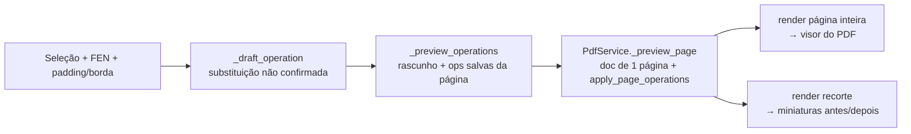

# Plano de Implementação (Skill): Editor de Diagramas de Xadrez em PDF

**Versão:** 1.5 (não travar e não perder trabalho)  
**Status:** MVP entregue → endurecimento para Beta  
**Stack alvo:** Python 3.10+ (rodando em 3.13)  
**Última revisão:** 2026-08-08  

---

## 0) Estado atual (2026-08-08)

O MVP está **entregue e em uso** sobre livros reais (ex.: *A Matter of Endgame
Technique*, 898 páginas). O que existe hoje:

| Área | Situação |
|---|---|
| Abrir/navegar/renderizar PDF | ✅ pronto (`pdf_service.PdfService`) |
| Seleção manual de diagrama | ✅ pronto (`widgets.SelectablePageWidget`) |
| Reconhecimento OCR (seleção / página / PDF inteiro) | ✅ via API externa (`ocr_api`) |
| Editor visual de tabuleiro + paleta de peças | ✅ pronto (`widgets.BoardEditorWidget`) |
| Substituição vetorial (Merida embutida / CairoSVG) + fallback raster | ✅ pronto (`renderer`) |
| Whiteout por lado, borda, link Lichess | ✅ pronto |
| Apagamentos (erase) | ✅ pronto |
| **Prévia ao vivo do resultado (WYSIWYG)** | ✅ **novo — ver §21** |
| **Fila de conferência dos candidatos do OCR** | ✅ **novo — ver §23** |
| Projeto/checkpoint versionado (`schema_version=8`) | ✅ pronto |
| Modo Estudo (PGN, variantes, comentários por lance) | ✅ pronto (`study`) |
| **Workers em segundo plano (OCR em lote / exportação)** | ✅ **novo — ver §25.1** |
| **Undo/redo no modo edição** | ✅ **novo — ver §25.2** |
| **Autosave do projeto** | ✅ **novo — ver §25.3** |
| **CI com `pytest`** | ✅ **novo — ver §25.4** |
| Logs estruturados em arquivo | ✅ novo (`logging_config`) |
| Detecção 100% local (OpenCV/PyTorch) | ❌ não implementado — o OCR é remoto |
| Empacotamento (executável Windows) | ❌ pendente |

**Desvio relevante em relação ao plano original:** o reconhecimento não usa o
pipeline OpenCV + PyTorch descrito nas §5 e §6. Ele delega para um endpoint HTTP
externo (`helpman.komtera.lt/chessocr`). Isso acelerou muito o MVP, mas traz três
consequências que precisam de decisão explícita (ver §22.1):

1. **Privacidade:** "Detectar no PDF" envia *todas as páginas renderizadas* do
   livro para um servidor de terceiros.
2. **Disponibilidade:** sem internet (ou com o endpoint fora do ar) o
   reconhecimento automático simplesmente não funciona.
3. **Custo/tempo:** 898 páginas = 898 requisições HTTP sequenciais na thread da UI.

---

## 1) Objetivo do Produto

Construir uma aplicação desktop que:

1. **Encontra diagramas de xadrez** em páginas de PDFs (escaneados e/ou digitais).
2. **Reconhece a posição** (peças por casa) e gera **FEN** confiável.
3. **Substitui o diagrama original** (baixa qualidade) por um **diagrama em alta qualidade**, preferencialmente **vetorial**, preservando:
   - tamanho (largura/altura),
   - posição (coordenadas exatas na página),
   - e layout do documento (sem deslocar texto/elementos).

### Resultados esperados
- PDF final com diagramas nítidos (vetor ou raster HQ), alinhados exatamente onde estavam.
- Fluxo de correção eficiente: o usuário consegue validar/corrigir em poucos cliques.
- Pipeline reutilizável (CLI) + GUI (produtividade).

---

## 2) Escopo, Não‑Escopo e Requisitos

### 2.1 Escopo (MVP)
- Abrir PDF, navegar páginas, renderizar preview.
- Detecção automática de candidatos a diagrama (com fallback manual).
- Extração do tabuleiro (crop + correção de perspectiva).
- Reconhecimento das 64 casas (classe vazia + 12 peças).
- Montagem do **piece placement** do FEN (ex.: `rnbqkbnr/pppppppp/8/...`).
- Editor visual para correção (clique nas casas + paleta de peças).
- Inserção no PDF:
  - **Preferência**: inserção de **vetor** (via “show page” de um PDF gerado do SVG).
  - **Fallback**: PNG HQ (300–600 DPI efetivos) com antialias.

### 2.2 Não‑Escopo (por enquanto)
- Reconhecer comentários, setas, marcações manuais (círculos, arrows), coordenadas (a‑h/1‑8) ou texto em volta.
- Reconhecer diagramas **parciais** (menos de 8×8) no MVP (pode entrar em v2).
- “Reflow” de PDFs (o produto é **edição visual**, não re-diagramação do livro).

### 2.3 Requisitos não‑funcionais (meta)
- **Precisão**: minimizar trocas graves (rei/rainha, cor errada).
- **Rapidez**: processar uma página típica em < 1s (CPU) após cache.
- **Confiabilidade**: salvar trabalho incremental (projeto com estado).
- **Reprodutibilidade**: pipeline determinístico para batch/CLI.
- **Auditabilidade**: logs + export de relatório (página, bbox, FEN, confiança).
- **Portabilidade**: instalação reproduzível em Windows (prioritário) e Linux.

---

## 3) Stack Tecnológico (atualizado)

| Componente | Tecnologia | Observações práticas |
|---|---|---|
| Linguagem | Python 3.9+ | Recomenda-se 3.11+ para performance/typing |
| GUI | **PySide6** (ou PyQt6) | PySide6 costuma ser mais simples em licenças; ambos ok |
| Render PDF | PyMuPDF (fitz) | Render rápido + edição sólida |
| CV | OpenCV (cv2) | Pré-processamento + detecção + perspectiva |
| ML | PyTorch | Classificação 13 classes |
| Xadrez | python-chess | Validação + geração de SVG |
| Vetor (opcional) | **CairoSVG** | Converter SVG → PDF (mantém vetor) |
| Raster HQ | Pillow | Redimensionamento/antialias e export |

> Nota: manter o core sem depender de CairoSVG é útil (fallback raster).

---

## 4) Arquitetura (módulos e contratos)

### 4.1 Visão macro (pipeline)
```mermaid
flowchart LR
  A[PDF: página] --> B[Render preview (pixmap)]
  B --> C{Auto-detect tabuleiros}
  C -->|OK| D[Extrair ROI + corrigir perspectiva]
  C -->|Falha| E[Seleção manual ROI]
  D --> F[Grid 8x8 + normalização]
  E --> F
  F --> G[Inferência ML por casa]
  G --> H[Montagem FEN + score/confiança]
  H --> I[Editor visual (correções)]
  I --> J[Render HQ (SVG->PDF ou PNG HQ)]
  J --> K[Inserir/overlay no PDF]
  K --> L[Salvar novo PDF + relatório]
```

### 4.2 Separação em camadas (recomendação)
- **Core (sem GUI)**: `cv`, `ml`, `chess`, `pdf`, `pipeline`
- **GUI**: apenas orquestra e chama o core (facilita testes)
- **CLI/Batch**: reusa o mesmo core

### 4.3 Contratos (dados)
Padronize estruturas simples para “passar dados” entre módulos.

**Tipos recomendados:**
- `DiagramCandidate`: `page_num`, `bbox_pdf` (Rect), `bbox_img` (x,y,w,h), `score_detect`
- `BoardCrop`: imagem corrigida 8×8, metadados de orientação e escala
- `InferenceResult`: matriz 8×8 de classes + confidências
- `FenResult`: FEN + validações + score
- `ReplaceOp`: `page_num`, `bbox_pdf`, `asset_bytes`, `asset_type` (pdf|png), `dpi`, `method`

---

## 5) Detecção de Diagramas (OpenCV) — robustez real

### 5.1 Estratégia híbrida (melhor que “apenas contornos”)
1. **Pré-processamento adaptativo**:
   - grayscale
   - `cv2.GaussianBlur` leve
   - binarização adaptativa (ou Otsu + morfologia)
2. **Heurística de “grid 8×8”**:
   - Hough Lines (linhas horizontais/verticais)
   - ou detecção de padrões repetitivos (picos em projeções)
3. **Validação geométrica**:
   - quadrilátero convexo
   - proporção ~ 1:1
   - presença de linhas internas (mínimo de 7 divisões em cada direção)
4. **Score final** combinando:
   - “gridness” + área + retidão + contraste

> Isso reduz falsos positivos (ex.: tabelas, gráficos, quadros decorativos).

### 5.2 Correção de perspectiva e normalização
- Encontrar 4 cantos (linhas → interseções ou contorno principal).
- `cv2.getPerspectiveTransform` + warp para um **quadrado canônico** (ex.: 512×512).
- Definir grid 8×8 com coordenadas **inteiras** (casas exatas).

### 5.3 Orientação do tabuleiro (importante)
Problema: alguns diagramas podem estar invertidos (brancas em cima).

Abordagens:
- **Heurística por material**: peões tendem a estar em ranks 2/7 (em posições “normais”).
- **Heurística por “legalidade fraca”**: ambos os reis devem existir e não podem ocupar mesma casa.
- **Auto-rotacionar**: testar 4 rotações; escolher a que maximiza a confiança global da inferência + validade.

---

## 6) Reconhecimento de Peças (ML) — plano mais operacional

### 6.1 Classes
- 0: vazio
- 1–6: P, N, B, R, Q, K (brancas)
- 7–12: p, n, b, r, q, k (pretas)

### 6.2 Dataset sintético (domínio‑randomizado)
Além do seu plano original, incluir:
- **Variação de temas**: contraste baixo, papel amarelado, sombras.
- **Variação de impressão**: halftone, bleed, artefatos de scanner.
- **Bordas/ruído de recorte**: uma casa “invade” a outra (padding aleatório).
- **Linhas grossas/falhas**: bordas apagadas, linhas duplas.
- **Compressão**: JPEG com qualidade variável + downscale/upsample.

Sugestão de geração:
- Renderizar o board inteiro → depois cortar as 64 casas.
- Guardar metadados: fonte/tema/seed/transform (para rastrear erros).

### 6.3 Modelo e calibração
- Arquitetura: **ResNet18** ou **MobileNetV3-Small** adaptada para 1 canal.
- Treino:
  - `CrossEntropyLoss`
  - `WeightedRandomSampler` ou pesos por classe (vazio domina)
  - Augmentations (torchvision transforms) consistentes com seu CV
- Métricas:
  - acurácia por classe
  - matriz de confusão
  - “board accuracy”: % de tabuleiros com **64/64** corretas (métrica dura)
  - “edit distance” (número médio de casas erradas por diagrama)

### 6.4 Rejeição (não forçar resposta)
Introduzir um estado **UNKNOWN** via regra:
- se `max_prob < threshold` numa casa, marcar como “incerta”
- GUI exige revisão das casas incertas (fluxo assistido)

Isso reduz erros silenciosos.

### 6.5 Fine‑tuning com feedback do usuário
- Quando o usuário corrige:
  - salvar `crop_board.png`, `grid_cells/*.png`, `fen_final.txt`, `rotation`, `bbox`
- Periodicamente:
  - re-treinar (ou fine-tune) com esses exemplos reais

---

## 7) Montagem e Validação do FEN (python-chess)

### 7.1 FEN mínimo vs completo
Para diagramas, o essencial é o **piece placement**.  
Você pode gerar:
- **FEN mínimo**: `piece_placement w - - 0 1` (default)
- **FEN estendido (opcional)**: permitir usuário definir lado a jogar

### 7.2 Validações úteis (sem virar “motor”)
- Exatamente 1 rei branco e 1 rei preto.
- Nenhuma casa com duas peças.
- Peões não podem estar na 1ª/8ª fileira (regra prática; exceções raras podem ser tratadas como aviso).
- Se falhar, destacar como **warning** e pedir revisão.

---

## 8) Renderização HQ (Vetor preferencial + fallback)

### 8.1 Vetor (recomendado)
Pipeline:
1. `python-chess` gera SVG do tabuleiro.
2. Converter SVG → **PDF vetorial** (CairoSVG).
3. Inserir no PDF alvo via PyMuPDF usando “show page” (colocar a página do PDF gerado dentro do retângulo do diagrama).

**Vantagens:**
- zoom infinito (texto/linhas nítidos)
- arquivo final menor que PNG gigante (muitas vezes)

### 8.2 Raster fallback (alta qualidade)
- Gerar SVG → raster (PNG) com dimensão suficiente para a bbox no PDF:
  - objetivo: 300–600 DPI efetivos no retângulo final
- Inserir com `page.insert_image(rect, stream=...)`

---

## 9) Inserção no PDF (PyMuPDF) — detalhes que evitam bugs

### 9.1 Conversão de coordenadas (pixel ↔ PDF)
- Render do preview usa uma `Matrix(scale_x, scale_y)`.
- Armazene sempre:
  - `matrix` usada
  - bbox no espaço de **imagem**
  - bbox no espaço de **PDF points**
- Quando usuário seleciona no preview:
  - converter para PDF via inversa da matrix

Cuidados obrigatórios para não deslocar overlay:
- considerar `page.rotation` (0/90/180/270) na ida e volta de coordenadas.
- trabalhar com `page.rect`/`cropbox` de forma explícita (não assumir origem simples).
- guardar um `TransformContext` por página: `rotation`, `cropbox`, `matrix_preview`, `zoom`, `dpi`.
- padronizar uma função única de conversão (evitar lógica duplicada GUI/core).

Contrato sugerido:
```python
@dataclass
class TransformContext:
    page_num: int
    rotation: int
    cropbox: tuple[float, float, float, float]
    matrix_preview: tuple[float, float, float, float, float, float]

def img_rect_to_pdf_rect(img_rect, ctx: TransformContext) -> tuple[float, float, float, float]:
    """Converte bbox do preview para coordenadas PDF points, respeitando rotação/crop."""
    ...
```

Teste mínimo obrigatório:
- para cada página de teste (incluindo rotações 90/180/270), validar round-trip:
  - `pdf -> img -> pdf` com erro absoluto <= 1.0 point por borda.

### 9.2 Estratégia “não destrutiva”
- Não remover a imagem antiga (pode ser difícil dependendo do PDF).
- Fazer **overlay** com o diagrama novo por cima.
- Opcional (v2): “whiteout” do fundo com um retângulo branco antes (se o diagrama original sangra bordas).

Ajuste recomendado para produção:
- tornar **whiteout padrão configurável** (`on` por default no MVP).
- ordem de desenho:
  1) retângulo branco no `bbox_pdf` (com pequena margem opcional, ex.: +0.5 pt)
  2) overlay do diagrama vetorial/raster
- oferecer opção de export:
  - `overlay_only` (sem whiteout)
  - `whiteout_overlay` (padrão)
- incluir preview “antes/depois” com e sem whiteout para inspeção rápida.

### 9.3 PDFs protegidos
- Detectar criptografia/senha.
- Se não puder editar, exportar como **novo PDF** (mesmo assim pode falhar se for “no copy/edit” estrito).

---

## 10) GUI (PySide6) — UX para produtividade

### 10.1 Layout sugerido (MVP)
- Esquerda: viewer do PDF (zoom/pan, página atual)
- Direita (tabs):
  - **Detecção**: lista de candidatos (página, miniatura, score)
  - **Edição**: tabuleiro interativo + FEN + warnings
  - **Exportação**: opções de saída + relatório

### 10.2 Editor de tabuleiro (muito melhor que “só campo FEN”)
- Grid 8×8 clicável
- Paleta de peças (brancas/pretas/vazio)
- Atalhos:
  - clique direito para limpar
  - scroll para alternar peça
  - Ctrl+Z / Ctrl+Y (undo/redo)
- Campo FEN sincronizado (edição textual também funciona)

### 10.3 Preview antes de gravar
- “Antes / Depois”:
  - overlay do diagrama HQ no preview da página
  - toggle para comparar

### 10.4 Estado do projeto
- Salvar automaticamente um `.json` (checkpoint):
  - diagramas detectados, FENs confirmados, bboxes
- Se o app fechar, continua de onde parou.

Reforço de robustez:
- incluir `schema_version` e `app_version` no topo do arquivo.
- incluir `source_pdf_fingerprint` (hash + tamanho + mtime) para detectar troca de arquivo.
- incluir migração de schema (`v1 -> v2`) com fallback seguro e log.

---

## 11) Estrutura de Diretórios (recomendada)

```
chess_pdf_editor/
├── README.md
├── pyproject.toml              # (ou requirements.txt)
├── src/
│   └── chess_pdf_editor/
│       ├── app/                # GUI
│       ├── pipeline/           # orquestração do core
│       ├── pdf/                # PyMuPDF wrapper
│       ├── cv/                 # detecção/crops/perspectiva
│       ├── ml/                 # modelo, dataloaders, inferência
│       ├── chess/              # FEN, SVG render, validações
│       ├── storage/            # cache + projetos + relatórios
│       └── utils/              # logging, types, configs
├── assets/
│   ├── fonts/
│   └── icons/
├── data/
│   ├── synthetic/
│   ├── real_samples/
│   ├── feedback/
│   └── models/
├── scripts/
│   ├── gen_dataset.py
│   ├── train.py
│   └── batch_replace.py
└── tests/
    ├── test_fen_validation.py
    ├── test_grid_detection.py
    └── test_pdf_overlay.py
```

---

## 12) Snippets (mais “concretos” e prontos para evoluir)

### 12.1 Interface do pipeline (core)
```python
from dataclasses import dataclass
from typing import List, Optional, Tuple

@dataclass
class DiagramCandidate:
    page_num: int
    bbox_pdf: Tuple[float, float, float, float]   # x0,y0,x1,y1 (points)
    score: float

@dataclass
class FenResult:
    fen: str
    confidence: float
    warnings: List[str]

def process_candidate(pdf_path: str, candidate: DiagramCandidate) -> FenResult:
    ...
```

### 12.2 Inserção vetorial via “show page” (conceito)
- Gerar um PDF de 1 página contendo o diagrama (a partir do SVG).
- Inserir essa página dentro do `rect` na página alvo.

```python
import fitz  # PyMuPDF

def overlay_pdf_page(target_doc: fitz.Document, page_num: int, rect, diagram_pdf_bytes: bytes):
    src = fitz.open("pdf", diagram_pdf_bytes)
    page = target_doc[page_num]
    page.show_pdf_page(fitz.Rect(rect), src, 0)  # coloca vetor dentro do retângulo
```

### 12.3 Inserção raster (fallback)
```python
import fitz

def overlay_png(target_doc: fitz.Document, page_num: int, rect, png_bytes: bytes):
    page = target_doc[page_num]
    page.insert_image(fitz.Rect(rect), stream=png_bytes, overlay=True)
```

---

## 13) Testes, QA e Métricas

### 13.1 Conjunto “golden”
- Separar 30–100 diagramas reais representativos (vários livros/estilos).
- Para cada diagrama:
  - bbox correta
  - FEN correto
  - snapshot do “antes/depois” para inspeção visual

### 13.2 Métricas operacionais
- % de diagramas detectados automaticamente (sem intervenção)
- % de FENs corretos sem correção
- # médio de casas corrigidas por diagrama
- tempo médio por diagrama (com/sem correção)

### 13.3 Gates de aceite (MVP/Beta)
Definir critérios objetivos para evitar “pronto subjetivo”.

MVP (mínimo):
- detecção automática >= 70% em conjunto golden.
- FEN correto sem edição >= 85% (com fallback manual sempre disponível).
- tempo médio por diagrama (com revisão) <= 20s em CPU.
- erro de alinhamento visual <= 1.5 pt no PDF final.

Beta (meta):
- detecção automática >= 85% em conjunto golden.
- FEN correto sem edição >= 93%.
- # médio de casas corrigidas <= 1.0 por diagrama.
- tempo médio por diagrama (com revisão) <= 10s.

---

## 14) Riscos e Mitigações (atualizado)

| Risco | Impacto | Mitigação prática |
|---|---|---|
| Falsos positivos (tabelas/quadros) | Troca indevida no PDF | Score + confirmação visual + lista de candidatos |
| Baixa resolução extrema | Confusão peça/vazio | Threshold + casas “incertas” forçando revisão |
| Estilos muito diferentes | queda de precisão | domain randomization + feedback + fine-tuning |
| Diagramas inclinados | grid errado | perspectiva robusta + validação por “gridness” |
| PDF protegido | sem edição | exportar novo PDF / alertar usuário |
| Desalinhamento (bbox) | overlay fora do lugar | conversão coordenadas rigorosa + preview antes de salvar |

---

## 15) Roadmap

### Concluído

**Sprint 1 — core mínimo** ✅
- Render PDF + seleção manual de ROI
- Inserção raster (PNG HQ) no PDF

**Sprint 2 — correção assistida** ✅
- Editor visual do tabuleiro + paleta de peças
- Checkpoint versionado (`schema_version`) + restauração automática de sessão

**Sprint 3 — reconhecimento** ✅ (com desvio: OCR remoto, não ML local)
- Reconhecer seleção / página / PDF inteiro
- Deduplicação por IoU + heurística anti-falso-positivo (>50% da página)
- Retomada do lote na página pendente após cancelamento

**Sprint 4 — vetor + acabamento** ✅
- Merida embutida → PDF vetorial; CairoSVG como segundo caminho; raster como fallback
- Whiteout por lado + borda + link Lichess
- Apagamentos independentes das substituições

**Sprint 4.5 — prévia ao vivo (2026-08-08)** ✅ — ver §21
- Substituição visível na página **antes** de confirmar
- Miniaturas antes/depois do diagrama
- Garantia WYSIWYG coberta por teste (prévia == PDF exportado, byte a byte)

**Sprint 5 — "não travar e não perder trabalho" (2026-08-08)** ✅ — ver §25
- Workers em segundo plano para OCR em lote e exportação
- Undo/redo de substituições, apagamentos e candidatos
- Autosave do projeto em intervalo fixo + ao fechar
- CI com `pytest` (GitHub Actions, Windows + Ubuntu)
- Extras da §22.4 que vinham junto: endpoint do OCR centralizado e persistido,
  `confidence` preenchida, `QSettings` injetável, logs estruturados

### Próximo — Sprint 6: precisão e ajuste fino

1. **Manipular a seleção sem redesenhar**: alças de redimensionamento e
   deslocamento por setas do teclado (passo de 0,25 pt com Shift).
2. **Alinhamento automático da bbox** ao diagrama detectado (snap às bordas do
   tabuleiro por projeção de linhas).
3. **Auto-orientação**: testar 4 rotações e escolher a de maior plausibilidade.
4. **Relatório de alterações** (CSV/JSON) com página, bbox, FEN, origem e avisos.

### Sprint 7: independência do OCR remoto

1. Detector local de diagramas (OpenCV: Hough + "gridness") como *primeira*
   passada — barato, offline, e reduz drasticamente as chamadas HTTP.
2. Classificador local das 64 casas (§6) usado quando o detector local acha um
   tabuleiro; endpoint remoto vira reforço opcional, não dependência.
3. Aviso explícito na UI antes do primeiro envio de páginas para servidor externo.

### Sprint 8: empacotamento e distribuição

1. Executável Windows (PyInstaller/Nuitka) com assets embutidos.
2. Migrações explícitas de `project_state.json` entre versões de schema.
3. Documentação de desenvolvimento no README.

---

## 16) Requisitos de Instalação (sugestão)

### requirements.txt (mínimo)
```txt
PySide6>=6.6.0
PyMuPDF>=1.23.0
opencv-python>=4.8.0
numpy>=1.24.0
pillow>=10.0.0
python-chess>=1.999
torch>=2.0.0
torchvision>=0.15.0
```

### extras (vetor)
```txt
cairosvg>=2.7.0
```

### Notas de instalação reproduzível (Windows/Linux)
- Priorizar Python 3.11 x64.
- Fixar versões em ambiente de release (`requirements-lock.txt`).
- `torch/torchvision`: instalar pares compatíveis (CPU ou CUDA) no mesmo índice.
- `cairosvg` no Windows pode exigir runtime nativo; manter fallback raster ativo por padrão.
- Validar setup com script `scripts/check_env.py` (import + versão + smoke test).

---

## 17) Entregáveis recomendados (para “fechar” o projeto)
- App GUI (Windows/Linux) com instalador/zip.
- CLI para batch (`batch_replace.py`) e logs.
- Pasta `golden/` com casos reais e um script de avaliação.
- Modelo `.pth` versionado + `model_card.md` (dados, métricas, limitações).
- `project_state.json` para retomar trabalho.

---

## 18) Checklist de aceitação (MVP)
- [ ] Selecionar diagrama manualmente e gerar FEN
- [ ] Corrigir FEN no editor visual
- [ ] Gerar diagrama HQ e inserir no PDF no mesmo lugar
- [ ] Salvar PDF de saída sem quebrar layout
- [ ] Reabrir projeto e continuar (checkpoint)
- [ ] Rodar em pelo menos 3 PDFs reais diferentes

---

## 19) Backlog de melhorias futuras

Esta seção registra melhorias identificadas na revisão do projeto em 2026-05-17. Elas não fazem parte de uma implementação imediata, mas servem como guia para as próximas etapas.

### 19.1 Prioridade alta

- [ ] **Mover OCR e exportação para workers em segundo plano**
  - Hoje o reconhecimento por OCR e a exportação do PDF rodam na thread principal da interface.
  - Para PDFs grandes ou endpoints lentos, a janela pode parecer travada.
  - Implementar com `QThread`, `QRunnable`/`QThreadPool` ou uma camada equivalente de worker.
  - Manter progresso, cancelamento e propagação clara de erros para a UI.

- [ ] **Dividir `app.py` em módulos menores**
  - O arquivo principal concentra UI, OCR, estado do projeto, estudo, overlays e exportação.
  - Separação sugerida:
    - `main_window.py`: janela principal e composição de telas.
    - `study_panel.py`: painel/modo de estudo.
    - `ocr_workflow.py`: reconhecimento de seleção, página atual e lote.
    - `operations.py`: criação, atualização e validação de operações.
    - `settings.py`: preferências persistidas via `QSettings`.
  - Objetivo: reduzir acoplamento, facilitar testes e tornar futuras mudanças menos arriscadas.

- [ ] **Adicionar GitHub Actions para testes**
  - Rodar `pytest` automaticamente em push e pull request.
  - Começar com matriz simples em Windows e Python estável.
  - Validar pelo menos testes unitários sem dependência de interface gráfica real.

### 19.2 Prioridade média

- [ ] **Melhorar configuração do OCR**
  - Evitar endpoint duplicado/hardcoded em múltiplos lugares.
  - Centralizar endpoint padrão, fallback e timeout.
  - Persistir endpoint escolhido pelo usuário em `QSettings`.
  - Permitir configuração por variável de ambiente para uso em scripts e ambientes automatizados.

- [ ] **Adicionar logs estruturados**
  - Registrar falhas de OCR, renderização, exportação e carregamento de projetos.
  - Evitar `except Exception` silencioso em pontos críticos.
  - Usar `logging` com arquivo local opcional, por exemplo `logs/chess_pdf_editor.log`.
  - Exibir mensagens amigáveis na UI, mantendo detalhes técnicos no log.

- [ ] **Criar migrações explícitas para `project_state.json`**
  - O projeto já tem `schema_version`.
  - Adicionar funções de migração entre versões para preservar compatibilidade com projetos antigos.
  - Testar carregamento de arquivos de estado salvos por versões anteriores.

- [ ] **Ampliar testes de integração**
  - Testar aplicação de overlay em PDF real de amostra.
  - Testar inserção de link Lichess.
  - Testar salvar/carregar projeto com operações, apagamentos e posições de estudo.
  - Testar OCR com mock HTTP, sem depender da internet.
  - Testar renderização com Merida, sem Merida e com fallback raster.

### 19.3 Prioridade baixa / empacotamento

- [ ] **Gerar executável Windows**
  - Avaliar PyInstaller ou Nuitka.
  - Incluir assets necessários, como fonte Merida e sons.
  - Criar script de build reproduzível.
  - Validar execução em máquina limpa sem ambiente de desenvolvimento.

- [ ] **Melhorar relatório de processamento**
  - Exportar CSV/JSON com página, bbox, FEN, origem da operação, confiança e avisos.
  - Útil para auditoria e comparação entre versões do OCR.

- [ ] **Documentar fluxo de desenvolvimento**
  - Adicionar seção no README com:
    - instalação para desenvolvimento;
    - execução de testes;
    - execução do app;
    - padrão para commits/releases.

### 19.4 Ordem sugerida de implementação

1. Adicionar GitHub Actions com `pytest`.
2. Criar workers para OCR/exportação sem travar a interface.
3. Separar `app.py` em módulos menores.
4. Centralizar configuração do OCR.
5. Adicionar logs estruturados.
6. Implementar migrações de projeto.
7. Expandir testes de integração.
8. Preparar empacotamento Windows.

---

## 20) Backlog de melhorias de interface e experiência do usuário

Esta seção registra a análise de UX feita em 2026-05-17. O objetivo é reduzir a sensação de interface poluída sem remover funcionalidades importantes.

### 20.1 Diagnóstico atual

- [ ] **Painel direito com excesso de responsabilidades**
  - O painel lateral mistura editor de tabuleiro, OCR, lista de substituições, áreas apagadas, FEN, acabamento, fonte Merida, endpoint OCR e estudo.
  - O usuário vê muitas decisões ao mesmo tempo, mesmo quando ainda não selecionou um diagrama.

- [ ] **Muitos botões com o mesmo peso visual**
  - Ações como reconhecer seleção, reconhecer página, reconhecer PDF inteiro, substituir, apagar área, remover e limpar aparecem com destaque semelhante.
  - Falta uma ação principal clara para cada momento do fluxo.

- [ ] **Configurações avançadas visíveis demais**
  - Endpoint OCR, caminho da fonte Merida, padding detalhado, borda e link Lichess são úteis, mas não deveriam competir com as ações principais.

- [ ] **Comandos duplicados em painel, toolbar e menus**
  - A duplicação é boa para produtividade, mas aumenta a carga visual quando os mesmos comandos aparecem em vários lugares.

- [ ] **Editor de tabuleiro pouco direto**
  - A seleção de peça por combo funciona, mas exige mais leitura e cliques do que uma paleta visual de peças.

### 20.2 Direção de redesign

- [ ] **Organizar a edição como fluxo por etapas**
  - Substituir ou reorganizar abas técnicas por etapas de trabalho:
    1. Selecionar
    2. Reconhecer
    3. Corrigir
    4. Aplicar
    5. Exportar
  - O painel deve indicar a próxima ação provável, não mostrar todas as ações com o mesmo destaque.

- [ ] **Criar painel contextual de edição**
  - Quando não houver PDF aberto: mostrar estado vazio com ação `Abrir PDF`.
  - Quando houver PDF sem seleção: orientar para selecionar um diagrama.
  - Quando houver seleção: destacar `Reconhecer seleção`.
  - Quando houver FEN válido: destacar `Adicionar substituição`.
  - Quando houver operações: destacar `Exportar PDF`.

- [ ] **Mover opções avançadas para área recolhível ou preferências**
  - Mover para `Avançado`:
    - endpoint OCR;
    - fonte Merida;
    - padding detalhado;
    - borda;
    - inclusão de link Lichess;
    - aplicar estilo em todas as substituições.
  - Alternativa futura: criar diálogo `Preferências`.

- [ ] **Unificar listas operacionais**
  - Trocar listas separadas de substituições, apagamentos e FENs por uma lista principal de `Alterações`.
  - Cada item deve indicar tipo, página e resumo:
    - `Diagrama`, com FEN resumido;
    - `Apagamento`, com página e área;
    - `Estudo`, se for mantido no mesmo painel.
  - Manter filtros ou abas secundárias apenas se a lista crescer demais.

- [ ] **Simplificar toolbar**
  - Manter na toolbar apenas comandos globais:
    - abrir PDF;
    - carregar/salvar projeto;
    - exportar PDF;
    - modos leitura/edição/estudo;
    - navegação de página;
    - zoom.
  - Remover ou evitar comandos de OCR/substituição na toolbar principal.

- [ ] **Melhorar rótulos**
  - `Reconhecer pagina atual` -> `Reconhecer página`
  - `Encontrar diagramas no PDF` -> `Detectar no PDF`
  - `Substituir no PDF` -> `Adicionar substituição`
  - `Apagar area` -> `Adicionar apagamento`
  - `Acabamento` -> `Aparência`
  - `Posicoes` -> `FEN`

- [ ] **Criar paleta visual de peças**
  - Substituir o combo `Peça ativa` por botões/ícones de peças.
  - Incluir opção de casa vazia.
  - Manter clique direito para limpar casa.
  - Usar destaque visual na peça ativa.

### 20.3 Layout-alvo sugerido

```text
PDF / Preview da página
└── seleção visual, overlays de alterações e zoom

Painel lateral: Edição
├── Seleção
│   ├── Reconhecer seleção
│   ├── Reconhecer página
│   └── Detectar no PDF
├── Posição
│   ├── editor de tabuleiro
│   ├── paleta visual de peças
│   ├── FEN
│   └── avisos de validação
├── Aplicar
│   ├── Adicionar substituição
│   └── Adicionar apagamento
├── Alterações
│   ├── lista única de alterações
│   ├── remover selecionada
│   └── limpar
└── Avançado
    ├── OCR endpoint
    ├── fonte Merida
    ├── padding
    ├── borda
    └── link Lichess
```

### 20.4 Etapas sugeridas para implementação

1. **Limpeza rápida de rótulos e hierarquia**
   - Renomear botões/abas.
   - Reordenar ações por fluxo.
   - Reduzir comandos duplicados visíveis.
   - Baixo risco, sem mudança estrutural profunda.

2. **Área avançada recolhível**
   - Esconder endpoint OCR, fonte Merida, padding, borda e link Lichess em `Avançado`.
   - Manter valores atuais e comportamento existente.
   - Reduz bastante a poluição visual sem mexer na lógica central.

3. **Painel contextual de edição**
   - Criar estados de UI conforme o progresso: sem PDF, sem seleção, seleção ativa, FEN válido, operações prontas.
   - Destacar uma ação principal por estado.
   - Exige cuidado com sinais/eventos da UI.

4. **Lista única de alterações**
   - Consolidar substituições e apagamentos em uma visão principal.
   - Manter compatibilidade com as estruturas internas atuais.
   - Exige revisão de seleção, remoção, foco e overlays.

5. **Paleta visual de peças**
   - Substituir combo por botões de peças.
   - Melhorar velocidade de correção manual.
   - Pode ser implementado dentro do `BoardEditorWidget`.

6. **Polimento final**
   - Ajustar espaçamentos, tamanhos mínimos, estados vazios e mensagens da barra de status.
   - Revisar modo estudo para seguir a mesma linguagem visual.
   - Fazer teste manual com PDFs reais em telas pequenas e grandes.

### 20.5 Critérios de aceite para a nova interface

- [ ] O usuário consegue identificar a próxima ação principal em até 3 segundos.
- [ ] Configurações avançadas não aparecem por padrão.
- [ ] O painel lateral não exige rolagem para executar o fluxo básico em tela 1500x900.
- [ ] O fluxo básico é possível com estes passos visíveis:
  1. abrir PDF;
  2. selecionar diagrama;
  3. reconhecer seleção;
  4. corrigir FEN/tabuleiro;
  5. adicionar substituição;
  6. exportar PDF.
- [ ] A correção manual no tabuleiro exige menos cliques do que o combo atual.
- [ ] Comandos destrutivos, como remover/limpar, têm menos destaque que ações principais.

---

## 21) Prévia ao vivo do resultado (implementado em 2026-08-08)

### 21.1 Problema

Até aqui o fluxo era **cego**: o usuário selecionava a área, corrigia a posição,
clicava em `Adicionar substituição` e só descobria como o diagrama tinha ficado
depois de exportar o PDF inteiro e abri-lo em outro programa. Erros de padding,
borda ou bbox custavam um ciclo completo de exportação.

### 21.2 Princípio de projeto: um único caminho de código

A prévia **não** reimplementa o desenho do diagrama em Qt. Ela roda exatamente a
mesma função que a exportação usa:

```text
apply_page_operations(page, operations, erase_operations, whiteout, include_lichess_link)
        ├── apply_operations_to_pdf(...)      → grava o PDF final
        └── PdfService._preview_page(...)     → alimenta a prévia na tela
```

Consequência: qualquer divergência entre "o que vejo" e "o que exporto" seria um
bug de renderização do PyMuPDF, não uma diferença de implementação. Isso está
travado por teste (`tests/test_preview.py::test_preview_matches_exported_pdf`),
que compara os PNGs da prévia e do PDF exportado **byte a byte**.

### 21.3 Arquitetura



Pontos-chave:

- **Documento de prévia de uma página só.** `insert_pdf(from_page=n, to_page=n)`
  copia apenas a página atual, então o custo não depende do tamanho do livro.
- **Cache por assinatura.** A chave cobre página, whiteout, link, fonte Merida
  ativa e a identidade visual de cada operação (retângulo, FEN, paddings, borda).
  Mudou algo → reconstrói; não mudou → reaproveita.
- **Cache de diagramas renderizados.** Mesma FEN + mesmo tamanho reaproveita o
  PDF/PNG do tabuleiro (`_BOARD_PDF_CACHE`), o que também acelera a exportação em
  lote de livros com posições repetidas.
- **Debounce de 140 ms.** Arrastar a seleção ou clicar várias casas seguidas não
  dispara um render por evento.
- **A seleção sobrevive à troca de bitmap.** `_apply_page_pixmap` salva e
  restaura o retângulo, com uma flag `_refreshing_view` para não realimentar o
  próprio ciclo de atualização.
- **Rascunho tem prioridade sobre a operação salva.** Se o rascunho cobre uma
  substituição existente (IoU ≥ 0,80), a salva é omitida da prévia — assim editar
  uma substituição já aplicada mostra a edição, não a versão antiga.
- **Redações em lote.** Todos os whiteouts e apagamentos da página viram
  `add_redact_annot` e um único `apply_redactions()`. Além de mais rápido, isso
  elimina o risco de uma redação posterior apagar um overlay já desenhado.

### 21.4 Interface

| Elemento | Onde | Função |
|---|---|---|
| `Prévia do resultado` (Ctrl+D) | toolbar + menu PDF | alterna a página entre original e resultado |
| `Ver resultado na página` | aba OCR | mesmo toggle, junto do fluxo de edição |
| `Prévia (antes / depois)` | aba OCR | miniaturas lado a lado do diagrama em foco |

Detalhes de comportamento:

- No modo prévia as marcações de trabalho (retângulos azul/laranja/verde) somem,
  para não competir com o resultado real. O título da janela ganha o sufixo
  `[prévia do resultado]`.
- Página sem nenhuma alteração pendente não monta documento de prévia: o
  resultado seria idêntico ao original.
- As miniaturas usam um recorte com 10% de margem, para que padding, borda e o
  link Lichess apareçam no enquadramento.

### 21.5 Ancoragem da posição (correção de 2026-08-08)

A primeira versão montava o rascunho com "seleção atual + FEN atual do editor". Isso
produzia um efeito errado e assustador: ao selecionar o **segundo** diagrama de uma
página, a prévia desenhava por cima dele a posição do **primeiro**, que ainda estava
carregada no editor. Parecia que o app tinha aplicado a substituição errada sozinho.

A correção é uma âncora: `_position_anchor` guarda `(página, retângulo)` da área que
originou a posição carregada. O rascunho só existe quando a seleção atual bate com a
âncora (IoU ≥ 0,40). A âncora é atualizada quando — e só quando — a posição passa a
pertencer àquela área:

| Evento | Âncora vira |
|---|---|
| `Reconhecer seleção` conclui | retângulo refinado pelo OCR |
| Usuário move uma peça / edita a FEN | seleção ativa |
| Foco em uma substituição existente | retângulo da substituição |
| Foco em um candidato | retângulo do candidato |
| `Reconhecer página` | retângulo da primeira detecção |

O limiar de 0,40 é folgado de propósito: reenquadrar a mesma bbox (para ajustar o corte)
mantém o rascunho vivo e a prévia acompanha o ajuste; selecionar outro diagrama zera.

### 21.6 Desempenho medido

Livro real de 1120 páginas, zoom 2.0, uma substituição na página:

| Operação | Tempo |
|---|---|
| Render normal da página (linha de base) | 123 ms |
| Prévia, primeira montagem | 119 ms |
| Prévia, cache válido (só re-render) | 94 ms |
| Prévia após trocar a FEN | 119 ms |
| Miniatura (recorte) | 8 ms |

Ou seja: a prévia custa **o mesmo que abrir a página**. Com o debounce, editar
uma casa aparece na tela em ~260 ms. Se algum PDF patológico fugir disso, o
caminho é mover o render de prévia para o worker do Sprint 5 — a API já é
síncrona e isolada em `PdfService`, então a mudança é local.

### 21.7 Cobertura de teste

`tests/test_preview.py` (motor):
- a área do diagrama realmente muda;
- **prévia == PDF exportado, byte a byte**, em múltiplas páginas com apagamentos;
- o recorte da miniatura bate com o mesmo recorte da página inteira;
- o cache é reaproveitado e invalidado quando a FEN muda;
- geometria preservada em página com `/Rotate 90`;
- operações fora do intervalo de páginas não derrubam a exportação.

`tests/test_app_preview.py` (GUI offscreen):
- rascunho montado a partir de seleção + FEN;
- alternância prévia/original preservando a seleção do usuário;
- prévia acompanha a edição do tabuleiro;
- **prévia do rascunho == prévia depois de confirmar** (o que se vê é o que se obtém);
- miniaturas antes/depois geradas e diferentes entre si;
- **selecionar outro diagrama não reaproveita a posição do anterior** (§21.5);
- reenquadrar a mesma bbox mantém o rascunho.

---

## 22) Backlog da revisão de 2026-08-08

### 22.1 Decisões que precisam do dono do produto

- [ ] **Política de privacidade do OCR em lote.**
  `Detectar no PDF` envia todas as páginas para um servidor de terceiros. Definir:
  aviso explícito na primeira execução? modo offline obrigatório? lista de
  endpoints confiáveis?

- [ ] **Dependência de rede.** Decidir se o detector local (Sprint 7) entra ou se
  o produto assume o endpoint remoto como requisito.

### 22.2 Corrigidos nesta revisão

- [x] **Exportação quebrava com operação fora do intervalo de páginas.**
  `apply_operations_to_pdf` indexava `doc[op.page_num]` sem checar limites
  (apagamentos já checavam). Um projeto salvo e reaberto contra um PDF menor
  derrubava a exportação com `IndexError`. Agora operações fora do intervalo são
  ignoradas, como já acontecia com os apagamentos.

- [x] **Sobrescrita silenciosa no auto-save do OCR em lote.**
  Ao terminar `Detectar no PDF`, o app gravava `<nome>_hq.pdf` sem perguntar,
  sobrescrevendo um arquivo existente. Agora pede confirmação.

- [x] **Fallback raster com Merida gerava caixas vazias.**
  `_render_with_merida_font` desenhava os code points Unicode de xadrez
  (`♙♘♗…`) usando a fonte Merida, que mapeia as peças em letras ASCII. O
  resultado eram glifos `.notdef`. Agora usa o mesmo mapeamento do caminho
  vetorial (`_merida_rows`).

- [x] **Prévia reaproveitava a posição do diagrama anterior.** Ver §21.5.

- [x] **OCR de página/PDF aplicava sem conferência.** Ver §23.

- [x] **Redações repetidas por operação.** Cada whiteout fazia
  `add_redact_annot` + `apply_redactions()` isolado, reescrevendo o content
  stream N vezes por página. Agora é uma passada só.

### 22.3 Prioridade alta

- [x] **Workers em segundo plano** — feito no Sprint 5, ver §25.1.

- [x] **Undo/redo das alterações** — feito no Sprint 5, ver §25.2.

- [x] **CI com `pytest`** — feito no Sprint 5, ver §25.4.

- [ ] **Ajuste fino da seleção.** Não há como mover ou redimensionar um retângulo
  já desenhado — só apagar e redesenhar. Alças + setas do teclado resolvem, e
  agora fazem ainda mais sentido porque o efeito é visível ao vivo.

- [ ] **Dividir `app.py`.** O arquivo passou de 3.700 linhas e concentra UI, OCR,
  estado, estudo, prévia e exportação (separação sugerida na §19.1). O Sprint 5
  já extraiu `workers`, `history`, `autosave` e `logging_config` para módulos
  próprios; o que sobrou em `app.py` é a UI e a orquestração.

### 22.4 Prioridade média

- [x] **`confidence` nunca é preenchida.** `OcrApiClient.predict` agora lê o campo
  da resposta, aceitando os nomes usuais (`confidence`/`conf`/`score`/
  `probability`/`prob`) e normalizando porcentagem para 0–1. Quando o serviço não
  manda nada o valor continua `None` — inventar número seria pior que não ter.

- [x] **Endpoint OCR hardcoded em dois lugares.** O padrão tem um dono só
  (`ocr_api.default_endpoint()`), a escolha do usuário é persistida em
  `QSettings: ocr_endpoint`, e `CHESS_OCR_ENDPOINT` / `CHESS_OCR_TIMEOUT`
  configuram scripts e ambientes automatizados sem tocar na GUI.

- [x] **`QSettings` embutido no `MainWindow.__init__`.** Agora é
  `MainWindow(settings=...)`; as fixtures de teste injetam um `.ini` descartável
  em vez de trocar a classe inteira por monkeypatch.

- [x] **Logs estruturados.** `logging_config` grava em
  `%LOCALAPPDATA%/ChessPdfEditor/logs` com rotação (2 MB × 3). Os `except
  Exception: pass` de render, projeto, fingerprint e redação viraram
  `logger.warning(..., exc_info=True)` — continuam engolindo a exceção (o app não
  pode morrer porque um diagrama falhou), mas deixam rastro.

- [ ] **Link Lichess pode colidir com o texto do livro.** Ele é inserido abaixo
  do diagrama sem whiteout próprio e sem checar se há conteúdo ali.

### 22.5 Novas ferramentas sugeridas

Ordenadas por (valor percebido ÷ esforço):

1. **Modo comparação "cortina"** — arrastar uma linha vertical sobre a página
   revelando original de um lado e resultado do outro. A infraestrutura já
   existe: são dois `RenderedPage` do mesmo tamanho.

2. **Aplicar estilo por lote com pré-visualização** — hoje
   `Aplicar em todas as substituições` muda tudo às cegas; com a prévia, mostrar
   uma grade de miniaturas "depois" de N diagramas antes de confirmar.

3. **Galeria de diagramas do livro** — painel com todas as substituições em
   miniatura (antes/depois), navegável, para revisar um livro inteiro sem
   percorrer página por página.

4. **Verificação de posição por engine** — apontar posições impossíveis ou
   suspeitas (rei em xeque para quem não joga, material absurdo) usando
   `python-chess`. Pega erro de OCR que passa pela validação atual.

5. **Detecção de diagrama por clique único** — clicar dentro do tabuleiro e o
   app encontra as bordas automaticamente, em vez de arrastar a seleção.

6. **Exportar diagramas isolados** — PNG/SVG/PDF de cada posição substituída,
   para reaproveitar em aulas e materiais próprios.

7. **Modo "revisar pendências"** — fila só com as posições marcadas como
   incertas (depende de `confidence` funcionar, §22.4).

8. **Diff de projeto** — comparar dois `project_state.json` e listar o que mudou,
   útil ao reprocessar um livro com um OCR melhor.

---

## 23) Fila de conferência dos candidatos (implementado em 2026-08-08)

### 23.1 Problema

`Reconhecer página` e `Detectar no PDF` gravavam as detecções direto em
`self.operations`. Ou seja: o OCR errava e a substituição errada já estava
aplicada — restava caçá-la na lista de `Alterações` e removê-la. Em `Detectar no
PDF` o efeito era pior, porque ao final o app ainda exportava `<nome>_hq.pdf`
automaticamente com tudo dentro.

### 23.2 Modelo

Um estado intermediário entre "detectado" e "aplicado":

```text
OCR ──► candidates[]  ──(Aplicar)──►  operations[]  ──► PDF exportado
             │
             └──(Descartar)──► descartado
```

`candidates` reusa `OverlayOperation` (mesma forma, `source` marcado com o sufixo
`-candidato`) e é persistido no projeto — `schema_version` 8. Projetos salvos em
schema 7 continuam abrindo: o campo ausente vira lista vazia.

A chave `Aplicar automaticamente ao reconhecer página/PDF` (`QSettings:
auto_apply_recognition`, **padrão desligado**) escolhe o destino. Ligada, o
comportamento antigo volta inteiro, incluindo a exportação automática ao fim do
lote — que agora só acontece nesse modo.

### 23.3 Fluxo de conferência

Clicar num candidato chama `_focus_candidate`, que reconstrói todo o contexto:
página, retângulo selecionado, posição no tabuleiro, lado a jogar e número do
lance. Com a prévia ligada (Ctrl+D), o usuário vê o resultado real antes de
decidir. Os candidatos aparecem na página em **roxo pontilhado**, distintos do
azul das substituições aplicadas.

Detalhe importante: `Aplicar` grava o **rascunho da prévia**, não a detecção
original. Se o usuário corrigiu uma casa durante a conferência, é a versão
corrigida que entra em `operations` — mantendo a promessa de que o que está na
tela é o que é aplicado. Sem rascunho válido, cai de volta no candidato como veio
do OCR.

Atalhos na lista: `Enter` aplica, `Delete` descarta. `Aplicar todos` e
`Descartar todos` pedem confirmação com a contagem.

A deduplicação por IoU (`_has_similar_operation`) passou a considerar
`operations` **e** `candidates`, senão rodar `Reconhecer página` duas vezes
enfileiraria tudo em dobro.

### 23.4 Cobertura de teste

`tests/test_app_preview.py`, com o cliente de OCR trocado por um dublê:
- auto-aplicar desligado → nada em `operations`, detecção em `candidates`;
- auto-aplicar ligado → aplica direto, fila vazia;
- `Aplicar` move o candidato para `operations`;
- **corrigir durante a conferência aplica a versão corrigida**;
- `Descartar` não deixa operação nenhuma;
- conferir com a prévia ligada não aplica nada.

`tests/test_project_state.py`:
- ida e volta dos candidatos no JSON do projeto;
- projeto em schema 7 (sem o campo) continua carregando.

---

## 24) Revisão de interface (2026-08-08)

Auditoria feita renderizando a `MainWindow` real com fontes nativas e capturando
as telas em tema claro e escuro, mais inspeção programática dos widgets.

### 24.1 Textos cortados — a causa

A aba OCR pedia **1121 px** de altura e recebia **270 px**. Sem área rolável, o
Qt comprime os widgets abaixo do mínimo e corta o texto. O caso extremo era
`Adicionar substituição`, a ação principal do produto, virar uma barra azul sem
texto nenhum.

Correção: cada aba do painel passou a ser embrulhada em `QScrollArea`
(`MainWindow._scrollable`). Com isso a aba pede 288 px e o `minimumSizeHint` cai
para 68 px — cabe em qualquer altura e rola quando precisa.

### 24.2 Texto invisível no tema escuro

`_SECTION_STYLE` fixava `color: #223042` **sem fundo**. Em tema escuro isso é
preto sobre preto: sumiam `Reconhecimento`, `Aplicar`, `Alterações`, `FEN`,
`Posições deste PDF` e todos os demais rótulos de seção. O botão de casa vazia da
paleta tinha o mesmo problema ao contrário: fundo `#ffffff` fixo com o `×`
herdando o branco do tema.

Regra adotada:

| Situação | Solução |
|---|---|
| Cor pode vir do tema | `palette(...)` no QSS (`palette(base)`, `palette(mid)`, `palette(alternate-base)`) |
| Fundo é fixo por design (casas do tabuleiro, paleta de peças) | cor de texto **também** fixa |
| Cor é semântica (aviso, marcador de comentário) | escolhida por `is_dark_theme()` |

Sobraram 5 cores fixas no QSS, todas intencionais: o azul de destaque com texto
branco e o preto dos botões de fundo claro.

### 24.3 Visor de PDF esmagado

Num perfil novo o splitter dava **58 px de 1500** ao PDF. O `QScrollArea` do
visor usa `widgetResizable(False)` e nesse modo reporta `sizeHint` (10, 20),
enquanto o painel lateral pedia 576 px. Correções: `minimumWidth` nos dois lados,
`setChildrenCollapsible(False)` e divisão inicial 60/40 quando não há estado
salvo. Agora abre em `[897, 598]`.

### 24.4 Widgets órfãos removidos

Cinco widgets eram criados e populados a cada atualização sem nunca aparecer —
restos da unificação em "Alterações":

`ops_list` · `erasers_list` · `btn_remove_eraser` · `btn_clear_erasers` ·
`moves_table` (StudyPanel)

O `moves_table` reconstruía três colunas **a cada lance jogado** no modo Estudo.
O `ops_list` era usado como modelo invisível de seleção; virou
`_current_operation_index` + `_set_current_operation()`. O `erasers_list` virou
`_current_eraser_index`. Auditoria confirma zero órfãos.

### 24.5 Acentuação

82 substituições em textos de interface. Conviviam `Aparência` e `Alterações`
(corretos) com `Edicao`, `Pagina`, `Configuracoes`, `Estudar selecao`,
`Numero do lance`, `Substituicao adicionada`. Dois testes que assertavam os
textos antigos foram atualizados.

### 24.6 Validação de FEN sem modal

`_on_fen_edited` dispara no `editingFinished`: sair do campo com uma FEN pela
metade abria um `QMessageBox` bloqueante. O aviso passou para o rótulo
`warnings`, que já existia logo abaixo do campo exatamente para isso. Os modais
continuam nas ações explícitas (`Adicionar substituição`, `Estudar seleção`),
onde o usuário clicou esperando um resultado.

### 24.7 Aba OCR em etapas numeradas

`1 · Reconhecer` → `2 · Conferir` → `3 · Conferir a prévia` → `4 · Aplicar` →
`5 · Alterações` → `Avançado` (recolhido).

A seção `2 · Conferir` fica **oculta quando a fila está vazia** — que é o estado
normal —, devolvendo espaço vertical ao resto.

### 24.8 Verificado e descartado

Suspeita de que os atalhos de tecla única (`←`/`→` para página, `Delete` e
`Enter` nas listas, todos com contexto de janela) roubassem teclas dos campos de
texto. Testado com eventos reais via `QTest`: **não roubam**. O Qt envia
`ShortcutOverride` antes e o campo focado consome a tecla. Nenhuma mudança feita.

### 24.9 Pendente

- Barra de ferramentas ainda transborda (`»`) em larguras menores.
- O editor de tabuleiro ocupa 424 px fixos no topo do painel.
- Modo Estudo: 9 botões esticados em duas fileiras.

---

## 25) Sprint 5 — "não travar e não perder trabalho" (implementado em 2026-08-08)

### 25.1 Workers em segundo plano

#### O problema

`Detectar no PDF` fazia 898 requisições HTTP **sequenciais na thread da UI**,
com `QtWidgets.QApplication.processEvents()` no meio do laço para manter a
janela viva. Consequências reais:

- o Windows marcava o app como *"não respondendo"* e escurecia a janela;
- `progress.wasCanceled()` só era lido no topo da iteração seguinte, então
  cancelar podia demorar uma requisição inteira;
- qualquer redraw dependia de o laço chegar no próximo `processEvents`.

A exportação tinha o mesmo defeito, em escala menor: `apply_operations_to_pdf`
num livro com centenas de diagramas segurava a UI por dezenas de segundos.

#### O contrato de thread

Este é o ponto delicado, porque PyMuPDF não é thread-safe e a prévia ao vivo
mantém um documento aberto na UI. A regra:

> Cada worker abre o **seu próprio** `fitz.Document` a partir do caminho do
> arquivo. Nenhum `fitz.Page`, `fitz.Document` ou `PdfService` cruza a fronteira
> de thread.

O que atravessa por sinal são só dataclasses próprias e tipos imutáveis:

```text
BatchOcrWorker (thread própria)          MainWindow (thread da UI)
  PdfService(pdf_path)  ──┐
  render_page(n)          │  page_done(page_num, [BoardDetection])
  OcrApiClient.predict()  ├──────────────► _on_batch_ocr_page_done
  image_rect_to_pdf_rect()│                  monta OverlayOperation
                        ──┘                  dedup por IoU, aplica ou enfileira
```

A conversão de coordenadas acontece **no worker**, não na UI, justamente porque
ela precisa do documento — e o documento do worker é o único que ele pode tocar.
As conexões entre threads são `QueuedConnection` por padrão, então todos os
`_on_batch_ocr_*` rodam na thread da UI e podem mexer em widgets à vontade.

#### O que passou a ser compartilhado

O cache global de diagramas renderizados (`_BOARD_PDF_CACHE` / `_BOARD_PNG_CACHE`
em `pdf_service`) agora é tocado por duas threads: a exportação no worker e a
prévia ao vivo na UI. `move_to_end` seguido de `popitem` não é atômico entre si,
então os acessos ganharam um `threading.Lock`. O render em si fica **fora** do
lock — é a parte cara, e renderizar a mesma posição duas vezes é melhor que uma
thread segurar a outra.

#### Detalhes de comportamento

| Antes | Agora |
|---|---|
| Janela congelada durante o lote | Janela responsiva; a barra de progresso anda de verdade |
| Cancelar esperava a requisição corrente terminar | Cancelar é lido imediatamente; termina a página atual e sai |
| Estilo (padding/borda) lido a cada detecção | Congelado no início do lote — mudar no meio não sai com metade de cada jeito |
| Fechar durante o lote: comportamento indefinido | `closeEvent` cancela e espera (teto de 5 s, depois `terminate`) |
| Segundo `Detectar no PDF` durante o primeiro | Recusado com aviso, em vez de sobrescrever o worker |

As listas de Alterações e Candidatos só são remontadas **no fim** do lote —
remontar a lista inteira a cada página custaria mais que o próprio OCR num livro
de 900 páginas. A página visível é a exceção: ali os overlays atualizam na hora,
para o usuário ver a detecção aparecer.

### 25.2 Undo/redo no modo edição

O modo Estudo já tinha desfazer; o modo Edição não — remover uma substituição
era definitivo. Isso ficou mais grave com a fila de candidatos, onde
`Descartar todos` some com dezenas de detecções de uma vez.

**Snapshot, não comando.** Um `Command` por ação (adicionar, remover, aplicar
candidato, estilo em lote, limpar tudo) exigiria escrever e manter o inverso de
cada uma — cinco oportunidades de errar. As listas aqui são rasas e pequenas
(algumas centenas de dataclasses por livro), então `ChangeHistory` copia o estado
inteiro: `operations` + `erase_operations` + `candidates`. Custa microssegundos e
não tem inverso para errar. O limite de 60 snapshots segura a memória.

Pontos de projeto:

- **`commit()` roda depois da mutação**, com um rótulo (`"remover substituição"`)
  que vira o texto do próprio menu: *Desfazer remover substituição*.
- **Commit sem mudança real é ignorado**, então ações que não alteram nada não
  entopem a pilha.
- **Mudança de estilo é debounced em 600 ms.** Cada passo do spinbox emite um
  sinal; sem isso, arrastar o padding de 0,5 a 3,0 criaria seis estados que
  ninguém quer desfazer um a um.
- **Abrir outro PDF zera o histórico.** Desfazer não pode ressuscitar alterações
  de outro livro.
- **`Ctrl+Z` no modo Estudo continua sendo do Estudo** — `_undo_change` roteia
  para `study_panel._undo()` quando esse é o modo ativo.

### 25.3 Autosave do projeto

Reconhecer um livro de 900 páginas e conferir os candidatos leva horas. Um
travamento antes do primeiro `Salvar projeto` jogava tudo fora.

**Onde grava.** Se o usuário já escolheu um arquivo de projeto, o autosave
escreve nele — foi o arquivo que ele pediu. Enquanto não escolheu, grava em
`%LOCALAPPDATA%/ChessPdfEditor/autosave/<nome>-<hash>.autosave.json`. O hash do
caminho absoluto desempata dois livros de mesmo nome em pastas diferentes, e o
nome legível na frente deixa o arquivo reconhecível. Assim o app não espalha
`.json` pelas pastas de livros do usuário.

**Como grava.** Sempre em arquivo temporário + `os.replace`, que é atômico no
Windows e no POSIX. Um autosave interrompido no meio (queda de energia, kill)
não pode deixar um JSON truncado no lugar do projeto bom.

**Como volta.** O caminho do autosave é gravado na mesma chave
(`last_project_path`) que a restauração de sessão já consultava, então a próxima
abertura reencontra o trabalho sem nenhuma pergunta. O projeto restaurado vira a
linha de base do histórico.

Intervalo padrão de 120 s, mais um autosave no `closeEvent`. Só grava se houver
algo pendente (`_autosave_dirty`). Uma falha de gravação nunca interrompe o
usuário com modal: vai para o log e a próxima tentativa acontece no tique
seguinte.

### 25.4 CI com `pytest`

`.github/workflows/tests.yml` roda a suíte em push na `main`, em pull request e
sob demanda. Matriz: **Windows** (plataforma prioritária) e **Ubuntu** (mais
barato, pega regressão de caminho/encoding cedo), ambos em Python 3.12.

Os testes de GUI rodam com `QT_QPA_PLATFORM=offscreen`; no Linux o PySide6 ainda
exige as libs de sistema do Qt, instaladas num passo `apt-get`. O relatório
JUnit sobe como artefato mesmo quando a suíte falha.

### 25.5 Isolamento da suíte

O app grava fora do diretório do projeto (autosave e log em `%LOCALAPPDATA%`).
Rodar os testes não pode sujar — nem ler — o perfil real do usuário, então
`tests/conftest.py` redireciona `CHESS_PDF_EDITOR_AUTOSAVE_DIR` e
`CHESS_PDF_EDITOR_LOG_DIR` para um temporário de sessão, e o `MainWindow` recebe
um `QSettings` apontando para um `.ini` descartável.

Sem isso, `test_closing_the_window_saves_pending_work` teria gravado um autosave
de verdade em `%LOCALAPPDATA%` a cada execução da suíte.

### 25.6 Cobertura de teste

De 63 para 123 testes (~8 s no total).

`tests/test_history.py` (11) — pilha de undo/redo isolada da GUI:
- o snapshot é imune a mutação posterior da lista da UI;
- commit sem mudança real não cria passo;
- um novo commit descarta o ramo de redo;
- o limite descarta o passado mais antigo, nunca o presente.

`tests/test_autosave.py` (6) — caminho e gravação:
- caminho estável para o mesmo PDF, distinto para nomes iguais em pastas diferentes;
- nome sobrevive a caracteres que o sistema de arquivos recusa;
- **uma gravação que falha não destrói o arquivo bom anterior** (o ponto do `os.replace`).

`tests/test_ocr_api.py` (22) — configuração e confiança, sem rede:
- variável de ambiente vence o padrão mas mantém a cadeia de fallback;
- confiança lida dos cinco nomes de campo usuais, porcentagem normalizada;
- **valor ausente ou lixo vira `None`, não um número inventado**.

`tests/test_app_workflow.py` (24) — o app real, offscreen:
- **o OCR roda mesmo fora da thread da UI** (o dublê registra em que thread foi chamado);
- o loop de eventos continua girando durante o lote;
- cancelar de fato interrompe e grava o ponto de retomada;
- **nenhuma `QThread` sobrevive ao fechamento da janela**;
- desfazer restaura substituição removida, apagamento e candidatos descartados;
- abrir outro PDF limpa o histórico;
- fechar a janela grava o trabalho pendente;
- autosave que falha não quebra o app e mantém o trabalho em memória;
- **a sessão seguinte reabre o autosave** com o histórico zerado;
- o endpoint do OCR sobrevive ao fechar e reabrir.

Os quatro testes mais importantes foram verificados por mutação: quebrar o commit
de histórico, o autosave no fechamento, a espera pelo worker e o reset ao abrir
outro PDF faz falhar exatamente um teste cada — o correspondente.

### 25.7 Pendente deste sprint

- O render de prévia continua síncrono na UI. Medido em 119 ms num livro de 1120
  páginas (§21.6), então não incomoda; se algum PDF patológico fugir disso, a API
  já está isolada em `PdfService` e a mudança é local.
- `apply_operations_to_pdf` não é interrompível, então a exportação não tem
  botão Cancelar — só a barra indeterminada.
